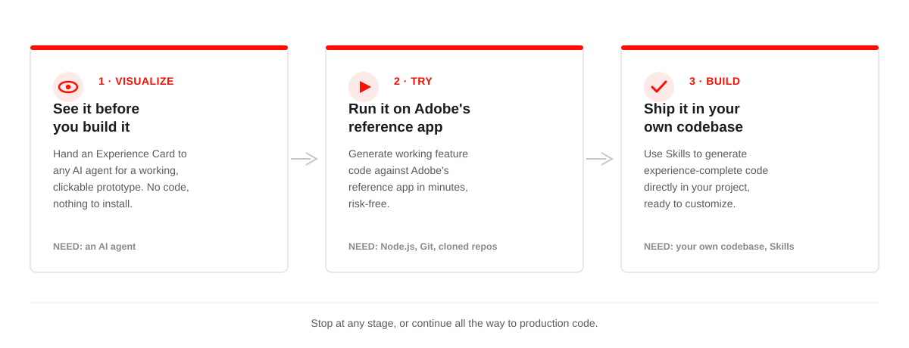
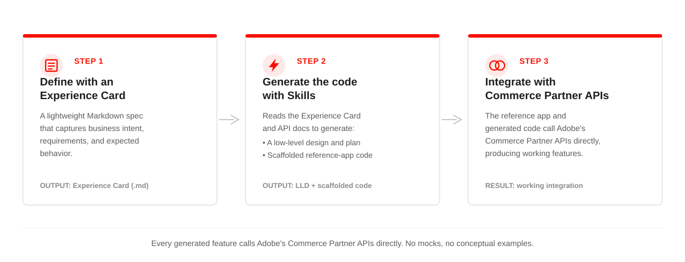

# Adobe Commerce Partnerships AI Kit

Build VIP Marketplace integrations faster through an AI-assisted, self-service development workflow.

### 👉 [AI Kit Git Repository](https://github.com/adobe/adobe-commerce-partnerships-ai-kit)

The Adobe Commerce Partnerships AI Kit provides a structured, AI-assisted development experience for building integrations with Adobe Commerce Partner APIs. It includes reusable feature specifications and AI-powered workflows that help partners accelerate development and validate integrations locally.

The AI Kit supports integration development for Adobe VIP Marketplace.

## How the AI Kit works

Whether your team is technical or non-technical, the AI Kit provides multiple entry points. You can visualize a feature without writing code, test it using Adobe's reference application, or implement it directly in your own codebase:

**Not sure where to start?** If your goal is to understand or demonstrate a feature, begin with Visualize. No setup is required. If you need working code in your own project, continue through Build.

## The pieces, and how they fit

| Component | Description |
| --- | --- |
| **Experience Card** | A lightweight Markdown specification that captures a feature's business goals, requirements, and expected behavior. Every workflow begins with an Experience Card. |
| **Skill** | A reusable, purpose-built command invoked through a slash command, such as `/implement-feature`, that instructs an AI agent to perform a specific task, including generating designs, scaffolding code, or validating a build. |
| **Service Card** | A generated description of your codebase's patterns, contracts, and conventions. Skills use Service Cards to ensure generated code aligns with your project's implementation standards. |
| **Low-Level Design (LLD)** | A generated implementation plan that provides the detailed design for a feature based on an API specification or Experience Card. The LLD is typically reviewed before code generation begins. |

## Defining features and generating code

## Business value

The AI Kit transforms a traditional design-and-development process into a guided, repeatable workflow that:

- Accelerates partner onboarding and integration development.
- Enables teams to work independently without waiting for Adobe engineering support.
- Provides a scalable, consistent self-service experience.
- Helps partners build and deploy integrations faster.

Read more about:

- [Quick start guide](./quick-start.md)
- [Available features](./available-features.md)
