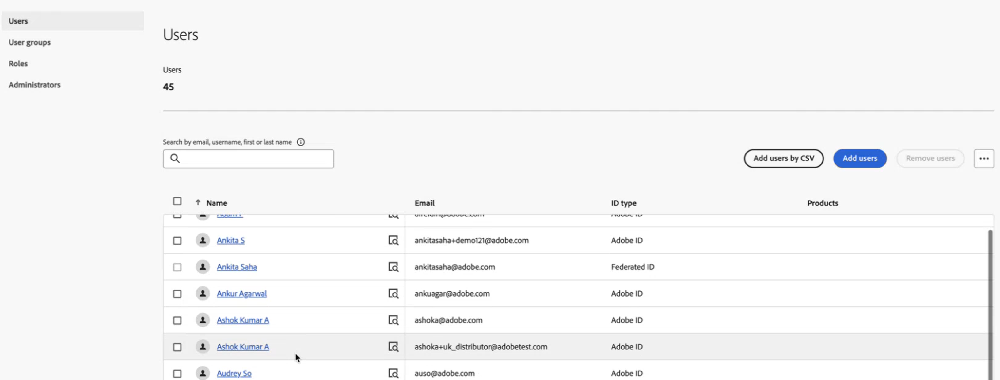
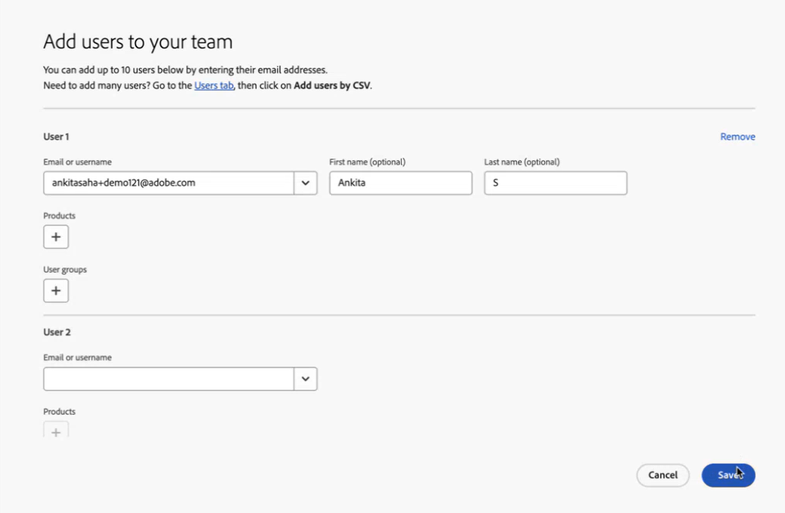
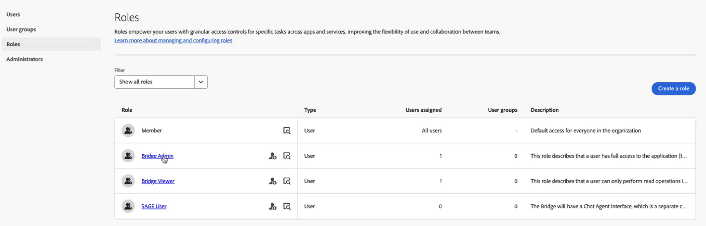
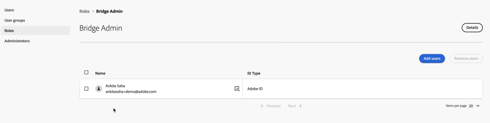
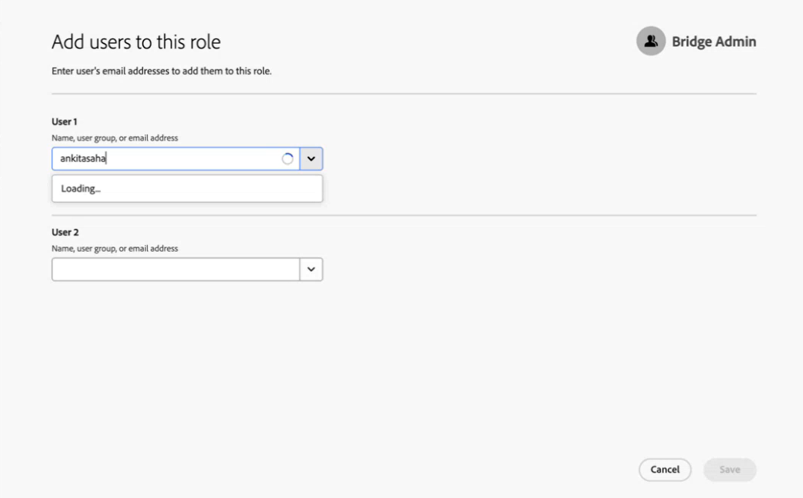
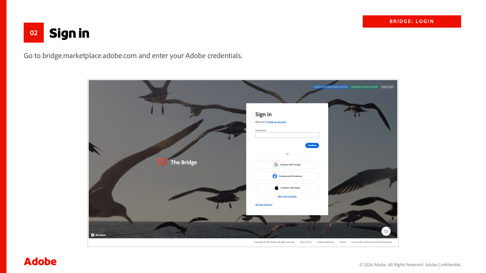
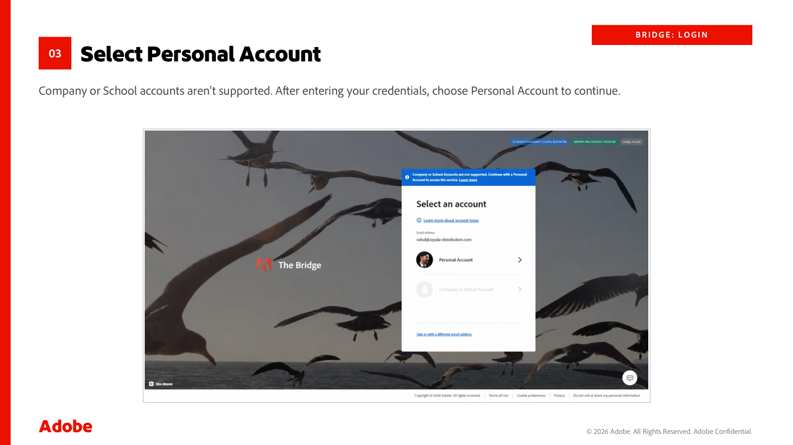
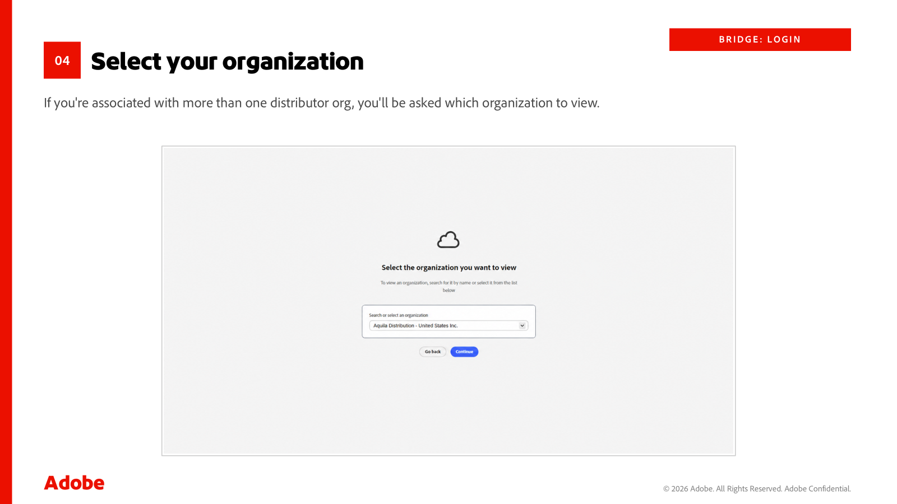
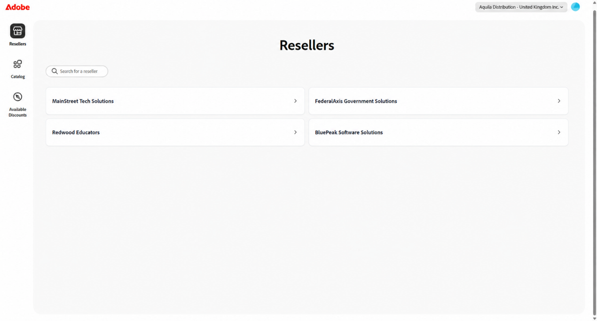
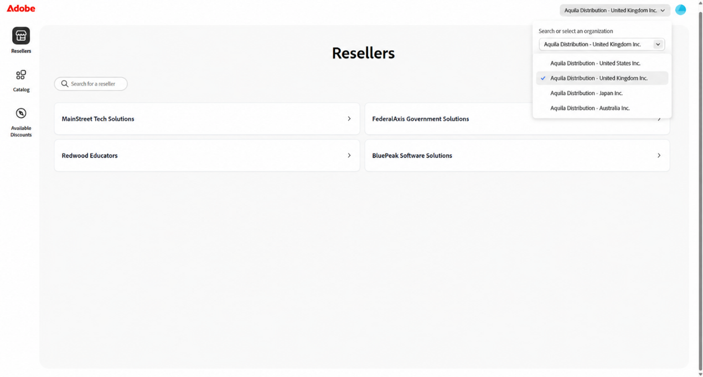

# Getting started with the Bridge

Access to the Bridge is granted in two steps: Adobe enables your organization, and then your Admin Console administrator assigns each user a Bridge role. Adobe does not enable individual users by default.

## Part 1: Assign Bridge roles to users

Bridge access is based on assigned roles. Only an Admin Console administrator for your organization can assign roles. Granting a user access is a two-step process:

1. Ensure that the user is part of your organization. Existing users who are already part of the organization only need a role assignment. Proceed directly to Assign a role. New users must first be added to the organization.
2. Assign a Bridge role to the user. The assigned role determines the user's level of access in the Bridge.

### Bridge roles

| Role | Access |
|---|---|
| **Bridge Admin** | Full read-write access to the Bridge. |
| **Bridge Viewer** | Read-only access to the Bridge. |

Only users assigned the **Bridge Admin** or **Bridge Viewer** role can sign in to the Bridge. These roles are managed by Adobe and cannot be deleted by administrators.

### Make user part of the organization

1. Sign in to [Adobe Admin Console](https://adminconsole.adobe.com/) using the admin account provided for your distribution.

2. From the Users tab, select **Add users**.
3. In the **Add users to your team** dialog box, enter the details of the user to be added and select **Save**.

### Assign a role

1. Sign in to [adminconsole.adobe.com](https://adminconsole.adobe.com) using the administrator account provided for your distribution, and select the correct account or organization.

2. From the top navigation bar, select **Roles**.

   

3. Select the role that you want to assign to the user.

   

   You can assign either the **Bridge Admin** or **Bridge Viewer** role.

4. Select **Add users**. The **Add users to this role** dialog box appears.

   

5. Select users who require the role and then select **Save**. The selected users can now access the Bridge according to the permissions granted by their assigned role.

   

Repeat this procedure whenever you need to add users or modify existing role assignments.

## Part 2: Sign in and select your distribution

Once a user has been assigned, they can sign in directly:

1. Go to [http://bridge.marketplace.adobe.com/](http://bridge.marketplace.adobe.com/).
2. Sign in using the Adobe credentials that were assigned a **Bridge Admin** or **Bridge Viewer** role.

3. When prompted to choose an account type, select **Personal Account**. Company or School account sign-in is not supported for the Bridge.

4. If your account is associated with more than one distributor organization, you are prompted to select an organization. Search by name or choose from the list.

5. Select the specific distribution you want to administer, then select **Continue**. You land on the Bridge, with **Resellers**, **Catalog**, and **Available Discounts** available from the left navigation menu.

**Note:** After signing in, the user lands on the Resellers view, where you can search by name or ID. Distributors see many resellers. Platinum partners see only a few.

### Switching distributions

If you are associated with more than one distribution, you do not need to sign out to change context. Use the picker at the upper-right corner of the Bridge to switch between the distributions associated with your account.

## Next steps

See [Supported features](./supported-features.md) to understand what you can do after signing in.
