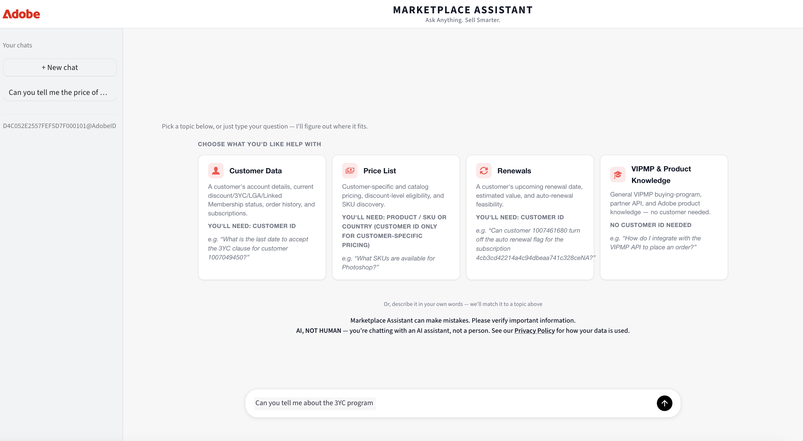

# Getting started with Marketplace Assistant

Marketplace Assistant is available only to users who already have access to Bridge. If your organization or user account is not yet provisioned for Bridge, complete that setup first.

See [Getting started with the Bridge](../getting-started.md) for detailed instructions on how your organization is enabled for Bridge and how Bridge roles are assigned to users.

## Marketplace Assistant user role

After you have access to Bridge, your organization's Admin Console administrator must assign the **Marketplace Assistant** role to your account.

No additional configuration is required after the role is assigned. Marketplace Assistant becomes available within Bridge as soon as the role is enabled.

## Launching Marketplace Assistant

After the Marketplace Assistant role is assigned, complete the following steps to launch Marketplace Assistant:

1. Go to [bridge.marketplace.adobe.com](http://bridge.marketplace.adobe.com/) and sign in using Adobe credentials that have been assigned the Marketplace Assistant role.
2. Select **Launch Marketplace Assistant** in the bottom-right corner of the page:

   

3. Review the disclaimer stating that responses are AI-generated and may be inaccurate. Select **I agree to verify responses before acting**, and then select **Continue**.

   

4. Choose a topic, **Customer Data**, **Price List**, **Renewals**, or **VIPMP & Product Knowledge**. Alternatively, enter your question directly in the message box.

   

You can also type your question directly into the message box. Marketplace Assistant automatically routes the question to the most relevant topic area. For example:

## Next steps

- [Overview](./index.md): Learn what Marketplace Assistant does and how it relates to Bridge.
- [Supported features](./supported-features.md): Review the questions Marketplace Assistant can answer today.
