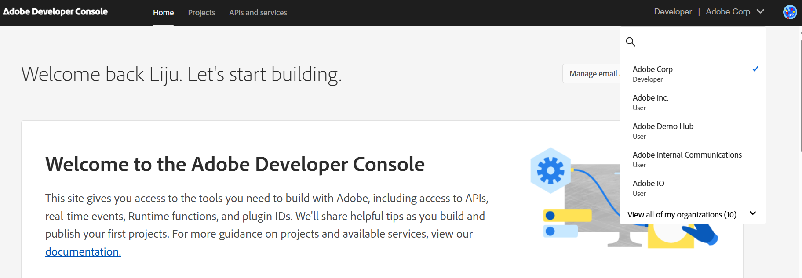
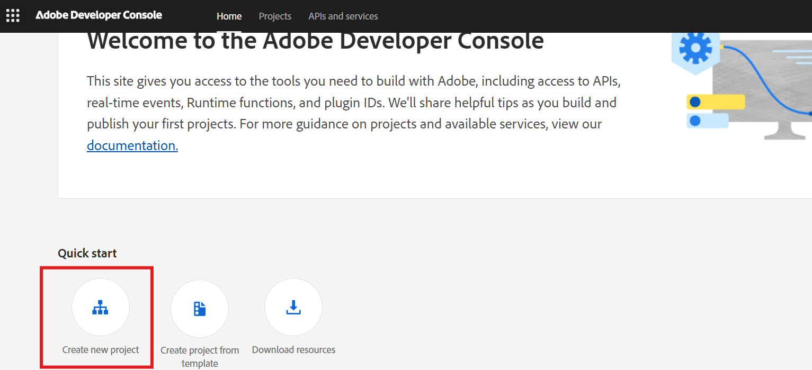

# Generate OAuth credentials

This topic provides information on how to:

- [Set up OAuth server-to-server credential](#set-up-oauth-server-to-server-credential)
- [Generate Access tokens](#generate-access-token)

## Set up OAuth server-to-server credential

Follow these steps to configure your OAuth credentials:

1. Sign in to [https://developer.adobe.com/console](https://developer.adobe.com/console)
2. In the top-right corner, select the organization for which you want to generate the token.

3. If no project exists for this organization, create a new one and add the Commerce API:

4. In your new project, select **Add API**.
5. Select the **Commerce Partner API** box.
6. Select **Next** and follow the remaining steps as outlined in the documentation: [Setting up the OAuth Server-to-Server credential](https://developer.adobe.com/developer-console/docs/guides/authentication/ServerToServerAuthentication/implementation#setting-up-the-oauth-server-to-server-credential)

## Generate access token

Refer to the following resources for generating access tokens:

- [Generate Access Token](https://developer.adobe.com/developer-console/docs/guides/authentication/ServerToServerAuthentication/implementation#generate-access-tokens)
- [Generating access tokens using standard OAuth2 libraries](https://developer.adobe.com/developer-console/docs/guides/authentication/ServerToServerAuthentication/implementation#generating-access-tokens-using-standard-oauth2-libraries) documentation.
