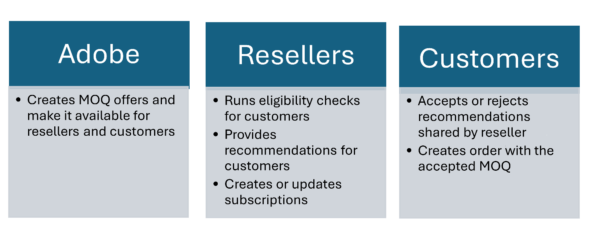

# Manage high volume discounts

Adobe extends volume discounts through its Three-year commitment (3YC) program, which is a loyalty program offering greater discount levels and a price lock for three terms (the current term and two additional terms). Customers must commit to a Minimum Commit Quantity (MCQ) that they will purchase and maintain throughout the 3-year period.

For 3YC customers, Adobe provides high penetration seat expansion offers for those purchasing 100 or more licenses, with discounts of up to 45%. Additional discounts are determined based on the Minimum Order Quantity (MOQ), which defines the initial purchase quantity and the associated discount rate. Any subsequent purchases will adhere to the customer’s MOQ.

Here are the discounts available based on the MOQ.

| MOQ Offers | Discount % |
|------------|------------|
| 100        | 35%        |
| 250        | 40%        |
| 500        | 45%        |

Customers can add more licenses or seats either mid-term or at the anniversary date. Each new addition will benefit from the same discount rate as their original MOQ. For example, if an organization initially purchases an MOQ of 100 and later adds 50 more seats, the additional seats will also receive a 35% discount. Similarly, if the organization with an MOQ of 100 adds 300 more licenses, bringing the total to 400, the new purchases will still receive the 35% discount based on the original MOQ. Therefore, if future growth is expected, starting with a higher MOQ is advisable.
Read more about various [high-penetration offer scenarios](./high_pen_scenarios.md).

## Who is eligible for high penetration offers?

Enterprise customers aiming to expand significantly can access high penetration offers if they meet the following conditions:

1. Customers must be enrolled in the 3YC program.
2. Customers require a minimum order quantity (MOQ) of 100 or more. Based on their seat requirements, customers can choose from the available MOQ offers. For instance, if a customer already has 110 seats, they should consider selecting either the 250 or 500 MOQ option, as shown in the following table.

**Note:**

- MOQ offers aren't available to new customers and can only be purchased by existing qualifying customers who already have a certain number of licenses for specific product groups. Product groups can be defined at the time of onboarding. For example, Acrobat Standard and Acrobat Pro are part of the Acrobat group, and customers having a combined quantity of 55 of these products will only qualify for Acrobat Pro MOQ 100 offer.

    | Current seats at renewal   Acrobat Pro + Standard|Eligible Minimum Quantity Orders (MQO)  |
    |--|--|
    |$\le$ 50 seats| 100   250   500|
    |$\le$ 125 seats|100   250  |
    |$\le$ 250 seats |500 |

The number of subscriptions at the renewal date on the anniversary date must be greater than or equal to the number of seats committed. The following table lists the seat expansion scenarios during renewals:

| Current seats at renewal   Acrobat Pro + Standard|Eligible Minimum Quantity Orders (MQO)  |3YC minimum commitment quantities   (needs to be increased based on MOQ) |
|--|--|--|
|$\le$ 50 seats| 100   250   500| 100+ |
|$\le$ 125 seats|100   250  | 250+ |
|$\le$ 250 seats |500 | 500+|

## High penetration offer renewal workflows

The following figure illustrates the roles and responsibilities of Adobe, resellers, and customers in making the high penetration offers available to customers:

### Prerequisite

The MOQ offers must be defined if they do not exist already. MOQ offers are defined with the pricing pool bit. The pricing pool bit is the third bit from the last in the offer ID provided to partners. Examples:

- 65304479CA04X12 = Acrobat Pro 100 MOQ Pack
- 65304479CA04Y12 = Acrobat Pro 250 MOQ Pack
- 65304479CA04Z12 = Acrobat Pro 500 MOQ Pack

### Renewal workflow: License renewal at the anniversary date

**Process:**

1. The Reseller makes a [previewRenewal](./high_pen_apis.md#preview-renewal-offers) API call.
2. The [previewRenewal](./high_pen_apis.md#preview-renewal-offers) API returns with the recommended or eligible high penetration offers. That is, Adobe checks if the customer's current product quantities match the maximum current quantity to determine eligibility.
3. The reseller provides the code and the right offer ID (SKU + extension).
4. The customer uses the [Update Subscription](./high_pen_apis.md#update-subscription) API.
to update the renewal preference with the new MOQ.
5. The customer accepts the terms and conditions in the Admin Console.
6. At the annoversary date, the auto-renewal configuration will use the code and price for the order. The customer's 3YC gets to a committed status.

### Mid-term seat addition workflow: Adding New Licenses for the existing customers

A subscription is created for every unique product (SKU) of a customer and any subsequent purchase of the same product is added to the same subscription. For every new purchase of another product, the customer creates a new subscription. All these subscriptions at renewal (AD) form a Renewal Order and get fulfilled through the Ordering sub-system. For example, if the customer has only Acro Standard product and not Acrobat Pro, they can use [Create Subscription](./high_pen_apis.md#create-subscription) API to create a scheduled subscription for the MOQ.

**Process:**

1. The customer or reseller on behalf of customer uses [Create Subscription](./high_pen_apis.md#create-subscription) API to create a new subscription.
2. Customers can use the [CreateOrder](../order_management/create_order.md) to purchase the MOQ offer mid-term, even if they do not currently hold an MOQ offer.

### End of 3YC Term workflow

**Process:**

1. Renewal reminder emails will notify the customer that their 3YC term is ending.
2. The migration code and dates will be retained to offer customer retention promotions in their subsequent 3-YC terms.

Read more about [high penetration offer scenarios](./high_pen_scenarios.md).
