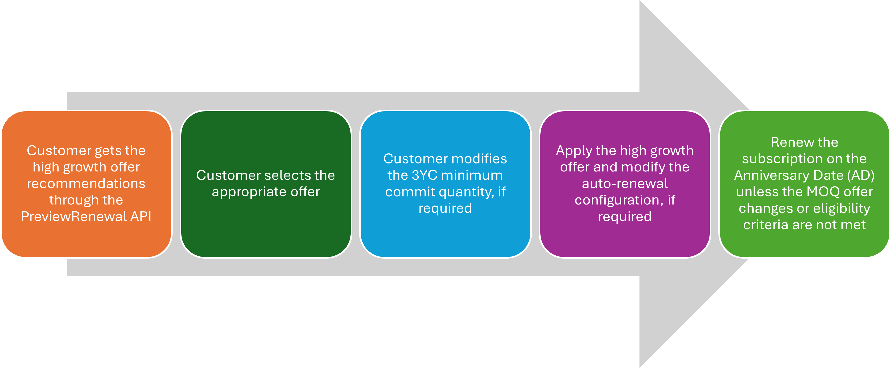
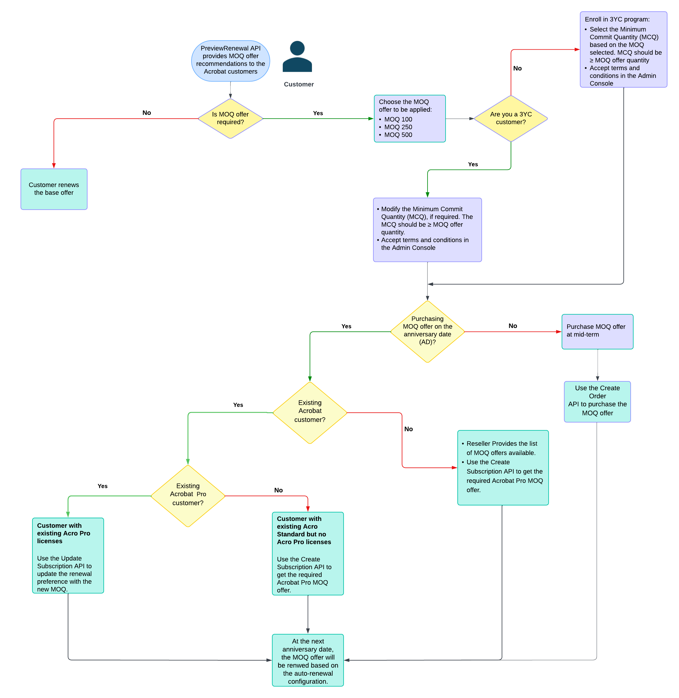
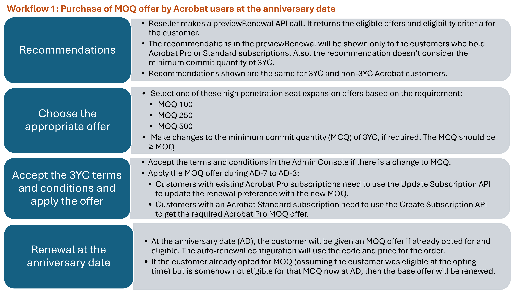
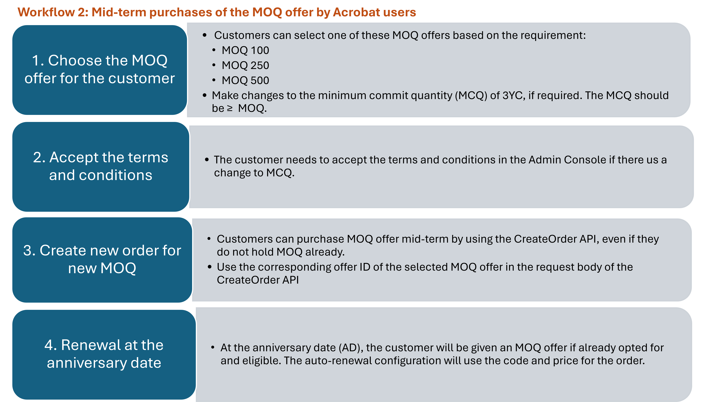
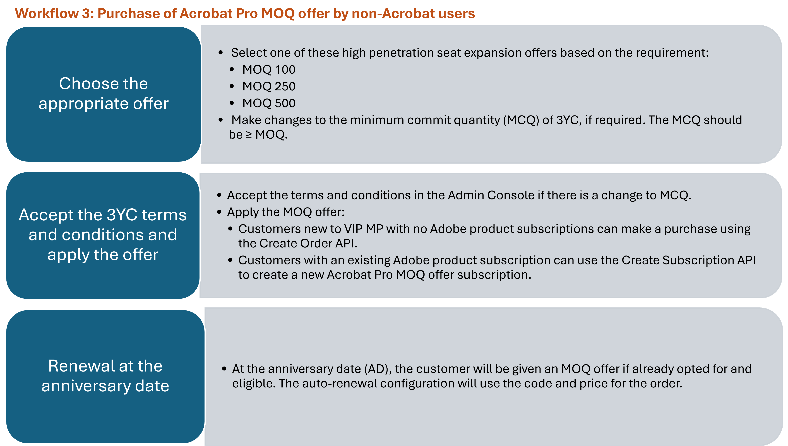

# Manage high growth offers

High growth offers are designed for customers who are either making new purchases or significantly expanding their existing Acrobat Pro seats. This will replace the current High Volume Discounting program (17-23 levels) that exists in VIP.

## What are high growth offers?

High growth offers are for customers enrolled in the [Three-Year Commits (3YC)](./three_year_commit.md) program, purchasing or renewing 100 or more licenses. The discounts are based on the Minimum Order Quantity (MOQ) offers, which define the purchase quantity and the associated discount rates. Any subsequent purchases will adhere to the customer’s high growth MOQ offer.

Here are the high growth offers available based on the MOQ:

- MOQ 100
- MOQ 250
- MOQ 500

Customer's Minimum Commit Quantiy of the 3YC must be always ≥
the MOQ offer quantity. The high-level customer journey to get a high growth offer is as follows:

**Note:** The terminology "high growth offer" and "MOQ offer" are used interchangeably in this document.

Customers can add licenses or seats mid-term or at the anniversary date, benefiting from the same discount rate as their original MOQ.

**Example scenario**

- Initial Purchase: MOQ 100
- Additional Licenses: 300 (Total becomes 400)
- Discount: Same as MOQ 100

Adobe defines the high growth offers, and the corresponding offer ID is shared with the partners. For example:

- 65304479CA14X12 = Acrobat Pro 100 MOQ
- 65304479CA14Y12 = Acrobat Pro 250 MOQ
- 65304479CA14Z12 = Acrobat Pro 500 MOQ

## Who is eligible for high growth offers?

Enterprise and Team customers of Acrobat Pro can take advantage of high growth offers if they meet the following conditions:

1. **Enrollment:** Customers must be enrolled in the 3YC program.
2. **MOQ requirement:** Customers require a minimum order quantity (MOQ) of 100 or more.

   - Customers can select from the available MOQ offers based on their seat requirements. For example, a customer with 110 seats can consider selecting either the 250 or 500 MOQ offer option, as shown in the following table.
   - MOQ offers are available to both new and existing customers with a certain number of licenses for specific product groups. For example, Acrobat Standard and Acrobat Pro are part of the Acrobat group, and customers with a combined quantity that falls in to the range mentioned in the following table become eligible for the corresponding MOQ offers.

    | Current seats at renewal   Acrobat Pro + Standard | Eligible Minimum Order Quantity (MOQ) |
    |-------------------------------------------------------|---------------------------------------|
    | ≤ 50 seats                                            | 100, 250, or 500             |
    | ≤ 125 seats                                           | 250 or 500                        |
    | ≤ 250 seats                                           | 500                                   |

3 - **MCQ requirement:** The number of subscriptions at the renewal date on the anniversary date must be greater than or equal to the number of seats committed (MCQ).

  | Current seats at renewal   Acrobat Pro + Standard | Eligible Minimum Order Quantity (MOQ) | 3YC Minimum Commit Quantities (MCQ) - Needs to be increased based on the MOQ) |
  |-------------------------------------------------------|---------------------------------------|-------------------------------------------------------------------------------|
  | ≤ 50 seats                                            | 100   250   500             | 100+                                                                          |
  | ≤ 125 seats                                           | 250   500                        | 250+                                                                          |
  | ≤ 250 seats                                           | 500                                   | 500+                                                                          |

## High growth offer use cases

Customers can opt for an MOQ at the renewal of the subscription at the anniversary date or at mid-term. Purchases at the anniversary date are for the next term, and mid-term purchases are applicable to the current term. The customer journey to get the high growth offer is as follows:

The following figures illustrate the detailed workflows for these scenarios:

Read more about [high growth offer scenarios](./high_pen_scenarios.md).
