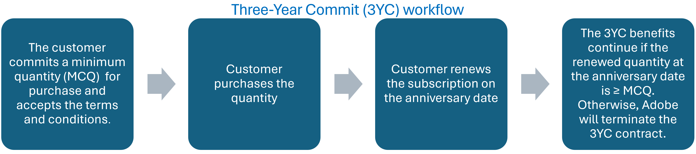
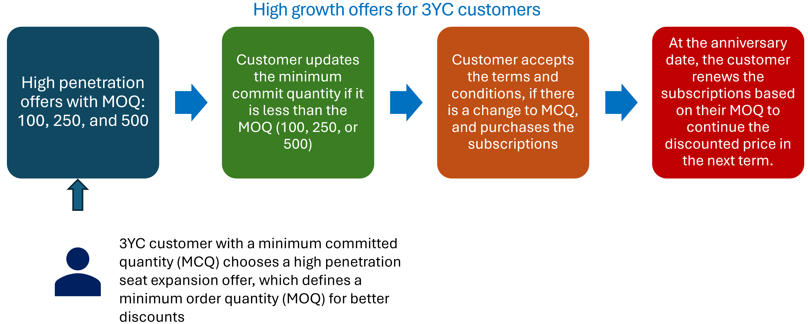

# Manage high growth offers

Adobe extends volume discounts to the B2B customers through the Three-year commitment (3YC) program, a loyalty program offering greater discount levels, and a price lock for three terms (the current term and two additional terms). Customers must commit to a minimum quantity (Minimum Commit Quantity - MCQ) they will purchase and maintain throughout the 3-year commitment period. The 3YC workflow is illustrated in the following figure:

For those enrolled in the 3YC program and purchasing or renewing 100 or more licenses, Adobe provides high growth offers with attractive discounts. These discounts are based on the Minimum Order Quantity (MOQ), which defines the purchase quantity and the associated discount rate. Any subsequent purchases will adhere to the customer’s high growth MOQ offer.

Here are the high growth offers available based on the MOQ:

- MOQ 100
- MOQ 250
- MOQ 500

**Note:** The terminology "high growth seat expansion offer" and "MOQ offer" are used interchangeably in this document.

Customers can add more licenses or seats either mid-term or at the anniversary date. Each new addition or renewal will benefit from the same discount rate as their original MOQ. For example, if an organization initially purchases a high growth offer of MOQ 100  and later adds 50 more seats in the same MOQ, the additional seats will also receive the same discount rate defined for the MOQ offer. Similarly, if the organization with an MOQ of 100 adds 300 more licenses, bringing the total to 400, the new purchases will still receive the same discount defined for the MOQ 100 offer. Therefore, if growth is anticipated, starting with a higher MOQ offer is advisable.
Read more about various [high-growth offer scenarios](./high_pen_scenarios.md).

## Who is eligible for high growth offers?

Enterprise and Team customers can take advantage of high growth offers if they meet the following conditions:

1. Customers must be enrolled in the 3YC program.
2. High growth offers are currently available only for the Enterprise and Teams customers of Acrobat Pro.
3. Customers require a minimum order quantity (MOQ) of 100 or more. Customers can select from the available MOQ offers based on their seat requirements. For example, a customer with 110 seats can consider selecting either the 250 or 500 MOQ offer option, as shown in the following table.

   **Note:** MOQ offers are available to both new and existing customers with a certain number of licenses for specific product groups. For example, Acrobat Standard and Acrobat Pro are part of the Acrobat group, and customers with a combined quantity of 45 of these products qualify for Acrobat Pro MOQ 100 offer.

     | Current seats at renewal   Acrobat Pro + Standard | Eligible Minimum Order Quantity (MOQ) |
    |-------------------------------------------------------|---------------------------------------|
    | ≤ 50 seats                                            | 100   250   500             |
    | ≤ 125 seats                                           | 250   500                        |
    | ≤ 250 seats                                           | 500                                   |

4 - The number of subscriptions at the renewal date on the anniversary date must be greater than or equal to the number of seats committed (MCQ). For example, if the number of seats is 130:

- MOQ offer quantity must be 250 or 500
- 3YC Minimum Commit Quantity (MCQ) must be 250+ or 500+ respectively

  | Current seats at renewal   Acrobat Pro + Standard | Eligible Minimum Order Quantity (MOQ) | 3YC Minimum Commit Quantities (MCQ) - Needs to be increased based on the MOQ) |
  |-------------------------------------------------------|---------------------------------------|-------------------------------------------------------------------------------|
  | ≤ 50 seats                                            | 100   250   500             | 100+                                                                          |
  | ≤ 125 seats                                           | 250   500                        | 250+                                                                          |
  | ≤ 250 seats                                           | 500                                   | 500+                                                                          |

## High growth offer workflows

Adobe defines the high growth seat expansion offers, and the corresponding offer ID is shared with the partners. For example:

- 65304479CA14X12 = Acrobat Pro 100 MOQ
- 65304479CA14Y12 = Acrobat Pro 250 MOQ
- 65304479CA14Z12 = Acrobat Pro 500 MOQ

Customers can opt for an MOQ at the renewal of the subscription at the anniversary date or at mid-term. Purchases at the anniversary date are for the next term, and mid-term purchases are applicable to the current term.

The following figures illustrate the workflows for these scenarios:

Read more about [high growth offer scenarios](./high_pen_scenarios.md).
