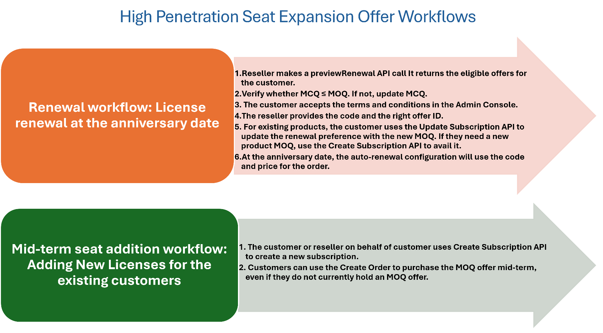

# Manage high penetration seat expansion offers

Adobe extends volume discounts through its Three-year commitment (3YC) program, which is a loyalty program offering greater discount levels and a price lock for three terms (the current term and two additional terms). Customers must commit to a Minimum Commit Quantity (MCQ) that they will purchase and maintain throughout the 3-year period.

For 3YC customers, Adobe provides high penetration seat expansion offers for those purchasing or renewing 100 or more licenses, with discounts of up to 45%. Additional discounts are determined based on the Minimum Order Quantity (MOQ), which defines the purchase quantity and the associated discount rate. Any subsequent purchases will adhere to the customer’s MOQ offer.

**Note:** High penetration seat expansion offers are currently available only for the Enterprise and Teams customers of Acrobat Pro and Acrobat Standard.

Here are the discounts available based on the MOQ.

| MOQ Offer Quantity | Discount % |
|--------------------|------------|
| 100                | 35%        |
| 250                | 40%        |
| 500                | 45%        |

Customers can add more licenses or seats either mid-term or at the anniversary date. Each new addition or renewal will benefit from the same discount rate as their original MOQ. For example, if an organization initially purchases an MOQ of 100 and later adds 50 more seats in the same MOQ, the additional seats will also receive a 35% discount. Similarly, if the organization with an MOQ of 100 adds 300 more licenses, bringing the total to 400, the new purchases will still receive the 35% discount based on the original MOQ. Therefore, if future growth is anticipated, starting with a higher MOQ is advisable.
Read more about various [high-penetration offer scenarios](./high_pen_scenarios.md).

## Who is eligible for high penetration offers?

Enterprise and Team customers aiming to expand significantly can access high penetration offers if they meet the following conditions:

1. Customers must be enrolled in the 3YC program.
2. Customers require a minimum order quantity (MOQ) of 100 or more. Customers can choose from the available MOQ offers based on their seat requirements. For instance, if a customer already has 110 seats, they can consider selecting either the 250 or 500 MOQ option, as shown in the following table.

**Note:**

- MOQ offers are available to new and existing customers with a certain number of licenses for specific product groups. For example, Acrobat Standard and Acrobat Pro are part of the Acrobat group, and customers with a combined quantity of 45 of these products will only qualify for Acrobat Pro MOQ 100 offer.

     | Current seats at renewal   Acrobat Pro + Standard | Eligible Minimum Order Quantity (MOQ) |
    |-------------------------------------------------------|---------------------------------------|
    | ≤ 50 seats                                            | 100   250   500             |
    | ≤ 125 seats                                           | 250   500                        |
    | ≤ 250 seats                                           | 500                                   |

The number of subscriptions at the renewal date on the anniversary date must be greater than or equal to the number of seats committed (MCQ). For example, if the number of seats is 130:

- MOQ offer quantity must be 250 or 500
- 3YC Minimum Commit Quantity (MCQ) must be 250+

## High penetration offer renewal workflows

Adobe defines the MOQ offers, and the corresponding offer ID is shared with the partners. For example:

- 65304479CA14X12 = Acrobat Pro 100 MOQ Pack
- 65304479CA14Y12 = Acrobat Pro 250 MOQ Pack
- 65304479CA14Z12 = Acrobat Pro 500 MOQ Pack

Workflows for various scenarios are as follows:

Read more about [high penetration offer scenarios](./high_pen_scenarios.md).
