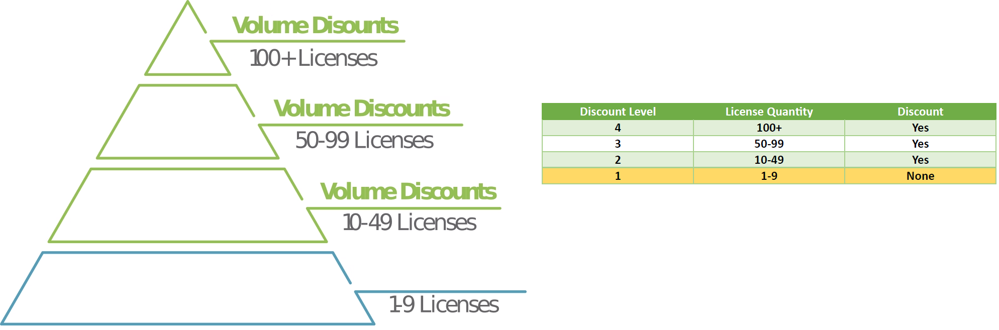
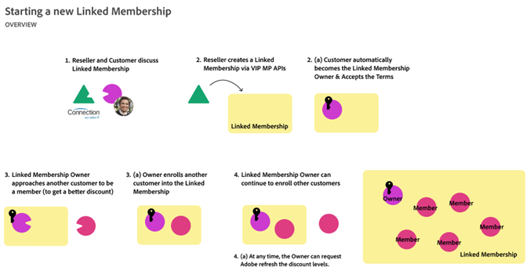
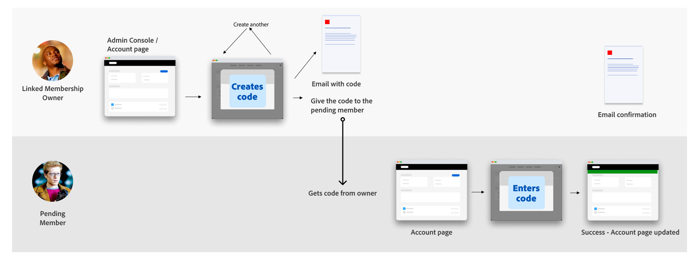

# Manage linked memberships

Linked Membership is an optional feature of the Adobe Value Incentive Plan Marketplace (VIP MP). This plan allows organizations affiliated with VIP MP to combine purchases across linked customer accounts to achieve [better volume discount levels](#how-to-attain-more-discounts-through-linked-membership) while still managing and purchasing licenses separately.

You can provide linked memberships to customers from the following types of organizations:

- Commercial affiliates
- Government agencies
- Primary and secondary education institutions, for example, school districts and state schools
- Departments with separate budgets and license administration needs

There are two types of Linked Memberships:

- **Standard:** Suitable for departments or sub-organizations with separate budget or administrative requirements,  including business affiliates, school districts, state schools, government departments, and entities.
- **Consortiums:** An association or combination of organizations with similar interests and objectives, managed by a controlling entity.

## How to attain more discounts through linked membership?

The linked membership feature helps organizations achieve better volume discounts, which are determined based on the number of licenses purchased during a license term. Organizations that purchase 10 or more licenses qualify for volume discounts. As the number of licenses increases, the discount level rises accordingly, as illustrated below:



With linked memberships, organizations affiliated with VIP MP  can combine or aggregate their licenses or transactions with their affiliates to secure better discounts. For example, _Organization A_ has 70 licenses and falls into Discount Level 3, as indicated in the previous table. _Organization B_ has 31 licenses and gets 5% discount defined for Level 2. By combining these organizations through linked membership, now they have 101 licenses and qualify for level 4 (15%) discounts.

You can include offers for all volume discounted price levels and scaled pricing models. The following table lists the discount tiers for transactions of all consumable-based products, such as Adobe Sign:

|Transaction range |Tier|
|:----|:----|
|1 to 999 |T1|
|1000 to 2499 |T2|
|2500 to 4999|T3|
|5,000-14,999 |T4|
|15,000 to 49,999|T5|
|50,000 to 99,999 |T6|
|> 100K |T7|

Resellers can create new linked memberships using the [Update Customer Account API](./update_customer_account.md). Each linked membership has one owner and multiple members. The owner of a linked membership and its members are B2B customer organizations. The owner must agree to the [terms and conditions](./index.md) in the Admin Console and enroll other members in the linked membership. The workflow for creating a linked membership and adding members is as follows:



The following sections provide how to manage different stages of this workflow:

- [Create new linked memberships](#creating-new-linked-memberships-using-api)
- [Get details of linked memberships](#get-details-of-linked-membership)
- [Update a linked membership to add members](#update-the-linked-membership-to-add-members)

## Creating new linked memberships using API

The following list provides certain important aspects related to linked membership creation:

- Linked membership account details are maintained independently of the VIP MP customer account details.
- Discount levels for linked memberships are automatically calculated on the anniversary date of the linked membership. The calculated discount level is automatically applied to all members and the owner.
- The calculated discount level will be propagated to all the participating linked members and the owner.
- A linked membership owner and members are not qualified for the three-year commit benefits.

Partner marketplaces can create linked memberships using the [Update Customer API](./update_customer_account.md).

### Request

The following example shows the parameters to be used in the request body of the [Update Customer API](./update_customer_account.md) endpoint to define a new linked membership:

```json
"linkedMembership": {
        "type": "STANDARD",
        "name": "This is the Group Created for 1005516130"
    },
    "companyProfile": {
        "companyName": "Test Customer 33a0e0bc-e38f-4b65-a5a2-8ccad6ea0e8",
        "preferredLanguage": "en-US",
        "marketSegment": "COM",
        "marketSubSegments": [],
        "address": {
            "country": "US",
            "region": "CA",
            "city": "San Jose",
            "addressLine1": "345 Park Ave",
            "addressLine2": "",
            "postalCode": "95110",
            "phoneNumber": ""
        },
        "contacts": [
            {
                "firstName": "David",
                "lastName": "John",
                "email": "dave.j+LM-3YC-23@adobetest.com"
            }
        ]
    }
```

You can use the following CURL command as a reference:

```json
curl --location --request PATCH 'https://partners.adobe.io/v3/customers/1005513636' \
--header 'x-api-key: <your-api-id>' \
--header 'X-Request-Id: 2950f0f0-300993c3c261b9a' \
--header 'X-Correlation-Id: 9f5cb46f-59e0-44f2' \
--header 'Content-Type: application/json' \
--header 'Accept: application/json' \
--header 'Authorization: Bearer XXXXX' \
--data-raw '{
    
    "linkedMembership": {
        "type": "STANDARD",
        "name": "This is the Group Created for 1005516130"
    },
    "companyProfile": {
        "companyName": "Test Customer 33a0e0bc-e38f-4b65-a5a2-8ccad6ea0e8",
        "preferredLanguage": "en-US",
        "marketSegment": "COM",
        "marketSubSegments": [],
        "address": {
            "country": "US",
            "region": "CA",
            "city": "San Jose",
            "addressLine1": "345 Park Ave",
            "addressLine2": "",
            "postalCode": "95110",
            "phoneNumber": ""
        },
        "contacts": [
            {
                "firstName": "David",
                "lastName": "John",
                "email": "dave.j+LM-3YC-23@adobetest.com"
            }
        ]
    }
}'
```

### Response body

Same as [Get Customer Account Details (Customer resource)](./get_customer_account.md).

**Note:** Any contacts specified in this call will receive the admin welcome email. This can be resent if an end-user did not receive it.

### HTTP status codes

| Status code | Description                  |
|-------------|------------------------------|
| 200         | Account successfully updated |
| 400         | Bad request                  |
| 401         | Invalid Authorization token  |
| 403         | Invalid API Key              |
| 404         | Invalid customer ID          |

## Get details of linked membership

The [Get Customer API](./get_customer_account.md) returns details about linked memberships associated with a customer (owner/member). The API returns the subscription details, including the linked membership details. The following response sample shows details fetched for a customer with a linked membership:

```json
{
    "externalReferenceId": "240715235148492799",
    "customerId": "1005512199",
    "resellerId": "1000250355",
    "status": "1000",
    "companyProfile": {
        "companyName": "Test organization for linked membership",
        "preferredLanguage": "en-US",
        "marketSegment": "EDU",
        "marketSubSegments": [],
        "address": {
            "country": "US",
            "region": "CA",
            "city": "SAN JOSE",
            "addressLine1": "3453 Park Ave",
            "addressLine2": "3453 Park Ave",
            "postalCode": "95110",
            "phoneNumber": ""
        },
        "contacts": [
            {
                "firstName": "ABC",
                "lastName": "Corporation",
                "email": "email@domain.com",
                "phoneNumber": "28880-7323-8195"
            }
        ]
    },
    "discounts": [
        {
            "offerType": "LICENSE",
            "level": "01"
        }
    ],
    "cotermDate": "2025-07-16",
    "creationDate": "2024-07-15T23:51:49Z",
    "benefits": [],
    "globalSalesEnabled": false,
    "linkedMembership": {
        "id": "51001315",
        "name": "This is the Group Created for 1005513636",
        "type": "STANDARD",
        "linkedMembershipType": "OWNER",
        "creationDate": "2024-07-17T03:47:35"
    },
    "links": {
        "self": {
            "uri": "/v3/customers/1005512199",
            "method": "GET",
            "headers": []
        }
    }
}
```

## Update the linked membership to add members

The workflow for adding new members to the linked membership is illustrated in the following figure:



The Admin Console facilitates the following:

- Enable a linked membership owner to:
  - Accept the terms (Standard/Consortium) within the Admin Console.
  - Generate an authorization code to add a linked member and share the details with the member.
- Facilitate a VIP customer to be a linked membership member.
- Enroll in a linked membership by entering an authorization code provided by a linked membership owner.

Read more about [how to manage linked memberships in the Admin Console](./index.md).

## Migrate linked membership from VIP to VIP MP

- Linked membership account information is displayed during the [VIP Marketplace migration preview](../migration/preview_offers.md) API call.
- The migration process requires the linked membership owner to migrate their account before any member migration can occur.

**Note:** Three-year commit (3YC) and linked memberships are mutually exclusive. Plan accordingly when you migrate from VIP to VIP MP.
