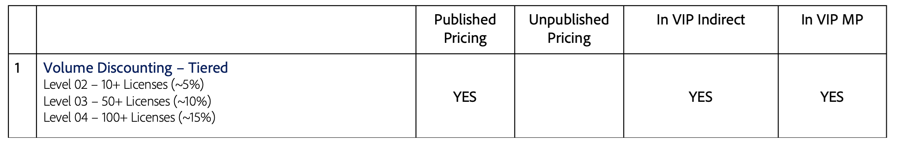
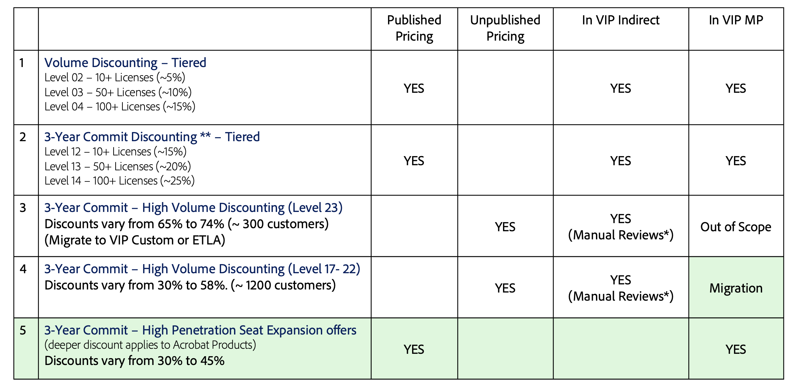

# Manage linked memberships

Linked Membership is an optional feature of the Adobe Value Incentive Plan Marketplace (VIP MP). Under this plan, organizations affiliated with VIP MP may aggregate purchases across linked customer accounts to achieve a [better volume discount level](#how-to-attain-more-discounts-through-linked-membership) while still purchasing and managing licenses separately.

You can provide linked memberships for the customers of the following types of organizations:

- Commercial affiliates
- Government agencies
- Primary and secondary education institutions, for example, school districts and state schools
- Departments with separate budgets and license administration needs

There are two types of Linked Membership types:

- **Standard:** Departments or sub-organizations with separate budget or admin needs,  such as business affiliates, school districts, state schools, government departments, and entities.
- **Consortiums:** An association or combination of organizations that have similar interests and missions, and such association or combination has a controlling entity.

## How to attain more discounts through linked membership?

The linked membership feature helps organizations to achieve better volume discounts, which are calculated based on the number of licenses purchased during a license term. If an organization purchases 10 or more licenses, that organization is qualified to receive volume discounts. When the number of licenses increases, the discount level also increases, as shown in the following illustration:


The following figure lists the tiered pricing corresponding to the discount levels and their feature parity between VIP and VIP Marketplace:



With linked membership, you can combine organizations affiliated with VIP MP for better discounts. For example, _Organization A_ has 70 licenses and falls into Discount Level 3, as indicated in the previous table. _Organization B_ has 31 licenses and gets 5% discount defined for Level 02. By combining these organizations through linked membership, they have 101 licenses and qualify for level 3 (15%) discounts.

Each linked membership has one owner and multiple members. The owner can be any of the organization's system administrators. This user must agree to the terms and conditions in the Admin Console and enroll other members in the linked membership. Although a system owner can create a new linked membership from the Admin Console, resellers create new linked memberships using the Customer Account API. The workflow is as follows:


The following sections provide how to manage different stages of this workflow:

- [Create new linked memberships](#creating-new-linked-memberships-using-api)
- [Get details of linked memberships](#get-details-of-linked-membership)
- [Update a linked membership to add members](#update-the-linked-membership-to-add-members)

## Creating new linked memberships using API

The following list provides certain important aspects of linked membership creation:

- Partner marketplaces can create linked memberships using the [Update Customer API](./update_customer_account.md). The Update Customer API endpoint accepts the necessary parameters to define a new linked membership.
- The [Get Customer API](./get_customer_account.md) returns details about linked memberships associated with a customer(owner/member).
- Linked membership account details are maintained independently of the VIP MP customer account details.
- Discount levels for linked memberships are automatically calculated on the linked membership anniversary date. The calculated discount level is automatically applied to all members and the owner of the Linked Membership.
- The calculated discount level will be propagated to all the participating linked members and the owner.
- A linked membership owner and members will not qualify for three-year commit benefits.

You need to use the [Update customer account API](./update_customer_account.md) to create a linked membership for a customer account. You can use the following CURL command as a reference:

```json
curl --location --request PATCH 'https://partners-stage.adobe.io/v3/customers/1005513636' \
--header 'x-api-key: 4449d1b9cb9242f88bd74f734' \
--header 'X-Request-Id: 2950f0f0-300993c3c261b9a' \
--header 'X-Correlation-Id: 9f5cb46f-59e0-44f2' \
--header 'Content-Type: application/json' \
--header 'Accept: application/json' \
--header 'Authorization: Bearer XXXXX' \
--data-raw '{
    
    "linkedMembership": {
        "type": "STANDARD",
        "name": "This is the Group Created for 1005516130"
    },
    "companyProfile": {
        "companyName": "Test Customer 33a0e0bc-e38f-4b65-a5a2-8ccad6ea0e8",
        "preferredLanguage": "en-US",
        "marketSegment": "COM",
        "marketSubSegments": [],
        "address": {
            "country": "US",
            "region": "CA",
            "city": "San Jose",
            "addressLine1": "345 Park Ave",
            "addressLine2": "",
            "postalCode": "95110",
            "phoneNumber": ""
        },
        "contacts": [
            {
                "firstName": "David",
                "lastName": "John",
                "email": "dave.j+LM-3YC-23@adobetest.com"
            }
        ]
    }
}'
```

## Get details of linked membership

Use the [Get customer account details API](./get_customer_account.md) to fetch the subscription details, including the linked membership details. The following response sample shows details fetched for a customer with a linked membership:

```json
{
    "externalReferenceId": "240715235148492799",
    "customerId": "1005512199",
    "resellerId": "1000250355",
    "status": "1000",
    "companyProfile": {
        "companyName": "PACES_Reseller Name_REGULAR240715233133214105",
        "preferredLanguage": "en-US",
        "marketSegment": "EDU",
        "marketSubSegments": [],
        "address": {
            "country": "US",
            "region": "CA",
            "city": "SAN JOSE",
            "addressLine1": "3453 Park Ave",
            "addressLine2": "3453 Park Ave",
            "postalCode": "95110",
            "phoneNumber": ""
        },
        "contacts": [
            {
                "firstName": "VINOD",
                "lastName": "KUMAR",
                "email": "pacesauto+240715235148492881@adobetest.com",
                "phoneNumber": "28880-7323-8195"
            }
        ]
    },
    "discounts": [
        {
            "offerType": "LICENSE",
            "level": "01"
        }
    ],
    "cotermDate": "2025-07-16",
    "creationDate": "2024-07-15T23:51:49Z",
    "benefits": [],
    "globalSalesEnabled": false,
    "linkedMembership": {
        "id": "51001315",
        "name": "This is the Group Created for 1005513636",
        "type": "STANDARD",
        "linkedMembershipType": "OWNER",
        "creationDate": "2024-07-17T03:47:35"
    },
    "links": {
        "self": {
            "uri": "/v3/customers/1005512199",
            "method": "GET",
            "headers": []
        }
    }
}
```

## Update the linked membership to add members

The workflow for adding new members to the linked membership is illustrated in the following figure:


The Admin Console facilitates the following:

- Enable a linked membership owner to:
  - Accept the terms (Standard/Consortium) within the Admin Console.
  - Generate an authorization code to add a linked member and share the details with the member.
- Enable a VIP member who isn't part of a linked membership to become an affiliate.
- Enroll in a linked membership by entering an authorization code provided by a linked membership owner.
- Notify the linked membership owner and member of different events that are part of the linked membership lifecycle, such as initiating a  linked member ownership, enrolling a member, and  creating an authorization code.

Read more about [how to manage linked memberships in the Admin Console](./index.md).

## Migrate linked membership from VIP to VIP MP

- Linked membership account information is displayed during the [VIP Marketplace migration preview](../migration/preview_offers.md) API call.
- The migration process requires the linked membership owner to migrate their account before any member migration can occur.
- There needs to be a one-time upload of linked membership information from VIP to VIP MP.

## Dependency of linked membership with three-year commits (3YC)

The discount level varies based on the 3YC status of the affiliate.  Depending on the status, the following use cases are possible:

- **Member has already enrolled in 3YC** <br />  Newly added affiliates who are already enrolled in 3YC keep the original discount level prior to joining the linked membership. They are not upgraded to the new discount level and look back until their 3YC dates are expired.
- **Member is currently not enrolled in 3YC** <br /> Inherits the discount level of the Linked Membership, when enrolled in 3YC, the VIP member gets the benefit of the linked membership. For example, the discount level will be set to 14 if the linked membership discount level is 4. The price is locked for 3 years based on discount level 14. Commit quantity is the quantity owned by the VIP member at the time of 3YC enrollment (for example, 15). The VIP member must maintain the 15 licenses for 3YC annual renewal.

More details of the interdependency between 3YC and linked membership are available in the following table:


