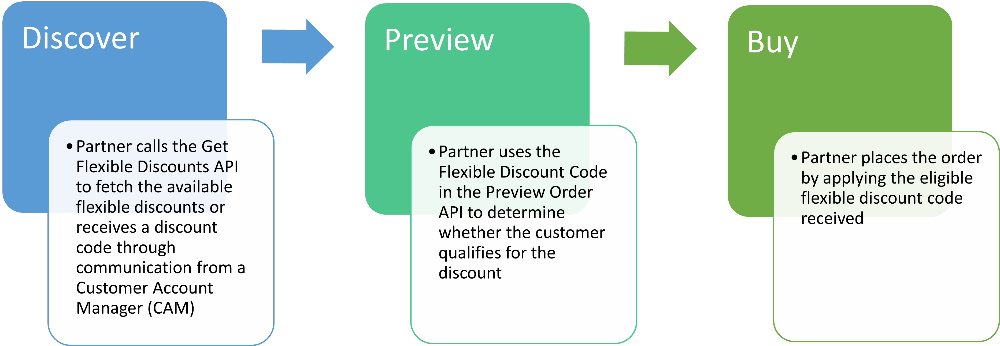

# Manage Flexible Discounts

The Flexible Discount feature enables partners to easily adjust product prices, making them more attractive to different customer segments. These discounts are primarily intended to boost customer retention or acquisition. You can view flexible discount details for a product in a specific market segment and country, and apply them while placing an order or while creating or modifying a subscription.

Flexible discounts also support discount reusability, which allows eligible discounts to be reused for renewals and additional purchases until a defined discount reusability date. This capability helps customers renew with confidence by avoiding sudden price increases after an introductory offer expires.

Key advantages of flexible discounts include:

- **Discounts to drive new product adoption:**

  - Provides selective discounts for enterprise accounts to encourage early adoption of new products.
  - Helps facilitate faster market penetration.

- **Quick flexible discount launches for seasonal sales:**

  - Allows partners to activate discounts within days for timely seasonal discounts like Black Friday.
  - Allows partners to discover upcoming discounts through the API ahead of their start date, enabling advance preparation of marketing and storefront workflows.

- **Reusable discounts to automatic discount continuity across renewals**

  - Allows customers to reuse an eligible discount for renewals and seat additions until a configured discount lock end date.
  - Ensure customers who take advantage of a reusable discount during its initial offering period (start/end date) can retain that pricing benefit beyond the discount’s end date, smoothing price transitions and reducing churn.
  - Customers can review the reusable discount using the Preview Renewal API call.
  - Eliminates the need for customers to reapply a discount by using Update Subscription when it is already associated with an eligible subscription.

**How reusable and non-reusable discounts work:**

In general, promotions and discounts are available only between their configured start and end dates. Reusable discounts extend this model by allowing continued application beyond the original end date, subject to prior use and configuration.

| Aspect                        | Standard (Non-reusable) discount                              | Reusable discount                                                                |
|-------------------------------|---------------------------------------------------------------|----------------------------------------------------------------------------------|
| Availability                  | Only between the discount start and end dates.                | Between the start date and beyond the end date until the discount lock end date. |
| Renewal usage                 | Not allowed after the discount end date.                      | Allowed if the discount was used at least once before the end date.              |
| Seat additions after end date | Not supported.                                                | Supported until the discount lock end date.                                      |
| Customer action required      | Must opt in again with **Update Subscription** if applicable. | No additional opt-in required once applied.                                      |

## Flexible discount types

The following types of flexible discounts are available:

1. **Percentage Discount (% discount):** A percentage reduction is applied to the base price of the product.
2. **Fixed Discount ($ discount):** A fixed monetary reduction is applied to the base price of the product.
3. **Fixed Price:** Offers a product at a fixed price, regardless of its original price.

The discounts applied based on these discount types are explained in the following tables:

**Percentage Discount – Example: 20% discount for Acrobat Pro**

| Part Number      | Original Price | Discounted Price |
|------------------|----------------|------------------|
| 30006208CA01A12  | $89.99         | $71.99           |
| 30006208CA02A12  | $87.99         | $70.39           |
| 30006208CA03A12  | $85.99         | $68.79           |
| 30006208CA04A12  | $83.99         | $67.19           |
| 30006208CA012A12 | $79.99         | $63.99           |
| 30006208CA013A12 | $77.99         | $62.39           |
| 30006208CA014A12 | $75.99         | $60.79           |

**Fixed Amount Discount – Example: $20 discount for Acrobat Express**

| Part Number      | Original Price | Discount Amount | Discounted Price |
|------------------|----------------|-----------------|------------------|
| 30006208CA01A12  | $89.99         | $20.00          | $69.99           |
| 30006208CA02A12  | $87.99         | $20.00          | $67.99           |
| 30006208CA03A12  | $85.99         | $20.00          | $65.99           |
| 30006208CA04A12  | $83.99         | $20.00          | $63.99           |
| 30006208CA012A12 | $79.99         | $20.00          | $59.99           |
| 30006208CA013A12 | $77.99         | $20.00          | $57.99           |
| 30006208CA014A12 | $75.99         | $20.00          | $55.99           |

**Fixed Price – Examples**

| Part Number     | Original Price | Discounted Price |
|-----------------|----------------|------------------|
| 65322535CA04A12 | $89.99         | $49.99           |
| 86322535CA04A12 | $87.99         | $45.00           |

These discounts are applied to a part number using a discount code. Partners must use this discount code while placing an order to provide a discounted price for their customers.

## Eligibility criteria

Flexible discounts are available to all VIP Marketplace customers, regardless of their existing volume discounts, including those with Linked Memberships. However, eligibility is determined by other factors, such as the customer's market segment, country, and so on.

Introductory offers apply only to customers who are purchasing a product for the first time.

**For reusable discounts**

- If a customer has used a reusable flexible discount before the end date of that flexible discount, the customer can continue to use the same flexible discount until the `discountLockEndDate`, even after the flexible discount’s end date.
- When a reusable flexible discount has already been used by a customer in an order that contributes to a subscription, the subscription will have the reusable flexible discount automatically applied during auto-renewal until the `discountLockEndDate`.
- To auto-apply the reusable discount to a subscription, customers do not need to explicitly opt in using [Update Subscription](../subscription-management/update-subscription.md).
- However, if a flexible discount is explicitly opted using Update Subscription, that opted flexible discount will take priority, and the automatic application of the reusable discount will not occur.
- If multiple reusable flexible discounts have been used in different orders contributing to the same subscription, the most recently applied reusable flexible discount will be automatically applied in the auto-renewal order.
- To identify whether a flexible discount is reusable, the `discountLockEndDate` field will be present for reusable flexible discounts in the [Get Flexible Discounts](./apis.md#get-flexible-discounts) API response.

## Partner integration process  

Partners need to facilitate the discovery and application of flexible discounts. There are two ways to discover flexible discounts today:

- **Open Discounts:** These discounts are returned through the Flexible Discounts API and are primarily used to acquire new customers who meet specific eligibility criteria.

  Example: 20% off Creative Cloud Pro Plus for Black Friday

- **Closed Discounts:** Discounts shared with partners through Customer Account Manager (CAM) or Sales Agents.  These discounts are intended to retain customers who are at risk of attrition or to target customers who are eligible for an upgrade. Although these discount codes are applied to orders in the same way as Open Discounts, these codes are not available through the [Get Flexible Discounts API](./apis.md#get-flexible-discounts).

  Example: 15% off discounts for customers with Acrobat Pro licenses who renew to Acrobat Studio

Both Open and Closed Discounts can leverage the discount types specified in the [Flexible discount types section](#flexible-discount-types).

Follow the steps illustrated in the figure below to apply flexible discounts and obtain the discounted price:

## What's next?

Read more about:

- [Managing Flexible Discounts using APIs](./apis.md)
- [Error codes specific to Flexible Discounts](./error-codes.md)
- [How to test flexible discounts in Sandbox](../../sandbox/sandbox-portal/flex-discounts/index.md)
