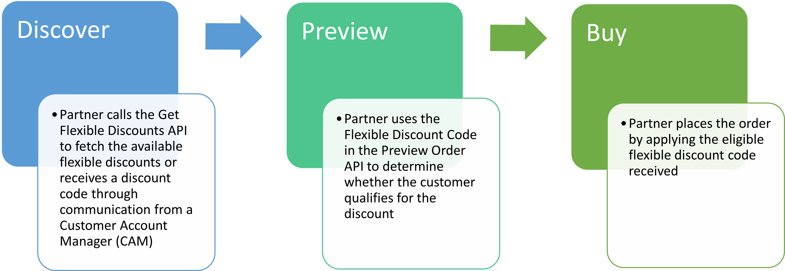

# Manage Flexible Discounts

The Flexible Discount feature enables partners to easily adjust product prices, making them more attractive to different customer segments. These discounts are primarily intended to boost customer retention or acquisition. You can view flexible discount details for a product in a specific market segment and country, and apply them while placing an order or while creating or modifying a subscription.

Flexible discounts also support discount reusability, which allows eligible discounts to be reused for renewals and additional purchases until a defined discount reusability date. This capability helps customers renew with confidence by avoiding sudden price increases after an introductory offer expires.

Key advantages of flexible discounts include:

- **Discounts to drive new product adoption:**

  - Provides selective discounts for enterprise accounts to encourage early adoption of new products.
  - Helps facilitate faster market penetration.

- **Quick flexible discount launches for seasonal sales:**

  - Allows partners to activate discounts within days for timely seasonal discounts like Black Friday.
  - Allows partners to discover upcoming discounts through the API ahead of their start date, enabling advance preparation of marketing and storefront workflows.

- **Reusable discounts to enable automatic discount continuity across renewals**

  - Allows customers to reuse eligible discounts for renewals and seat additions until a configured discount lock end date.
  - Ensures customers who take advantage of a reusable discount during its initial offering period (start/end date) can retain that pricing benefit beyond the discount’s end date, smoothing price transitions and reducing churn.
  - Customers can review the reusable discount using the Preview Renewal API call.
  - Eliminates the need for customers to reapply a discount by using Update Subscription when it is already associated with an eligible subscription.

- **Support for mid-term upgrade (upgrade anytime) and seat expansion scenarios:**

  - Supports anytime upgrade paths, including mid-term upgrade discounts (for example, Acrobat Pro for Teams to Acrobat Studio for Enterprise), as well as seat-growth offers. This enables partners to run migration and expansion campaigns through the same flexible discount APIs.

- **Support for 3-year commitment (3YC) incentives:**

  - Supports offers for customers who are new to 3YC (orders that make them 3YC-compliant) or existing 3YC customers, including cases where minimum commit quantity (MCQ) thresholds are met. Promotions can be reused and applied to the first term, the current term, or for additional purchases and renewal for the three year commit duration.

**How reusable and non-reusable discounts work:**

In general, promotions and discounts are available only between their configured start and end dates. Reusable discounts extend this model by allowing continued application beyond the original end date, subject to prior use and configuration.

| Aspect                        | Standard (Non-reusable) discount                              | Reusable discount                                                                |
|-------------------------------|---------------------------------------------------------------|----------------------------------------------------------------------------------|
| Availability                  | Only between the discount start and end dates.                | Between the start date and beyond the end date until the discount lock end date. |
| Renewal usage                 | Not allowed after the discount end date.                      | Allowed if the discount was used at least once before the end date.              |
| Seat additions after end date | Not supported.                                                | Supported until the discount lock end date.                                      |
| Customer action required      | Must opt in again with **Update Subscription** if applicable. | No additional opt-in required once applied.                                      |

## Flexible discount types

The following types of flexible discounts are available:

1. **Percentage Discount (% discount):** A percentage reduction is applied to the base price of the product.
2. **Fixed Discount ($ discount):** A fixed monetary reduction is applied to the base price of the product.
3. **Fixed Price:** Offers a product at a fixed price, regardless of its original price.

The discounts applied based on these discount types are explained in the following tables:

**Percentage Discount – Example: 20% discount for Acrobat Pro**

| Part Number      | Original Price | Discounted Price |
|------------------|----------------|------------------|
| 30006208CA01A12  | $89.99         | $71.99           |
| 30006208CA02A12  | $87.99         | $70.39           |
| 30006208CA03A12  | $85.99         | $68.79           |
| 30006208CA04A12  | $83.99         | $67.19           |
| 30006208CA012A12 | $79.99         | $63.99           |
| 30006208CA013A12 | $77.99         | $62.39           |
| 30006208CA014A12 | $75.99         | $60.79           |

**Fixed Amount Discount – Example: $20 discount for Acrobat Express**

| Part Number      | Original Price | Discount Amount | Discounted Price |
|------------------|----------------|-----------------|------------------|
| 30006208CA01A12  | $89.99         | $20.00          | $69.99           |
| 30006208CA02A12  | $87.99         | $20.00          | $67.99           |
| 30006208CA03A12  | $85.99         | $20.00          | $65.99           |
| 30006208CA04A12  | $83.99         | $20.00          | $63.99           |
| 30006208CA012A12 | $79.99         | $20.00          | $59.99           |
| 30006208CA013A12 | $77.99         | $20.00          | $57.99           |
| 30006208CA014A12 | $75.99         | $20.00          | $55.99           |

**Fixed Price – Examples**

| Part Number     | Original Price | Discounted Price |
|-----------------|----------------|------------------|
| 65322535CA04A12 | $89.99         | $49.99           |
| 86322535CA04A12 | $87.99         | $45.00           |

These discounts are applied to a part number using a discount code. Partners must use this discount code while placing an order to provide a discounted price for their customers.

## Eligibility criteria

Flexible discounts are available to all VIP Marketplace customers, regardless of their existing volume discounts, including those with Linked Memberships. However, eligibility is determined by other factors, such as the customer's market segment, country, and so on.

Introductory offers apply only to customers who are purchasing a product for the first time.

### Reusable discount eligibility

- If a customer has used a reusable flexible discount before the end date of that flexible discount, the customer can continue to use the same flexible discount until the `discountLockEndDate`, even after the flexible discount’s end date.
- When a reusable flexible discount has already been used by a customer in an order that contributes to a subscription, the subscription will have the reusable flexible discount automatically applied during auto-renewal until the `discountLockEndDate`.
- To auto-apply the reusable discount to a subscription, customers do not need to explicitly opt in using [Update Subscription](../subscription-management/update-subscription.md).
- If a flexible discount is explicitly opted using Update Subscription, that opted flexible discount will take precedence, and the automatic application of the reusable discount does not occur.
- If multiple reusable flexible discounts have been used across different orders contributing to the same subscription, the most recently applied reusable flexible discount will be automatically applied in the auto-renewal order.
- To identify whether a flexible discount is reusable, check for the presence of `discountLockEndDate` field in the [Get Flexible Discounts](./apis.md#get-flexible-discounts) API response.

### 3-year commitment (3YC) eligibility

Flexible discounts may require the customer to meet 3-year commitment (3YC) criteria.

- Customer must either be entering a 3YC commitment (new to 3YC) or be compliant with an active 3YC commitment (existing 3YC)  
- Certain discounts require the MCQ to be greater than or equal to a configured discount MCQ threshold
- When applicable, the qualifying order quantity + existing quantity must meet or exceed the committed minimum commit quantity (MCQ)
- Eligibility may be scoped to:  
  - First commitment year (from start date to first anniversary)  
  - Current commitment year (annual eligibility window resets on first use)  
  - Full commitment term (through the commitment end date)  
- Some discounts apply only to non-3YC customers and exclude customers entering or maintaining a 3YC commitment  

**New to 3YC**

- Customer must enter into a 3YC commitment on the qualifying order.
- The customer must not have previously enrolled in a 3YC commitment.
- Eligible based on configured scope:  
  - First year only  
  - Full commitment term  
- Reusable within the defined eligibility window, if applicable  

**Existing 3YC**

- Customer must be compliant with an active 3YC commitment  
- Eligible based on configured scope:  
  - Current commitment year (resets annually on first use)  
  - Remaining commitment term  
- Reusable within the defined eligibility window, if configured  

**MCQ threshold-based scenarios**

- Applies to both new and existing 3YC customers, depending on configuration  
- The qualifying order quantity + existing quantity must meet MCQ requirements and the configured MCQ threshold  
- Eligibility may be limited to:  
  - First year  
  - Current year  
  - Remaining term  

**Non-3YC customers**

- Applies only to customers with no active 3YC commitment  
- Customers entering or maintaining a 3YC commitment are excluded  
- Eligible only within the current subscription term  

**Additional considerations for 3YC-based discounts:**

- Reusable 3YC discounts may remain eligible after the discount end date, provided the customer continues to meet applicable 3YC criteria and prior usage conditions.
- Reusable 3YC discounts can apply across eligible orders. These discounts are automatically applied during renewal orders but must be explicitly applied for new orders.
- Reusable discounts that were first applied on a switch order are not automatically applied again on subsequent renewal orders.

Use the `discountLockEndDate` field and Preview Order APIs (for example, Preview Renewal) to confirm discount behavior for a specific customer.

**Notes:**

- “New to 3YC” refers to customers who enter compliance with a 3YC commitment through a new order, not those who add seats to an existing subscription.
- Customers who recommit after their previous 3YC term has ended are considered existing 3YC customers, not new 3YC customers. 

For more information on the error codes returned in case the eligibility crieteria are not mer, see [Error codes specific to Flexible Disocunts](./error-codes.md).

### Mid-term upgrade eligibility

Mid-term upgrade, also known as anytime upgrade, scenarios apply to SWITCH orders.

**Upgrade eligibility**

- Customer may be new to the target product or an existing owner of the target product, depending on configuration  

- Upgrade types:
  - Full seat switch (100%)  
    - Customer must cancel or upgrade all source product seats  
  - Partial seat switch  
    - Customer must cancel or upgrade at or above the configured minimum seat percentage

**3YC considerations for upgrades**

- Upgrade eligibility may vary based on 3YC status (new, existing, or non-3YC).  
- Some upgrade discounts apply only during specific periods, such as the first commitment year.

**Discount applicability:**

- Apply only to added or upgraded target product quantities  
- Do not apply to cancelled source product quantities  
- Can be combined with applicable 3YC eligibility rules  

## Partner integration process  

Partners need to facilitate the discovery and application of flexible discounts. There are two ways to discover flexible discounts today:

- **Open Discounts:** These discounts are returned through the Flexible Discounts API and are primarily used to acquire new customers who meet specific eligibility criteria.

  Example: 20% off Creative Cloud Pro Plus for Black Friday

- **Closed Discounts:** Discounts shared with partners through Customer Account Manager (CAM) or Sales Agents.  These discounts are intended to retain customers who are at risk of attrition or to target customers who are eligible for an upgrade. Although these discount codes are applied to orders in the same way as Open Discounts, these codes are not available through the [Get Flexible Discounts API](./apis.md#get-flexible-discounts).

  Example: 15% off discounts for customers with Acrobat Pro licenses who renew to Acrobat Studio

Both Open and Closed Discounts can leverage the discount types specified in the [Flexible discount types section](#flexible-discount-types).

Follow the steps illustrated in the figure below to apply flexible discounts and obtain the discounted price:

## Adobe Instant Deal Registration opportunities

The Flexible Discounts API is one discovery surface for [Adobe Instant Deal Registration](../instant-deal-registration/index.md), a separate automatically applied, codeless reseller credit. Request `categories=DEAL_REGISTRATION` explicitly because these entries are not included in the default category set. They contain descriptive details, validity dates, status, qualification criteria, and outcomes, but no partner-visible `code` or `id`.

Do not submit an Instant Deal Registration identifier with a flexible discount code. Adobe evaluates and applies the credit independently during order processing.

## What's next?

Read more about:

- [Managing Flexible Discounts using APIs](./apis.md)
- [Error codes specific to Flexible Discounts](./error-codes.md)
- [How to test flexible discounts in Sandbox](../../sandbox/sandbox-portal/flex-discounts/index.md)
- [Adobe Instant Deal Registration](../instant-deal-registration/index.md)
