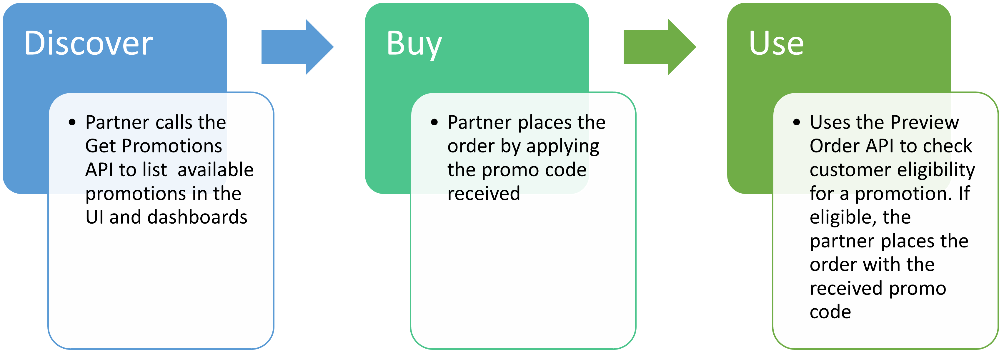

# Manage Flexible Promotions

The Flexible Promotion feature enables partners to easily adjust product prices, making them more attractive to different customer segments. These promotions primarily aim to boost customer retention or acquisition. You can access details about the flexible promotions available for a product in a specific market segment and region, and apply them when placing an order.

Key advantages of Flexible Promotions include:

**Discount offers to increase new product adoption:**

- Selective discounts for enterprise accounts to encourage early adoption of new products.
- Facilitates faster market penetration.

**Quick promotion launches for seasonal sales:**

- Allows partners to activate discounts within days for timely seasonal promotions like Black Friday.

**Targeted promotions for specific reseller tiers:**

- Criteria-based options for exclusive discounts to high-value resellers.

The following two types of discounts are available with flexible promotions:

1. **Percentage Discount (% off Promo):** A percentage reduction is applied to the base price of the product.
2. **Fixed Amount Discount ($ off Promo):** A fixed monetary reduction is applied to the base price of the product.

The discounts applied based on these discount types are explained in the following tables:

**Percentage Off Discount – Example: 20% discount for Acrobat Pro**

| SKU              | Original Price | Promo Price |
|------------------|----------------|-------------|
| 30006208CA01A12  | $89.99         | $71.99      |
| 30006208CA02A12  | $87.99         | $70.39      |
| 30006208CA03A12  | $85.99         | $68.79      |
| 30006208CA04A12  | $83.99         | $67.19      |
| 30006208CA012A12 | $79.99         | $63.99      |
| 30006208CA013A12 | $77.99         | $62.39      |
| 30006208CA014A12 | $75.99         | $60.79      |

**Fixed Amount Discount – Example: $20 discount for Acrobat Express**

| SKU              | Original Price | Discount Amount | Promo Price |
|------------------|----------------|-----------------|-------------|
| 30006208CA01A12  | $89.99         | $20.00          | $69.99      |
| 30006208CA02A12  | $87.99         | $20.00          | $67.99      |
| 30006208CA03A12  | $85.99         | $20.00          | $65.99      |
| 30006208CA04A12  | $83.99         | $20.00          | $63.99      |
| 30006208CA012A12 | $79.99         | $20.00          | $59.99      |
| 30006208CA013A12 | $77.99         | $20.00          | $57.99      |
| 30006208CA014A12 | $75.99         | $20.00          | $55.99      |

These discounts are applied to an offer using a promotion code. Partners must use this promotion code while placing the order to get a discounted price for their purchase. The same promotion can be applied to multiple products.

## Eligibility criteria

Flexible promotions are accessible to all VIP Marketplace customers, irrespective of their current discounts, including Linked Memberships or High-Volume Discounts. However, eligibility is determined by other factors, such as the customer's market segment and country.

## Partner integration process  

Partners need to facilitate the discovery and application of Flexible Promotions. Perform the steps illustrated in the following figure to get a discounted price using flexible promotions:

