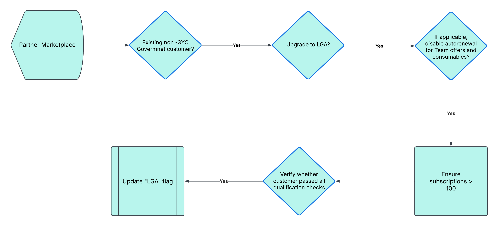
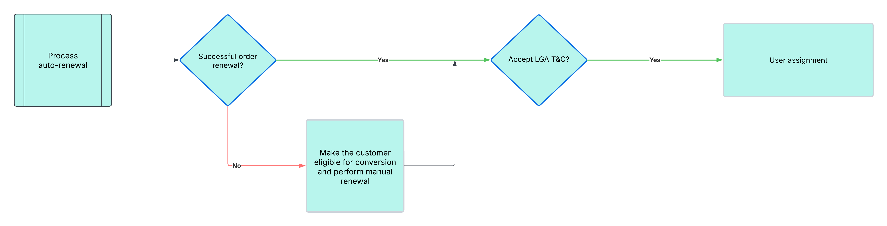

# Convert an existing government customer to LGA

You can convert an existing government customer to an LGA. An LGA-enabled distributor can do this in the last 30 days of the customer's current term (Anniversary date –30 (AD-30)). Ensure that the following conditions are met to convert a GOV customer to an LGA:

- If the customer holds any Team offer or consumables, the `autoRenewal` must be turned off.
- The customer should not be part of any active Linked Memberships. If required, the  customer can join an LGA-specific Linked Membership after the AD.
- The customer should not be applied for or committed to Three-Year Commits (3YC).
- The `marketSegment` of the customer must be `GOV`.
- The `country` must be US or Canada.
- `renewalQuantity` must be >100.

The workflow is as follows:

**Phase 1: Collecting intent**



**Phase 2: Converting customer to LGA**



**Notes:**

- The upgrade to LGA will automatically occur at the time of the renewal order, provided the customer meets all the conditions before the upgrade is processed. If the renewal order does not meet the conditions, the subscription will expire, and the customer will need to manually place the renewal order.
- Customers who wish to become LGA in the last 30 days will not be permitted to place orders for Team offers or consumables.

The detailed steps are as follows:

1. Use the [Update Subscription API](../subscription_management/update_subscription.md) (`PATCH /v3/customers/<customer-id>/subscriptions/<subscription-id>`) to disable `autoRenewal`. A sample request body is as follows:

    ```json
    {
        "autoRenewal": {
       "enabled": false,
       "renewalQuantity": 7
    }
    }
    ```

2. Use the [GET Customer Details API](../customer_account/get_customer_account.md) (`GET: /v3/customers/<customer-id>`) to verify other aspects such as 3YC, Linked Membership, market segment, country, region, and renewal quantity.
3. Use the [Update Customer Details API](../customer_account/update_customer_account.md) (`PATCH : /v3/customers/<customer-id>`) to specify the customer as an LGA customer and marketSubSegments as FEDERAL or STATE. The request body is as follows:

    ```json
    {
    ...
    "benefits": [{
        "type": "LARGE_GOVERNMENT_AGENCY",
    }]
    "companyProfile": {
        ...
        "marketSegment": "GOV",
        "marketSubSegments": ["FEDERAL", "STATE"],
      }
      ...
    }
    ```

4. Use the [GET Customer Details API](../customer_account/get_customer_account.md) (`GET: /v3/customers/<customer-id>`) to view the LGA status and other details. The status field shows `"status":  "PENDING_UPGRADE”` to indicate that the customer will be upgraded to LGA at the AD. Sample response of the Get Customer Details API before AD:

   ```json
    {
        ...
        "benefits": [{            
        "type": "LARGE_GOVERNMENT_AGENCY",
        "status":  "PENDING_UPGRADE"
     }]
     "companyProfile": {
        ...
        "marketSegment": "GOV",
        "marketSubSegments": ["FEDERAL", "STATE"],
      }
      ...
    }
   ```

5. Subscriptions opted by the customer get updated at the Anniversary Date (AD).
6. New LGA Terms and Conditions (T&C) are created on the Anniversary Date. This new T&C will replace the existing T&C. Renewal will happen at LGA level 06-09. Admin Console will present the new LGA T&C for acceptance at the next login.
7. Use the Get Customer Details API after AD, to verify the LGA details of the customer.

Sample response of the Get Customer API after AD:

```json
{
  "externalReferenceId": "240715235148492799",
  "customerId": "1005512199",
  "resellerId": "1000250355",
  "status": "1000",
  "companyProfile": {
    "companyName": "Test organization for linked membership",
    "preferredLanguage": "en-US",
    "marketSegment": "GOV",
    "marketSubSegments": [
      "FEDERAL"
    ],
    "address": {
      "country": "US",
      "region": "CA",
      "city": "SAN JOSE",
      "addressLine1": "3453 Park Ave",
      "addressLine2": "3453 Park Ave",
      "postalCode": "95110",
      "phoneNumber": ""
    },
    "contacts": [
      {
        "firstName": "ABC",
        "lastName": "Corporation",
        "email": "email@domain.com",
        "phoneNumber": "28880-7323-8195"
      }
    ]
  },
  "discounts": [
    {
      "offerType": "LICENSE",
      "level": "01"
    }
  ],
  "cotermDate": "2025-07-16",
  "creationDate": "2024-07-15T23:51:49Z",
  "benefits": [
    {
      "type": "LARGE_GOVERNMENT_AGENCY",
      "status": "ACTIVE"
    }
  ],
  "globalSalesEnabled": false,
  "links": {
    "self": {
      "uri": "/v3/customers/1005512199",
      "method": "GET",
      "headers": []
    }
  }
}
```
