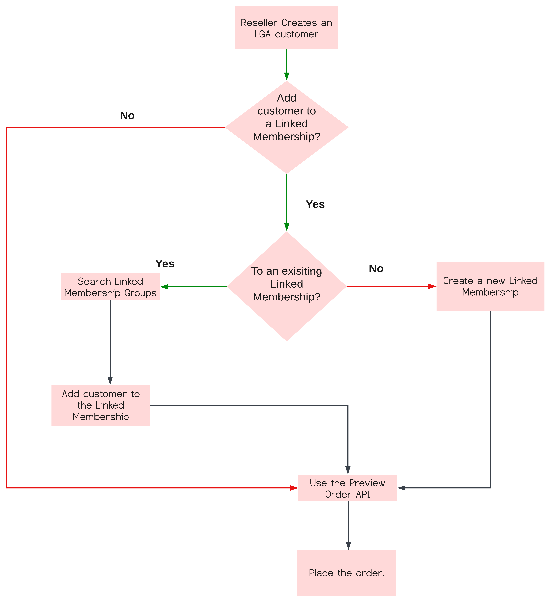

# Create an LGA customer

It is recommended that distributors follow a defined process for setting up an LGA customer account and placing an order.



## APIs to create and manage an LGA customer

You need to use the following APIs at various steps of the workflow to create an LGA customer:

1. Create an LGA customer:

    - Create a customer: [POST /v3/customers](#1-create-an-lga-customer)
    - Verify customer details: [GET/v3/customers/{customer-id}](#2-get-customer-details)

2. Add LGA customers to a Linked Membership group. You can select one of these two options:

    - **Option 1:** Add LGA customer to an existing Linked Membership Group:
        - Search Linked Membership Groups: [GET /v3/linked_membership_groups](#3-search-linked-membership-groups)
        - Add to an existing group: [POST /v3/customers/{customer_id}/linked_membership/enroll/{linked_membership_id}](#4-add-an-lga-customer-to-an-existing-linked-membership-without-needing-an-authorization-code)
    - **Option 2:** Create a Linked Membership for the LGA customer:
        - [PATCH /v3/customers/{customer-id}](#4-add-an-lga-customer-to-an-existing-linked-membership-without-needing-an-authorization-code)

3. Place an order:

    - Preview Order API: [POST /v3/orders](../order_management/order_scenarios.md), with `orderType` set to `Preview`
    - Create Order API: [POST /v3/orders](../order_management/create_order.md), with `orderType` set to `NEW`

The subsequent sections explain these APIs in detail.

### 1. Create an LGA customer

Use the `POST /v3/customers` API to create an LGA customer. Here are the specifics that differ from the standard Create Customer request:

- The `benefits` array must include the `LARGE_GOVERNMENT_AGENCY` indicator for the LGA customer.
- The `marketSegment` should be set to `GOV` for LGA customers.
- The `marketSubSegments` field is mandatory for LGA customer creation and should have one of the following values:  `FEDERAL` or `STATE`.

#### Request

```json
{
  "resellerId": "5556667778",
  "externalReferenceId": "342",
  "companyProfile": {
    "companyName": "Fairmont",
    "preferredLanguage": "en-US",
    "marketSegment": "GOV",
    "marketSubSegments": ["FEDERAL"],  //  "FEDERAL" or "STATE"
    "address": {
      "country": "US",
      "region": "CA",
      "city": "San Jose",
      "addressLine1": "200 Fairmont Ave",
      "addressLine2": "Apt 123",
      "postalCode": "95110-1234",
      "phoneNumber": "800-123-4567"
    },
    "contacts": [
      {
        "firstName": "Donald",
        "lastName": "Duck",
        "email": "donald@duck.com",
        "phoneNumber": "408-123-4567"
      }
    ]
  },
  "benefits": [
    {
      "type": "LARGE_GOVERNMENT_AGENCY"
    }
  ]
}
```

#### Response

```json
{
  "externalReferenceId": "342",
  "customerId": "9876543210",
  "resellerId": "5556667778",
  "globalSalesEnabled": false,
  "companyProfile": {
    "companyName": "Fairmont",
    "preferredLanguage": "en-US",
    "marketSegment": "GOV",
    "marketSubSegments": [
      "FEDERAL"
    ],
    "address": {
      "country": "US",
      "region": "CA",
      "city": "San Jose",
      "addressLine1": "200 Fairmont Ave",
      "addressLine2": "Apt 123",
      "postalCode": "95110-1234",
      "phoneNumber": "800-123-4567"
    },
    "contacts": [
      {
        "firstName": "Donald",
        "lastName": "Duck",
        "email": "donald@duck.com",
        "phoneNumber": "408-123-4567"
      }
    ]
  },
  "discounts": [
    {
      "offerType": "LICENSE",
      "level": "08"
    }
  ],
  "benefits": [
    {
      "type": "LARGE_GOVERNMENT_AGENCY",
      "status": "ACTIVE"
    }
  ],
  "cotermDate": "",
  "creationDate": "2019-05-02T22:49:52Z",
  "status": "1002",
  "links": {
    "self": {
      "uri": "/v3/customers/9876543210",
      "method": "GET",
      "headers": []
    }
  }
}
```

The following table provides descriptions for the response parameters:

|Property|Type|Description| Range/Limits|
|:----|:----|:----|:----|
|externalReferenceId|string| Optional <br /> Marketplace’s ID for customer. ID does not need to be unique.|Max: 35 characters|
|customerId <br /> (read only)|string|Unique ID for customer created upon account creation.|Max: 40 characters|
|resellerId|string|ID of reseller tied to customer.|Max: 40 characters|
|globalSalesEnabled|String|Global status of a customer.| |
|linkedMembership|linkedMembership resource| Information about the Linked Membership.| |
|companyProfile|companyProfile resource|Information about the customer.| |
|discounts|discounts resource|Details of the discount applicable to the customer, including the discount level.| |
|benefits|benefits resource|Details of the benefits applied to the customer account and its corresponding status. For example, the type parameter indicates `LARGE_GOVERNMENT_AGENCY` if the customer is an LGA customer.| |
|cotermDate <br /> (read only)|String (date)|Date that renewal order is to be placed. This should be one year after first order is provisioned (if a 1-year term) and gets updated upon each renewal order.|10 characters|
|creationDate <br />(read only)|String (datetime)|Date and time of account creation | Date and time in UTC. |
|status <br /> (read only)|string|Status code of customer account.|4 characters|
|links <br /> (read only)|Links resource|Deep links to get customer account details.| |

For more details, see [Create Customer API](../customer_account/create_customer_account.md) and [Customer Account parameters](../references/resources.md#customer-top-level-resource).

### 2. Get customer details

You can use the `GET: /v3/customers/{customer-id}` API to get the details of a customer and its LGA details.

#### Request Body

No change to the request body of the standard GET customer API request.

#### Response

```json
{
  "externalReferenceId": "240715235148492799",
  "customerId": "1005512199",
  "resellerId": "1000250355",
  "status": "1000",
  "companyProfile": {
    "companyName": "Test organization for linked membership",
    "preferredLanguage": "en-US",
    "marketSegment": "GOV",
    "marketSubSegments": [
      "FEDERAL"
    ],
    "address": {
      "country": "US",
      "region": "CA",
      "city": "SAN JOSE",
      "addressLine1": "3453 Park Ave",
      "addressLine2": "3453 Park Ave",
      "postalCode": "95110",
      "phoneNumber": ""
    },
    "contacts": [
      {
        "firstName": "ABC",
        "lastName": "Corporation",
        "email": "email@domain.com",
        "phoneNumber": "28880-7323-8195"
      }
    ]
  },
  "discounts": [
    {
      "offerType": "LICENSE",
      "level": "01"
    }
  ],
  "cotermDate": "2025-07-16",
  "creationDate": "2024-07-15T23:51:49Z",
  "benefits": [
    {
      "type": "LARGE_GOVERNMENT_AGENCY",
      "status": "ACTIVE"
    }
  ],
  "globalSalesEnabled": false,
  "linkedMembership": {
    "id": "51001315",
    "name": "This is the LM Created for 1005513636",
    "type": "STANDARD",
    "linkedMembershipType": "OWNER",
    "creationDate": "2024-07-17T03:47:35",
    "country": "US",
    "benefitTypes": [
      "LARGE_GOVERNMENT_AGENCY"
    ],
},
  "links": {
    "self": {
      "uri": "/v3/customers/1005512199",
      "method": "GET",
      "headers": []
    }
  }
}
```

The following details are displayed in the respose body of an LGA customer:

- The `benefits` array shows `LARGE_GOVERNMENT_AGENCY` if the customer is an LGA.
- The `linkedMembership` array shows `benefitTypes` and `country` fields.

For more details, refer to [Get Customer Details API](../customer_account/get_customer_account.md).

### 3. Search Linked Membership Groups

To use an existing Linked Membership for the LGA customer, use the GET /v3/linked_membership_groups API to search for Linked Membership Groups that match your criteria. You can refine the search using query parameters.

Usage instructions:

- The Search Linked Membership Groups API searches only for LGA Linked Memberships, and only LGA-enabled distributors can use this search API.
- You can use query parameters such as `country` and `name`.

Sample request with query parameters: `GET <ENV>/v3/linked_membership_groups?country=US&name=SampleName`

#### Query parameters

|Query Params Name|Type|Mandatory?|Description|Range/Limits|
|:----|:----|:----|:----|:----|
|country|String|Yes|Country of linked membership to search. It is a mandatory parameter for searching LGA Linked Memberships.|US", "CA" for LGA Linked Memberships. |
| name | String |No | Name or part of the name of the Linked Membership to search. |Min: 0 characters <br /> Max: 80 characters|

#### Request Header

See [Headers Section](../references/api_headers.md)

#### Request Body

None.

#### Response

```json
[
  {
  
    "id": "31002062",
    "name": "Linked Membership Name",
    "type": "STANDARD",  // “STANDARD” or “CONSORTIUM”
    "creationDate": "2024-05-31T10:35:01",
    "marketSegment": "GOV",
    "country": "US",
    "membersCount": 5,
    "benefitTypes": [
      "LARGE_GOVERNMENT_AGENCY"
    ],
    "discounts": [
      {
        "offerType": "LICENSE",
        "level": "06"
      }
    ]
  }

]
```

**LinkedMembership resource**

|Property Name|Type|Description|Range/Limits|
|:----|:----|:----|:----|
|id|string|The unique ID of the Linked Membership.|Max: 40 characters|
|name|string|Name of the Linked Membership.|Max: 80 characters|
|type|string|Type of the Linked Membership.|STANDARD", "CONSORTIUM|
|creationDate|string|Date and time when Linked Membership was created.|Time in UTC|
|marketSegment|string|Market segment of the Linked Membership.|GOV", "COM", "EDU"; only " GOV" is applicable for LARGE_GOVERNMENT_AGENCY |
|country | string |Country for which the Linked Membership is applicable. |Min: 2 characters, Max: 2 characters |
|membersCount |Integer| Number of members in a Linked Membership. | Min: 0 Max: 999999 |
| benefitTypes |Array of strings |An array of benefit types. <br /> LARGE_GOVERNMENT_AGENCY| Max: 40 characters |
|discounts|Discounts resource array|Applicable discounts for Linked Membership.| |

**Discounts resource in linkedMembership**

|Property Name|Type|Description|Range/Limits|
|:----|:----|:----|:----|
|offerType|string|Type of offer|"LICENSE" only for LARGE_GOVERNMENT_AGENCY |
|level| string| Discount level|Level 06-09 for LARGE_GOVERNMENT_AGENCY|

##### HTTP status codes

- 2xx – Success
- 4xx – Error in client’s request
- 5xx – Error in Adobe servers

|Status code|Message|Description|
|:----|:----|:----|
|200|OK|List of Linked Memberships successfully returned.|
|400|Bad Request|The request was unable to be completed due to some client error|
|401|Unauthorized|The authorization token is invalid|
|403|Forbidden|The API key is invalid|
|404|Not Found|The requested resource does not exist|

### 4. Add an LGA customer to an existing Linked Membership without needing an authorization code

The enroll customer API allows partners and distributors to use the distributor's auth token and add LGA customers to an existing Linked membership without needing an authorization code.

**Note:** The LGA customer being added to the Linked Membership must be from the same country as the Linked Membership.

**Request URL:** `POST <ENV>/v3/customers/{customer_id}/linked_membership/enroll/{linked_membership_id}`

#### Request Header

See [API Headers](../references/api_headers.md).

#### Request Body

None.

#### Response

```json
{
"message" : "Customer Successfully enrolled in the Linked Membership"
}
```

##### HTTP status codes

- 2xx – Success
- 4xx – Error in client’s request
- 5xx – Error in Adobe servers

|Status code|Message|Description|
|:----|:----|:----|
|200|OK|Member successfully added to the Linked Membership|
|400|Bad Request|The request was unable to be completed due to some client error|
|401|Unauthorized|The authorization token is invalid|
|403|Forbidden|The API key is invalid|
|404|Not Found|Invalid Customer ID or Linked Membership ID|

### 5. Create a new Linked Membership for LGA customers

Use the [Update Customer Details](../customer_account/update_customer_account.md) API (`PATCH : /v3/customers/{customer-id}`)  to create a new Linked Membership and to add the LGA customer to it.

**Notes:**

- If the customer is LGA, the Linked Membership created through UpdateCustomer API, will be of type LGA.
- The country, market segment, and discount levels of the Linked Membership will be picked from the customer.

#### Request Body

```json
{
  "linkedMembership": {
    "type": "STANDARD",
    "name": "This is the LM Created for 1005516130"
  },
  "companyProfile": {
    "companyName": "Test Customer 33a0e0bc-e38f-4b65-a5a2-8ccad6ea0e8",
    "preferredLanguage": "en-US",
    "marketSegment": "GOV",
    "marketSubSegments": [
      "FEDERAL"
    ],
    "address": {
      "country": "US",
      "region": "CA",
      "city": "San Jose",
      "addressLine1": "345 Park Ave",
      "addressLine2": "",
      "postalCode": "95110",
      "phoneNumber": ""
    },
    "contacts": [
      {
        "firstName": "David",
        "lastName": "John",
        "email": "dave.j+LM-3YC-23@adobetest.com"
      }
    ]
  }
}
```

#### Response

Same response as that of [Get Customer Details](../customer_account/get_customer_account.md) API.
