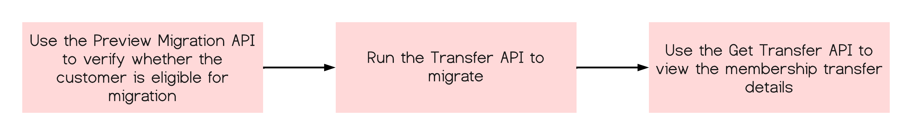

# Migrate LGA customers from VIP to VIP Marketplace

The standard migration workflow is as follows:



## 1. Preview Migration API (Preview Offers)

Use the [Migration Preview](../migration/preview_offers.md) (`GET /v3/memberships/{{membershipId}}/offers`) API to verify whether the customer is eligible for migration. For LGA customers, the benefits array shows the type as `LARGE_GOVERNMENT_AGENCY`, as shown in the following example:

```json
{
  "totalCount": 1,
  "items": [
    {
      "offerId": "12345678CA01A12",
      "currencyCode": "USD",
      "quantity": 10,
      "renewalDate": "2020-06-08"
    }
  ],
  "benefits": [
    {
      "type": "LARGE_GOVERNMENT_AGENCY"
    }
  ],
  "discounts": [
    {
      ...
    }
  ]
}
```

Read more about [Preview Transfer API](../migration/preview_offers.md).

## 2. Transfer API (Migration)

Use the [POST /v3/memberships/{membership-id}/transfers](../migration/transfer_subscription.md) API to migrate. Different error codes will be returned for LGA ineligible cases during migration.

A sample response is as follows:

```json
{
  "transferId": "110014510",
  "customerId": "1005472660",
  "resellerId": "1000187468",
  "creationDate": "2024-07-03T06:04:01Z",
  "status": "1000",
  "totalCount": 1,
  "lineItems": [
    {
      "lineItemNumber": 1,
      "offerId": "65304479CA01A12",
      "quantity": 110,
      "subscriptionId": "9bec01597a466898af170a5a203bb1NA",
      "renewalDate": "2025-06-10T16:22:08.000+00:00"
    }
  ],
  "benefits": [
    {
      "type": "LARGE_GOVERNMENT_AGENCY",
      "commitmentRequest": null,
      "recommitmentRequest": null
    }
  ],
  "discounts": [
    ... // existing fields
  ],
}
```

For more information, see [Transfer API](../migration/transfer_subscription.md).
