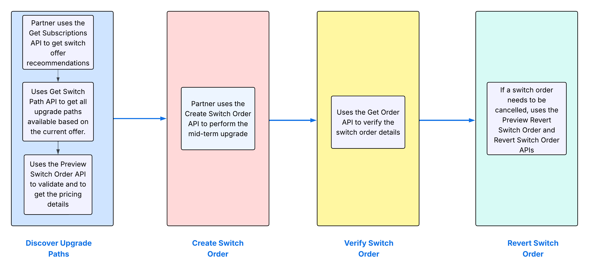

# Mid-term upgrade

The Mid-Term Upgrade capability in VIP Marketplace enables partners to upgrade customer's product subscriptions during the active term rather than waiting for the renewal cycle.  It allows transitions to higher-tier offerings such as moving from Teams to Enterprise products.

### Upgrade path

Upgrade Paths are a foundational element of mid-term upgrades. They define valid transitions between products and are used to guide partners and customers through structured upgrade journeys. A simple one to one upgrade path is supported. For example:

- Teams to Enterprise
  - Acrobat Standard Teams to Acrobat Standard Enterprise
  - Acrobat Standard to Pro
  - Acrobat Pro Teams to Acrobat Studio Enterprise
- Adobe Creative Cloud Teams to Adobe Creative Cloud Pro Teams
- Adobe Creative Cloud Single App (for example, Photoshop for Teams) to Adobe Creative Cloud All Apps for Teams
- CCE Edition 3 to CCE Edition 4

Upgrade paths include a `switchType` indicator that defines whether the upgrade must be full or can be partial:

- **Full switch**  
  The entire quantity of the original subscription is upgraded to the new product.

  **Example:** All 100 seats of Acrobat Standard Teams need to be switched to Acrobat Standard Enterprise.
  The upgrade path will be marked as FULL_ONLY.

- **Partial switch**  
  Only a portion of the original subscription quantity is upgraded.  

  **Example:** Out of 100 seats, only 40 are switched to Acrobat Standard Enterprise, and the remaining 60 stay on the original product.
  If upgrade path is marked PARTIALLY_ALLOWED, partner can upgrade partially also along with full.

**Note:** After a full switch, only the new product renews. After a partial switch, both products renew. Anniversary date remains unchanged.

### Reassigning users

During the mid-term upgrade process in VIP Marketplace, partners have the option to automatically reassign users from the original subscription to the upgraded product. To enable this, partners should include the query parameter `reassign-users=true` when submitting the switch order request.

Reassigning users follows a LIFO (Last-In-First-Out) strategy, meaning the most recently assigned users are reassigned first.

## Advantages of mid-term upgrade

- **Customer Flexibility**: Customers can access advanced features and higher-value products when needed, without waiting for the end of their subscription term.
- **Revenue Acceleration**: Adobe and its partners can capture upsell opportunities immediately, which improves annual recurring revenue and reduces deferred income.
- **Simplified Partner Workflow**: Upgrade flows are streamlined through API support and preview functionality, making it easier for resellers to manage transitions.
- **Reversal Support**: Upgrades can be reverted within a 14-day window, which provides operational safety and customer assurance.
- **Pricing Transparency**: Provides prorated pricing, corrected discount levels, and refund estimates.

## Limitations

- **Complex Upgrades Excluded**: Combining multiple single apps into All Apps is not supported due to complexity in license mapping and pricing.
- **Partial Upgrade Restrictions**: Certain partial upgrades may be limited based on product eligibility or financial viability. Subscriptions tagged as high growth offers or certain global customer products are excluded from switch eligibility.

## Mid-term upgrade process

The following figure illustrates the upgrade process:

For more information:

- [Discover upgrade paths](./apis.md#discover-upgrade-path)
- [Create switch order](./apis.md#apply-switch-plan)
- [Validate switch order](./apis.md#verify-switch-order)
- [Revert switch orders](./apis.md#revert-switch-order)
