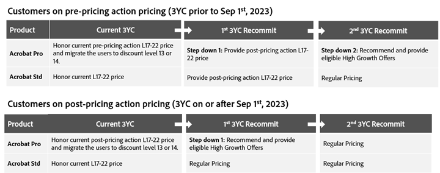
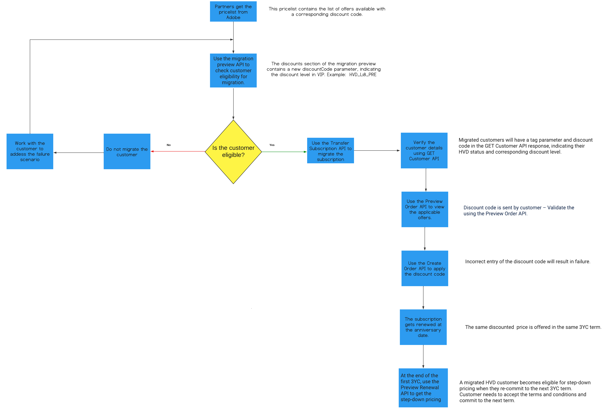

# Migrate High Volume Discount customers from VIP to VIP Marketplace

Three-year commitment (3YC) customers benefiting High Volume Discounts in the VIP buying program can migrate to the VIP Marketplace. Only the Acrobat customers in COM (commerce) and GOV (government) market segments and on discount level 17-22 can be migrated to VIP Marketplace. These customers will be reassigned to discount levels 13 or 14 in the VIP Marketplace to ensure consistency in discount offerings.

The discount rates after migration depend on their current Acrobat subscription and pricing plan, as shown below:



Customers with 50-99 licenses are migrated to discount level 13 and with 100 + licenses are migrated to discount level 14 in VIP MP.

## Migration workflow

### prerequisites

To migrate high-volume discounts from VIP to VIP MP, the following eligibility criteria must be met:

- The customer must be enrolled in a three-year commitment (3YC).
- The number of licenses must be > Minimum Committed Quantity (MCQ) of 3YC. If required, the MCQ must be updated in VIP prior to migration.
- Adobe provides a price list with partners. Each HVD Acrobat Pro subscription in the price list includes a discount code, indicating the corresponding discount level for VIP customers. For instance, if the HVD customer migrating to VIP MP is at discount level 18, the partner must offer a corresponding price that ensures the same discount post-migration. The following discount codes are available:

| Discount codes for customers on pre-price actions pricing | Discount codes for customers on post-price actions pricing |
| --------------------------------------------------------- | ---------------------------------------------------------- |
| HVD_L17_PRE                                               | HVD_L17_POST                                               |
| HVD_L18_PRE                                               | HVD_L18_POST                                               |
| HVD_L19_PRE                                               | HVD_L19_POST                                               |
| HVD_L20_PRE                                               | HVD_L20_POST                                               |
| HVD_L21_PRE                                               | HVD_L21_POST                                               |
| HVD_L22_PRE                                               | HVD_L22_POST                                               |

### Migration steps

The workflow for migrating an HVD customer from VIP to VIP Marketplace is illustrated in the following figure:



## HVD customer migration using API

### 1. Preview migration

Use the Migration Preview (`/v3/memberships/{{membershipId}}/offers`) API to verify whether the customer is eligible for migration. This API returns a discount code, indicating the customer’s eligibility and applicable discount level.

Sample response:

```json
{
  ...
  "benefits": [ ... ],
  "discounts": [
    {
      "level": "14",
      "offerType": "LICENSE",
      "discountCode": "HVD_L18_PRE"
    }
  ]
}
```

**Note:** Refer to the [Migration Preview](preview_offers.md) section for the full set of response.

The newly introduced discount code parameter indicates the discount level and whether the existing subscription is based on the pre-price action pricing or post-price action pricing. For example, HVD_L18_PRE specifies that the HVD customer is at discount level 18 and received the pre-price action pricing for the current subscription.

### 2. Transfer subscription

Use the Transfer Subscription API (`POST /v3/memberships/<membership-id>/transfers`) to migrate the subscription from VIP to VIP MP. Read more about [Transfer Subscription API](transfer_subscription.md).

### 3. Post migration steps

#### 3.1 Get customer details

Partners can use the GET Customer Details API to identify migrated HVD customers distinctly to offer them special pricing for their current and upcoming 3YC terms. The migrated customer consists of newly introduced tags and `discountCode` parameters indicating the customer type and discount level.

```json
{
  ...
  "tags": ["HVD_MIGRATED_CUSTOMER"],
  "discounts": [
    {
      "level": "12",
      "offerType": "LICENSE",
      "discountCode": "HVD_L18_PRE"
    }
  ]
}
```

**Note:** Refer to the [Get Customer Details](../customer_account/get_customer_account.md) section for the full set of response.

#### 3.2 Preview Order

Use the Preview Offer API (POST /v3/orders) to get the offers available to the migrated customer.

Sample request:

```json
{
  "orderType": "PREVIEW",
  "externalReferenceId": "759",
  "currencyCode": "USD",
  "lineItems": [
    {
      "extLineItemNumber": 4,
      "offerId": "80004567EA01A12",
      "quantity": 1,
      "currencyCode": "USD",
      "deploymentId": "12345",
      "discountCode": "HVD_L18_PRE"
    }
  ]
}
```

The `discountCode` can be null, correct, or wrong. Irrespective of your entry, the Preview Offer API returns the correct offer ID as shown in the following sample response:

```json
{
  "referenceOrderId": "",
  "orderType": "PREVIEW",
  "externalReferenceId": "759",
  "orderId": "",
  "customerId": "9876543210",
  "currencyCode": "USD",
  "creationDate": "2019-05-02T22:49:54Z",
  "status": "",
  "lineItems": [
    {
      "extLineItemNumber": 4,
      "offerId": "80004567EA01A12",
      "quantity": 1,
      "subscriptionId": "",
      "status": "",
      "currencyCode": "USD",
      "deploymentId": "12345",
      "discountCode": "HVD_L18_PRE"
    }
  ]
}
```

**Note:** Refer to the [Preview Order](../order_management/create_order.md) section for the full set of response.

#### 3.3 Create Order

Use the Create Order API (`POST /v3/orders`) to create an order with the discounted price for the migrated customer based on the current discount level.

Sample request:

```json
{
  "orderType": "NEW",
  "externalReferenceId": "759",
  "currencyCode": "USD",
  "lineItems": [
    {
      "extLineItemNumber": 4,
      "offerId": "80004567EA01A12",
      "quantity": 1,
      "currencyCode": "USD",
      "deploymentId": "12345",
      "discountCode": "HVD_L18_PRE"
    }
  ]
}
```

The `discountCode` may be null, correct, or wrong offer ID. The new order will be created only if you provide a valid discount code.

Sample response:

```json
{
  "referenceOrderId": "",
  "orderType": "NEW",
  "externalReferenceId": "759",
  "customerId": "9876543210",
  "orderId": "5120008001",
  "currencyCode": "USD",
  "creationDate": "2019-05-02T22:49:54Z",
  "status": "1002",
  "lineItems": [
    {
      "extLineItemNumber": 4,
      "offerId": "80004567EA01A12",
      "quantity": 1,
      "status": "1002",
      "subscriptionId": "",
      "currencyCode": "USD",
      "deploymentId": "12345",
      "discountCode": "HVD_L17_PRE"
    }
  ],
  "links": { ... }
}
```

Refer to the [Create Order](../order_management/create_order.md) section for the full set of response.

#### 3.4 Preview Renewal

Use the Preview Renewal API to get the step-down pricing for the next term.

Sample request:

```json
{
  "referenceOrderId": "",
  "orderId": "",
  "customerId": "1005388836",
  "currencyCode": "USD",
  "orderType": "PREVIEW_RENEWAL",
  "status": "",
  "lineItems": [
    {
      "extLineItemNumber": 1,
      "offerId": "65324918CA02A12",
      "quantity": 10,
      "discountCode": "HVD_L17_PRE",
      "subscriptionId": "a5ea3c7a764545a711d2a153678f02NA",
      "status": ""
    }
  ]
}
```

Sample response:

```json
{
  "referenceOrderId": "",
  "orderId": "",
  "customerId": "1005388836",
  "currencyCode": "USD",
  "orderType": "PREVIEW_RENEWAL",
  "status": "",
  "lineItems": [
    {
      "extLineItemNumber": 1,
      "offerId": "65324918CA02A12",
      "quantity": 10,
      "discountCode": "HVD_L17_POST",
      "subscriptionId": "a5ea3c7a764545a711d2a153678f02NA",
      "status": ""
    }
  ],
  "creationDate": "2024-04-01T07:26:05Z"
}
```

For example, if a customer on level 17 and on pre-pricing action pricing, this API provides HVD_L17_POST as the discount code for the second 3YC term. Read more about [Preview Renewal](../order_management/create_order.md) API.
