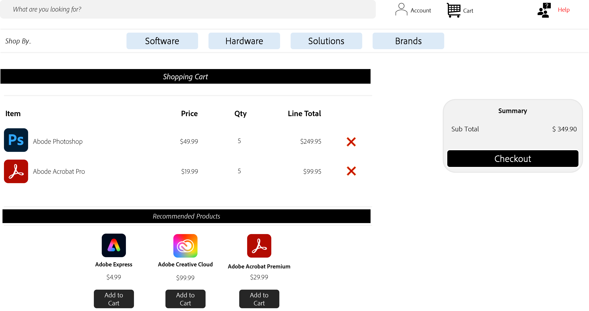
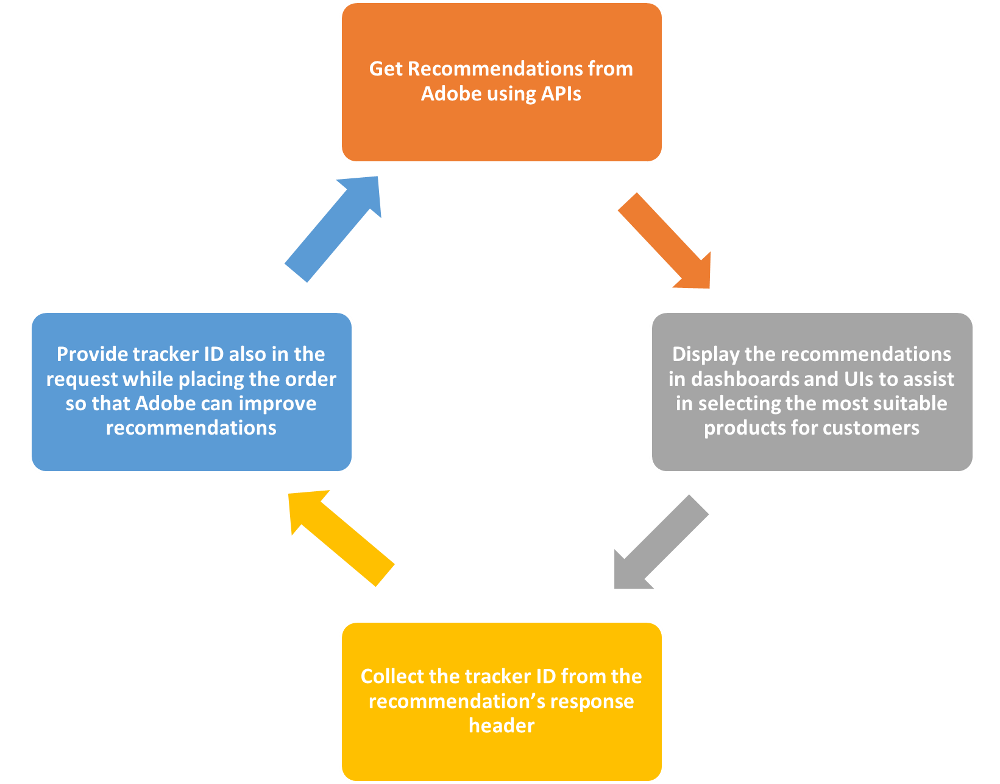
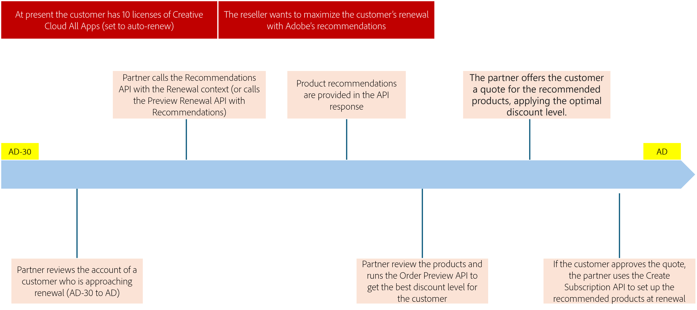

# Manage recommendations

Adobe's APIs enable VIP Marketplace partners to deliver intelligent, personalized, and in-context product recommendations, enhancing customer experience through upsell, cross-sell, and add-on opportunities. This boosts customer satisfaction and retention, benefiting resellers and Adobe with growth and increased customer engagement and conversion.

Adobe's recommendations are context-aware, tailored to the products the customer has or intends to purchase. For instance, new customers receive different suggestions compared to existing ones. These recommendations are presented at various phases of the user journey: discover, buy, use, and renew. Sample recommendations include:

- CC All Apps Pro for CC All Apps customers
- Acrobat Pro for Acrobat Standard customers
- Creative Cloud Enterprise Edition 4 for Creative Cloud Enterprise customers
- Adobe Express for non-Adobe Express customers
- Acrobat AI Assistant to Acrobat Pro customers

These recommendations provide details of the product available for the customer in the upsell, cross-sell, and add-on motions.

## Partner integration process to provide recommendations

In the VIP Marketplace, users can be either 'resellers' or 'end-customers,' depending on the partner's business strategy and marketplace design. A reseller places orders against the customer's business account, whereas the customer navigates the partner marketplace to find products to order against their business account.

Regardless of the user type, the journey remains the same, as the recommendations API focuses on customer-centric recommendations. For example, a partner can use the Preview Order API to list the recommendations, as illustrated in the following example:

Below is a high-level overview of the partner integration model for providing recommendations:

**Note:** Sending the tracker ID received with the recommendations back to Adobe helps Adobe gain insights into the effectiveness of the recommendations and improve future suggestions.

## Sample Recommendations Use Case

The following use case demonstrates how to obtain recommendations for a customer who is 30 days from the Anniversary Date (AD).

### Scenario

- Customer is in the AD-30 interval (renewal period)
- Partner is ready to quote the reseller or customer and wants to explore recommended additional products.
- Autorenewal is enabled.

The following figure illustrates how recommendations are fetched to assist customers in selecting the best products that meet their needs:

Read more about [how to manage recommendations using APIs](./apis.md).
