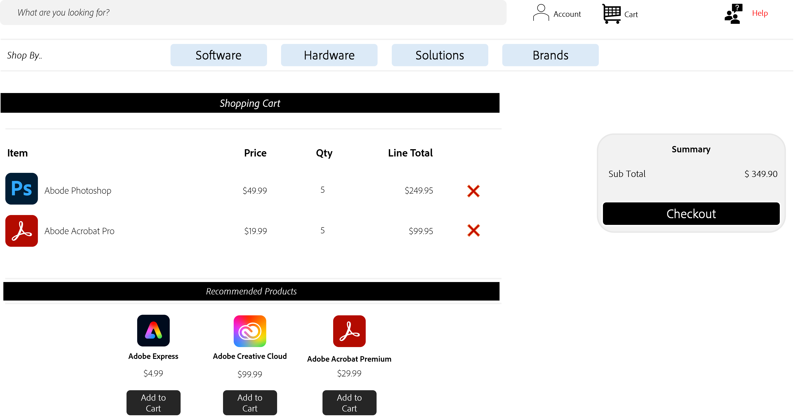
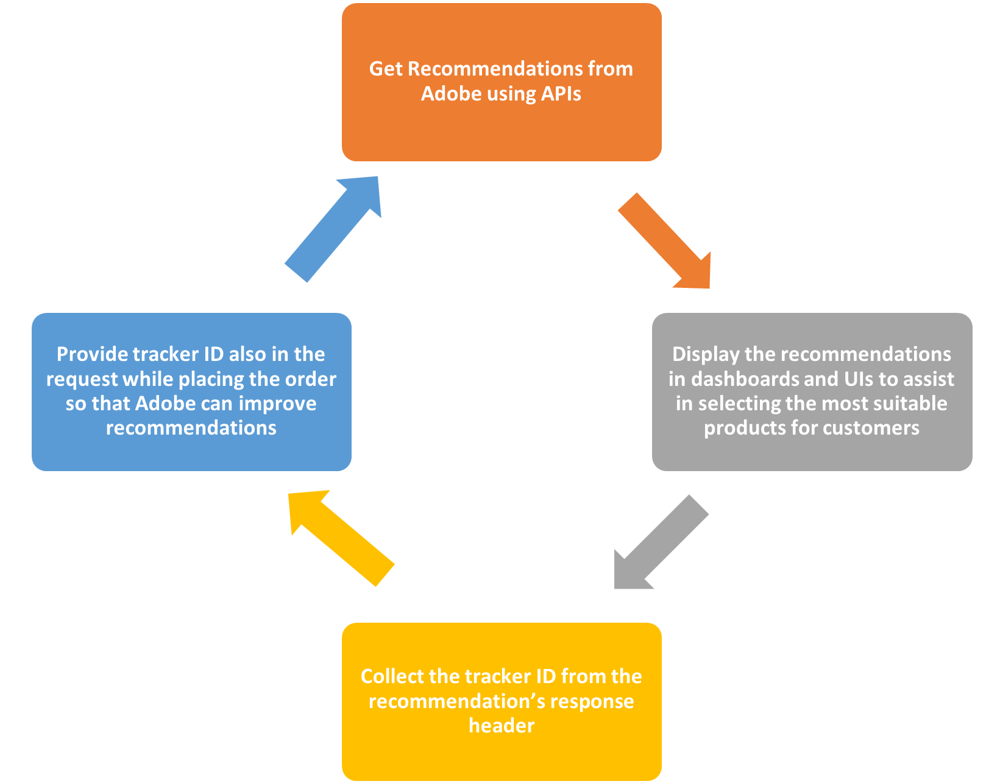
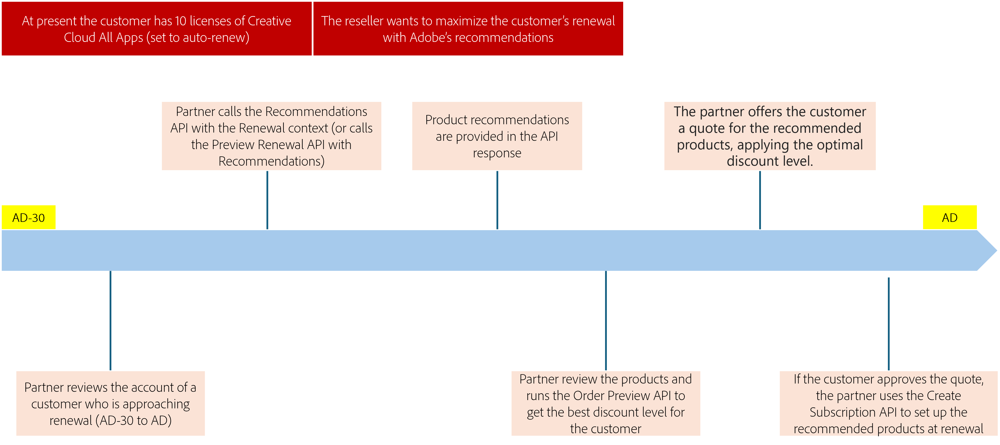

# Manage Recommendations

Adobe's APIs enable VIP Marketplace partners to deliver intelligent, personalized, and in-context product recommendations, enhancing customer experience through upsell, cross-sell, and add-on opportunities. This boosts customer satisfaction and retention, benefiting resellers and Adobe with growth and increased customer engagement and conversion.

Adobe's recommendations are context-aware, tailored to the products the customer has or intends to purchase. For instance, new customers receive different suggestions compared to existing ones. These recommendations are presented at various phases of the user journey: discover, buy, use, and renew. Sample recommendations include:

- CC All Apps Pro for CC All Apps customers
- Acrobat Pro for Acrobat Standard customers
- Creative Cloud Enterprise Edition 4 for Creative Cloud Enterprise customers
- Adobe Express for non-Adobe Express customers
- Acrobat AI Assistant to Acrobat Pro customers

These recommendations provide details of the product available for the customer in the upsell, cross-sell, and add-on motions.

In the VIP Marketplace, users can be either 'resellers' or 'end-customers,' depending on the partner's business strategy and marketplace design. A reseller places orders against the customer's business account, whereas the customer navigates the partner marketplace to find products to order against their business account.

Regardless of the user type, the journey remains the same, as the recommendations API focuses on customer-centric recommendations. For example, a partner can use the Preview Order API to list the recommendations, as illustrated in the following example:

## Recommendation Ranking and Ordering

The [Fetch Recommendations](./apis.md#fetch-recommendations) API returns a ranked list of product recommendations tailored to an individual customer. Each recommendation includes both a `category` and a `rank`, which together define how partners should interpret and present the results.

### Recommendation categories

Recommendations are grouped into the following categories:

- **Upsell**
    Recommends a higher-tier version of a product the customer already owns.

- **Cross-sell**  
    Recommends complementary products that extend the value of the customer’s existing products.

- **Addon**  
    Recommends additional products or services that enhance the current product experience.

These categories are designed to reflect the type of opportunity.

### Ranking within categories

Within each category, multiple recommendations may be offered and are further prioritized using a ranking attribute to help partners identify the order of relevance.

For a customer with Acrobat Standard, the API may return:

| Category | Product                     | Rank |
|----------|-----------------------------|------|
| Upsell   | Acrobat Pro                 | 0    |
| Upsell   | Acrobat Studio              | 1    |
| Addon    | Acrobat AI Assistant (AIA)  | 0    |

In the example above:

- **Acrobat Pro** is the highest-priority upsell recommendation.
- **Acrobat Studio** is a secondary upsell option.
- **AIA** is the top (and only) addon recommendation.

### Dynamic nature of recommendations

Recommendations are generated dynamically at runtime based on:

- Customer entitlements
- Market and regional factors
- Product availability
- Recommendation engine logic

As a result:

- Partners should invoke the Recommendation API in real time for each customer interaction.
- Partners should not cache or hardcode SKU mappings.
- The set of recommendations and their ranking may change over time.

### Best practices

- Always fetch recommendations per customer session or transaction.
- Display recommendations grouped by category and ordered by rank.
- Design UI components to handle variable list lengths.
- Avoid building logic that depends on fixed product relationships or static hierarchies.

## Partner integration process to provide recommendations

Below is a high-level overview of the partner integration model for providing non-overlay recommendations:

**Note:** Sending the tracker ID received with the recommendations back to Adobe helps Adobe gain insights into the effectiveness of the recommendations and improve future suggestions.

## Sample Recommendations Use Case

The following use case demonstrates how to obtain recommendations for a customer who is 30 days from the Anniversary Date (AD).

### Scenario

- Customer is in the AD-30 interval
- Partner is ready to quote the reseller or customer and wants to explore recommended additional products.
- Autorenewal is enabled.

The following figure illustrates how recommendations are fetched to assist customers in selecting the best products that meet their needs:

## Overlay recommendations

Adobe agents frequently engage directly with customers during overlay interactions to understand their needs and assess purchase intent. When an agent identifies a clear intent to purchase, a lead is generated on behalf of the customer and persisted within a Recommendation object. This lead is surfaced to the customer's assigned partner through the existing [Fetch Recommendations](./apis.md#fetch-recommendations) API.

Overlay recommendations bridge the coordination gap between Adobe and partners by providing timely, actionable visibility into customer purchase intent. With this information, partners can proactively engage the customer, continue the conversation, and efficiently complete order placement.

### How overlay recommendations differ from product recommendations?

| Aspect | Product Recommendations | Overlay Recommendations |
|---|---|---|
| Source | Generated algorithmically by the recommendation engine | Created by Adobe agents during overlay interactions |
| Purpose | Suggest upsell, cross-sell, and add-on opportunities | Communicate customer purchase intent to partners |
| Structure | `productRecommendations` with `upsells`, `crossSells`, `addOns` | `overlayRecommendations` with `new` and `renew` lead arrays |
| Lifecycle | Dynamic per request | Stateful: OPEN, consumed on order placement, or expired |

Both types are returned together in the [Fetch Recommendations](./apis.md#fetch-recommendations) response, allowing partners to discover product recommendations and purchase-intent leads in a single API call.

Read more about [how to manage recommendations using APIs](apis.md).
