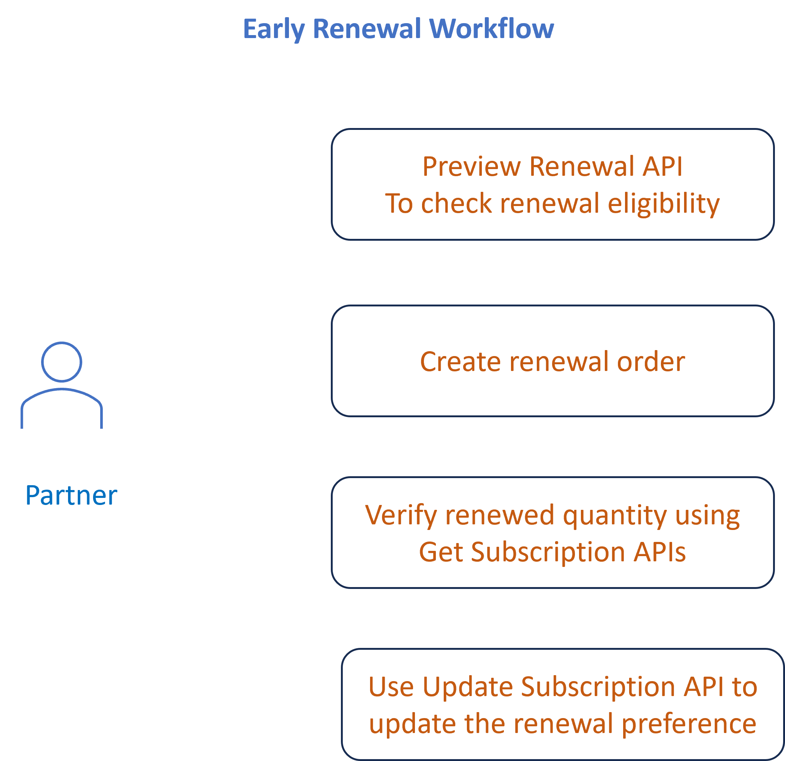

# Manage manual renewals using APIs

The following two renewal types are supported:

- [Early renewals](#early-renewals)
- [Late renewals](#late-renewals)

## Early renewals

Early renewal enables partners to renew subscriptions before AD. It introduces new behavior in the subscription lifecycle and state transitions.

The following are the key capabilities and rules that define how early renewal works in practice:

- **Place renewal orders ahead of AD**

  Partners can submit renewal orders before the customer’s AD. These orders are invoiced immediately upon placement.

- **Order return period**

  The return period is 14 days, and it starts from the date the order is placed.Returns are allowed both before and after the AD; however, the AD does not roll back after a return.

- **Price effective date**
  - **For non-3YC customers:**  The price effective date is based on the order placement date.
  - **For 3YC customers:** Based on the license commitment start date. Early renewal does not modify the customer’s commitment cycle. When a customer under 3YC attempts to renew early (before AD), the system preserves the integrity of the 3‑year commitment. In 3YC, AD is not reset to the early renewal date.
Instead, AD is rolled over only after renewal is processed, ensuring that the next renewal cycle remains aligned with the original 3YC structure.

- **Quantity and product rules**  
  - The first early renewal order must include only existing products and quantities.
  - Offer‑level validation ensures that the ordered quantity (plus any previously renewed quantity) does not exceed the customer’s current quantity.
  - Seats or products additions are allowed only after the initial early renewal order is successfully processed.

  **Note:** EOL SKUs can be early renewed only for 3YC customers and are blocked for non‑3YC customers; EOS SKUs cannot be early renewed for any customer type.

- **Subsequent orders**  
  Partners must place any subsequent renewal orders only after the first early renewal order is fully processed. Concurrent (back‑to‑back) orders without waiting for order completion are not allowed.

- **Impact on renewal preferences**  
  Early renewal does not alter the customer’s renewal preferences or quantities set for auto-renewal. The renewal date remains unchanged and continues to drive system‑initiated auto‑renewals. After an early renewal, only the anniversary date is updated. The renewal date remains unchanged and continues to serve as the auto‑renew trigger.

#### Impact of early renewal on anniversary date and renewal date

| Attribute            | Changes After Early Renewal? | Description                                                                 |
|----------------------|------------------------------|-----------------------------------------------------------------------------|
| Anniversary Date (AD) | ✔ Yes                        | Updated (“rolled over”) to next AD after first early renewal order.         |
| Renewal Date          | ✖ No                         | Remains unchanged; continues to trigger auto-renewal attempts.              |

### Examples: Early Renewal, Auto‑Renewal, and AD Behavior

| Example | Scenario Description | Initial State | Partner or System Action | System Behavior | Renewal Result |
|--------|-----------------------|---------------|---------------------------|------------------|--------------------------|
| **1** | Early renewal before AD (AD rolls over immediately) | AD = Nov 30, 2025<br>Renewal Date = Nov 30, 2025<br>Current quantity = 100 | Partner renews 100 seats on Nov 10, 2025 | AD updates to Nov 30, 2026<br>Renewal Date stays Nov 30, 2025<br>renewed_quantity = 100 | Auto‑renewal finds no remaining seats. <br /><br />AD changes. Renewal Date does not change. |
| **2** | Early renewal of partial quantities | AD = Oct 1, 2025<br>Renewal Date = Oct 1, 2025<br>Current quantity = 100 | Partner early‑renews 40 seats on Sep 10 | AD is updated to Oct 1, 2026<br>renewed_quantity = 40 | On Renewal Date, remaining 60 seats are auto‑renewed. <br /><br /> Early renewal covers part; auto‑renewal completes the rest. |
| **3** | Multiple early renewal orders | AD = Jan 31, 2026<br>Renewal Date = Jan 31, 2026<br>Current quantity = 200 | Jan 1: Renew 120 seats early<br>Jan 5: Renew remaining 80 seats early | After first: AD is updated to Feb 1, 2027, renewed_quantity = 120<br>After second: renewed_quantity = 200 | On Renewal Date, no remaining seats. <br /> <br />AD rolls over only once, after the first early renewal. |
| **4** | Return order after early renewal | Customer early renews 100 seats, AD rolls over. | Partner returns 20 seats | renewed_quantity = 80<br>AD does not roll back | On Renewal Date, system renews 20 remaining seats.<br /> <br />Returns reduce renewed_quantity, not AD. |
| **5** | Auto‑renewal without early renewal | AD = Apr 15, 2026<br>Renewal Date = Apr 15, 2026<br>renewal_quantity = 50 | No early renewal; auto‑renew runs on Renewal Date | System renews 50 seats | AD rolls to Apr 15, 2027. <br /><br /> Auto‑renew always rolls AD when it completes. |
| **6** | Late renewal (after AD) | AD = July 10, 2026 | Partner renews on July 20 | System processes renewal immediately | AD rolls to July 10, 2027 as part of renewal completion | <br /><br /> Late renewal behaves like normal renewal: AD rolls when renewal completes. |
| **7** | AD and Renewal Date divergence | AD = Dec 1, 2025<br>Renewal Date = Dec 1, 2025 | Early renewal on Nov 15, 2025 | AD is updated to Dec 1, 2026<br>Renewal Date stays Dec 1, 2025 | Auto‑renew runs but finds everything renewed; next year dates align | <br /> <br />Early renewal can cause dates to diverge temporarily, but they align again in the next cycle. |

### Early renewal workflow using APIs



#### 1. Preview Renewal

The `Create Order` API with `orderType` set to `PREVIEW_RENEWAL` allows partners to simulate a renewal order before the actual renewal is processed. This helps validate renewal eligibility, pricing, and offer availability in advance.

**Notes:**

- `subscriptionId` is necessary when the order is for an existing subscription
- If the intention is to renew a new offer, then it is optional.
   - Optionally, in this case, `deploymentId` and `currency` can be included as valid properties.
- The order request will be rejected if a subscriptionId is found for the offerId included in the request.

**Request**

- URL: `<ENV>/v3/customers/<customer-id>/orders`
- Body:

   ```json
   {
  "orderType": "PREVIEW_RENEWAL",
  "externalReferenceId": "759",
  "currencyCode": "USD",
  "lineItems": [
    {
      "extLineItemNumber": 1,
      "offerId": "80004567EA01A12",
      "subscriptionId": "e0b170437c4e96ac5428364f674dffNA",
      "quantity": 10

    }
    ]
  }
  ```

**Response**

  ```json
     {
     "referenceOrderId": "",
     "externalReferenceId": "",
     "orderId": "",
     "customerId": "1006370655",
     "currencyCode": "USD",
     "orderType": "PREVIEW_RENEWAL",
     "creationDate": "2025-05-02T22:49:54Z",
     "status": "",
    "lineItems": [
      {
        "extLineItemNumber": 1,
        "offerId": "11083117CA03A12",
        "quantity": 10,
        "subscriptionId": "3d0630693446f8bdff9cbd08f4b68bNA",
        "status": "1000",
        "currencyCode": "USD",
        "proratedDays": 365,
        "pricing": {
          "partnerPrice": 350.50,
          "discountedPartnerPrice": 350.50,
          "netPartnerPrice": 350.50,
          "lineItemPartnerPrice": 3505.00
        }
      }
     ]
     }
  ```

#### 2. Create renewal order

Use the `POST /v3/customers/<customer-id>/orders` endpoint with `orderType` `RENEWAL` to place a renewal order. 

**Notes:**

- `subscriptionId` is necessary when the order is for an existing subscription
- If the intention is to create a subscription for a new offer, then it is optional.
   - Optionally, in this case, `deploymentId` and `currency` can be included as valid properties.
- The order request will be rejected if a subscriptionId is found for the offerId included in the request.

**Request:**

```json
{
  "orderType": "RENEWAL",
  "externalReferenceId": "759",
  "currencyCode": "USD",
  "lineItems": [
    {
      "extLineItemNumber": 1,
      "offerId": "80004567EA01A12",
      "subscriptionId": "e0b170437c4e96ac5428364f674dffNA",
      "quantity": 10

    }
  ]
}
```

**Response**

```json
{
  "referenceOrderId": "",
  "orderType": "RENEWAL",
  "externalReferenceId": "759",
  "customerId": "9876543210",
  "orderId": "5120008001",
  "currencyCode": "USD",
  "creationDate": "2019-05-02T22:49:54Z",
  "status": "1002",
  "lineItems": [
    {
      "extLineItemNumber": 1,
      "offerId": "80004567EA01A12",
      "quantity": 1,
      "status": "1002",
      "subscriptionId": "e0b170437c4e96ac5428364f674dffNA"
    }
  ],
  "links": { ... }
}
```

#### 3. Verify renewed quantity details using GET Subscriptions API

Use the `<ENV> /v3/customers/<customer-id>/subscriptions/<subscription-id> ` or `<ENV> /v3/customers/<customer-id>/subscriptions` API to verify renewed quantity for the subscription.

The `renewedQuantity` parameter in the response indicates the quantity that was manually renewed before the Anniversary Date.

A sample response is as follows:

```json
{
  "subscriptionId": "1c3a4517c44cfc925704fe942a79abNA",
  "offerId": "65304479CA01A12",
  "currentQuantity": 10,
  "usedQuantity": 0,
  "autoRenewal": {
    "enabled":true,
    "renewalQuantity": 5
  },

"renewedQuantity":5,
  "creationDate": "2024-09-13T09:22:13Z",
  "renewalDate": "2025-09-13",
  "status": "1000",
  "currencyCode": "USD",

  "links": {
    "self": {
      "uri": "/v3/customers/123456789/subscriptions/1c3a4517c44cfc925704fe942a79abNA",
      "method": "GET",
      "headers": []
    }
  }
}
```

## Late renewals

Late renewal occurs after the AD when the subscription either did not auto‑renew or was opted out of auto‑renewal.

Rules:

- Occurs after Anniversary Date (AD) up to the allowed grace period (typically 14 days).
- Partners can renew expired or near‑expired subscriptions manually during this window.
- Can only include products from the previous term.
- Quantity must be equal to or less than the previous‑term quantity.
- Additional quantity is not allowed in the renewal order.
- New purchases require a separate new Create Order workflow.

**Note:** You can use the same set of APIs mentioned above for [Early Renewals](#early-renewals), to perform late renewals as well. A renewal‑type order placed after the AD is considered a late renewal order. Whereas, a renewal type of order placed with line item before AD will be considered an Early Renewal Order.
