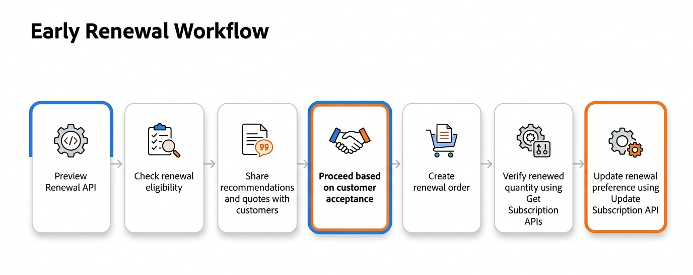

# Manage manual renewals using APIs

Partners can manually renew subscriptions using APIs to preview eligibility and pricing, submit early or late renewal orders, and manage quantities and offer rules. This enables flexible renewal timing while maintaining service continuity and compliance with subscription rules.

The following two manual renewal types are supported:

| Variant | When | Rules |
|---------|------|-------|
| [Early renewal](#early-renewals) | Before AD (between AD-30 and AD-1) | New products and extra seats allowed. Invoiced immediately. AD rolls over after the first early renewal. Not allowed in the final term of a three‑year commitment (3YC) unless the customer recommits. |
| [Late renewal](#late-renewals) | After AD, within grace period (typically 14 days) | Same products only; quantity ≤ prior term. No new products or extra quantity in the renewal order. |

## Quick reference

| What you need | Where to go |
|---------------|-------------|
| Preview renewal pricing and eligibility | -  [Preview Renewal Order](../order-management/create-order.md)  (`POST /v3/customers/{customerId}/orders` with `orderType: "PREVIEW_RENEWAL"`). See [Order scenarios](../order-management/order-scenarios.md) for more details. |
| Place a renewal order (early or late) | `POST /v3/customers/{customerId}/orders` with `orderType: "RENEWAL"`. See [Create Order](../order-management/create-order.md) and [Order scenarios](../order-management/order-scenarios.md). |
| Verify renewed quantity | - [Get details of all subscriptions of a customer](../subscription-management/get-details-for-customers.md) (`GET /v3/customers/{customerId}/subscriptions`) <br /> - [Get details of a specific subscription](../subscription-management/get-details.md) (`GET /v3/subscriptions/{subscriptionId}`) |
| Renewal-specific error codes | [Error codes specific to early renewals](error-codes.md) |

## Early renewals

Early renewal allows partners to renew subscriptions before the AD and introduces specific lifecycle and validation rules.

### Key rules

- Orders placed before AD are invoiced immediately.
- The return period is 14 days from order placement. Returns do not roll back the AD.
- The AD rolls over only once, after the first successful early renewal order.
- Subsequent renewal orders are allowed only after the previous order is fully processed.

### Pricing behavior

- **Non‑3YC customers:** Price effective date is the order placement date.
- **3YC customers:** Price effective date is based on the license commitment start date. Early renewal does not reset the 3YC commitment cycle.

### Quantity and product rules

- The first early renewal can include existing products or new products.
- Offer‑level validation ensures renewed quantity does not exceed the customer’s current entitlement.
- Additional seats or products are allowed only after the first early renewal is processed.
- EOL SKUs can be early renewed only for 3YC customers.
- EOS SKUs cannot be early renewed.

#### Impact of early renewal on anniversary date and renewal date

| Attribute             | Changes After Early Renewal? | Description                                                         |
|-----------------------|:-----------------------------:|---------------------------------------------------------------------|
| Anniversary Date (AD) | Yes                        | Updated (“rolled over”) to next AD after first early renewal order. |
| Renewal Date          | No                         | Remains unchanged; continues to trigger auto-renewal attempts.      |

### Examples: Early Renewal, Auto‑Renewal, and AD Behavior

| Scenario                                | Initial State                                                                  | Partner or System Action                                                | System Behavior                                                                                             | Renewal Result                                                                                                                 |
|-----------------------------------------------------|--------------------------------------------------------------------------------|-------------------------------------------------------------------------|-------------------------------------------------------------------------------------------------------------|--------------------------------------------------------------------------------------------------------------------------------|
| Early renewal before AD (AD rolls over immediately) | AD = Nov 30, 2025<br />Renewal Date = Nov 30, 2025<br />Current quantity = 100 | Partner renews 100 seats on Nov 10, 2025                                | AD updates to Nov 30, 2026 <br />Renewal Date stays Nov 30, 2025<br />renewed_quantity = 100                | Auto‑renewal finds no remaining seats. <br /> <br /> AD changes. Renewal Date does not change.                                 |
| Early renewal of partial quantities                 | AD = Oct 1, 2025<br />Renewal Date = Oct 1, 2025<br />Current quantity = 100   | Partner early‑renews 40 seats on Sep 10                                 | AD is updated to Oct 1, 2026<br />renewed_quantity = 40                                                     | On Renewal Date, remaining 60 seats are auto‑renewed. <br /><br /> Early renewal covers part; auto‑renewal completes the rest. |
| Multiple early renewal orders                       | AD = Jan 31, 2026<br />Renewal Date = Jan 31, 2026<br />Current quantity = 200 | Jan 1: Renew 120 seats early<br />Jan 5: Renew remaining 80 seats early | After first: AD is updated to Feb 1, 2027, renewed_quantity = 120<br />After second: renewed_quantity = 200 | On Renewal Date, no remaining seats. <br /> <br />AD rolls over only once, after the first early renewal.                      |
| Return order after early renewal                    | Customer early renews 100 seats, AD rolls over.                                | Partner returns 20 seats                                                | renewed_quantity = 80<br />AD does not roll back                                                            | On Renewal Date, system renews 20 remaining seats.<br /> <br />Returns reduce renewed_quantity, not AD.                        |
| Auto‑renewal without early renewal                  | AD = Apr 15, 2026<br />Renewal Date = Apr 15, 2026<br />renewal_quantity = 50  | No early renewal; auto‑renew runs on Renewal Date                       | System renews 50 seats                                                                                      | AD rolls to Apr 15, 2027. <br /><br /> Auto‑renew always rolls AD when it completes.                                           |
| Late renewal (after AD)                             | AD = July 10, 2026                                                             | Partner renews on July 20                                               | System processes renewal immediately                                                                        | AD rolls to July 10, 2027 as part of renewal completion                                                                        |
| AD and Renewal Date divergence                      | AD = Dec 1, 2025<br />Renewal Date = Dec 1, 2025                               | Early renewal on Nov 15, 2025                                           | AD is updated to Dec 1, 2026<br />Renewal Date stays Dec 1, 2025                                            | Auto‑renew runs but finds everything renewed; next year dates align                                                            |

### Early renewal workflow using APIs



#### 1. Preview Renewal

Simulate a renewal to validate eligibility, pricing, and offers before placing the order.

**Endpoint:** `POST <ENV>/v3/customers/<customer-id>/orders`

**Notes:**

- `subscriptionId` is necessary when the order is for an existing subscription
- If the intention is to renew a new offer, then it is optional.
  - Optionally, in this case, `deploymentId` and `currency` can be included as valid properties.
- The order request will be rejected if a subscriptionId is found for the offerId included in the request.

**Request**

- URL: `<ENV>/v3/customers/<customer-id>/orders`
- Body:

   ```json
   {
  "orderType": "PREVIEW_RENEWAL",
  "externalReferenceId": "759",
  "currencyCode": "USD",
  "lineItems": [
    {
      "extLineItemNumber": 1,
      "offerId": "80004567EA01A12",
      "subscriptionId": "e0b170437c4e96ac5428364f674dffNA",
      "quantity": 10
    }
    ]
  }
  ```

**Response**

  ```json
     {
     "referenceOrderId": "",
     "externalReferenceId": "",
     "orderId": "",
     "customerId": "1006370655",
     "currencyCode": "USD",
     "orderType": "PREVIEW_RENEWAL",
     "creationDate": "2025-05-02T22:49:54Z",
     "status": "",
    "lineItems": [
      {
        "extLineItemNumber": 1,
        "offerId": "11083117CA03A12",
        "quantity": 10,
        "subscriptionId": "3d0630693446f8bdff9cbd08f4b68bNA",
        "status": "1000",
        "currencyCode": "USD",
        "proratedDays": 365,
        "pricing": {
          "partnerPrice": 350.50,
          "discountedPartnerPrice": 350.50,
          "netPartnerPrice": 350.50,
          "lineItemPartnerPrice": 3505.00
        }
      }
     ]
     }
  ```

#### 2. Create renewal order

Use the `POST /v3/customers/<customer-id>/orders` endpoint with `orderType` as  `RENEWAL` to place a renewal order.

**Endpoint:** `POST <ENV>/v3/customers/<customer-id>/orders`

**Notes:**

- `subscriptionId` is necessary when the order is for an existing subscription
- If the intention is to create a subscription for a new offer, then it is optional.
  - Optionally, in this case, `deploymentId` and `currency` can be included as valid properties.
- The order request will be rejected if a subscriptionId is found for the offerId included in the request.

**Request:**

```json
{
  "orderType": "RENEWAL",
  "externalReferenceId": "759",
  "currencyCode": "USD",
  "lineItems": [
    {
      "extLineItemNumber": 1,
      "offerId": "80004567EA01A12",
      "subscriptionId": "e0b170437c4e96ac5428364f674dffNA",
      "quantity": 10

    }
  ]
}
```

**Response**

```json
{
  "referenceOrderId": "",
  "orderType": "RENEWAL",
  "externalReferenceId": "759",
  "customerId": "9876543210",
  "orderId": "5120008001",
  "currencyCode": "USD",
  "creationDate": "2019-05-02T22:49:54Z",
  "status": "1002",
  "lineItems": [
    {
      "extLineItemNumber": 1,
      "offerId": "80004567EA01A12",
      "quantity": 1,
      "status": "1002",
      "subscriptionId": "e0b170437c4e96ac5428364f674dffNA"
    }
  ],
  "links": { ... }
}
```

#### 3. Verify renewed quantity details using GET Subscriptions API

Use the Subscriptions API to confirm `renewedQuantity` and other renewal-related fields.

**Endpoints:**

- `GET <ENV>/v3/customers/<customer-id>/subscriptions/<subscription-id>`
- `GET <ENV>/v3/customers/<customer-id>/subscriptions`

The `renewedQuantity` parameter in the response indicates the quantity that was manually renewed before the Anniversary Date.

A sample response is as follows:

```json
{
  "subscriptionId": "1c3a4517c44cfc925704fe942a79abNA",
  "offerId": "65304479CA01A12",
  "currentQuantity": 10,
  "usedQuantity": 0,
  "autoRenewal": {
    "enabled":true,
    "renewalQuantity": 5
  },

"renewedQuantity":5,
  "creationDate": "2024-09-13T09:22:13Z",
  "renewalDate": "2025-09-13",
  "status": "1000",
  "currencyCode": "USD",

  "links": {
    "self": {
      "uri": "/v3/customers/123456789/subscriptions/1c3a4517c44cfc925704fe942a79abNA",
      "method": "GET",
      "headers": []
    }
  }
}
```

## Late renewals

Late renewal occurs after the AD when the subscription either did not auto‑renew or was opted out of auto‑renewal.

**Rules:**

- Occurs after Anniversary Date (AD) up to the allowed grace period (typically 14 days).
- Partners can renew expired or near‑expired subscriptions manually during this window.
- Can only include products from the previous term.
- Quantity must be equal to or less than the previous‑term quantity.
- Additional quantity is not allowed in the renewal order.
- New purchases require a separate new Create Order workflow.

**Note:** You can use the same set of APIs mentioned above for [Early Renewals](#early-renewals), to perform late renewals as well. A renewal‑type order placed after the AD is considered a late renewal order. Whereas, a renewal type of order placed with line item before AD will be considered an Early Renewal Order.

## See also

- [Manage renewals (overview)](overview.md)
- [Create Order](../order-management/create-order.md) – Full Create Order API reference
- [Order scenarios](../order-management/order-scenarios.md)
- [Get Order Details](../order-management/get-order.md)
- [Get details of a specific subscription](../subscription-management/get-details.md), [Get details of all subscriptions of a customer](../subscription-management/get-details-for-customers.md)
- [Error codes specific to early renewals](error-codes.md)
