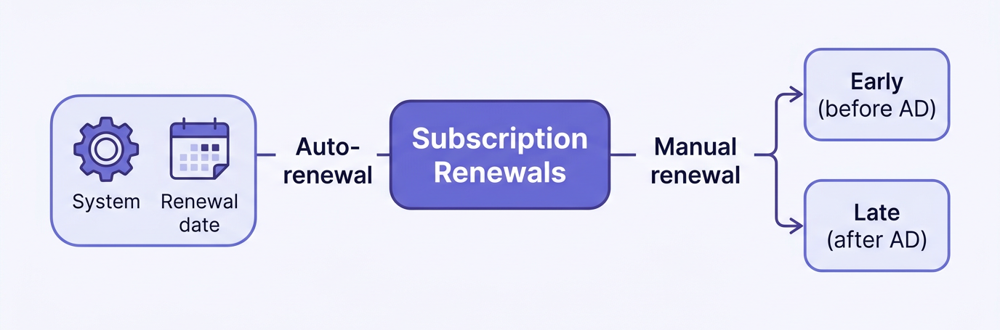

# Manage renewals

Managing subscription renewals enables partners to ensure uninterrupted service and maintain accurate subscription configurations. Adobe supports both auto-renewals, which are system-initiated, and manual renewals, which are partner-initiated and can occur either early or late.

**Key dates:**

- **Anniversary date (AD):** The contract renewal date that determines the start and end of the subscription term. The AD rolls over after a successful early renewal.
- **Renewal date:** The date on which the system runs auto-renewal. This date does not change if an early renewal is completed.

## Renewal types

### Auto-renewal (system-initiated)

- Triggered automatically by Adobe on the renewal date each year.
- Uses the subscription’s configured renewal quantity and preferences.
- No partner action is required unless the customer opts out. In that case, use [Update Subscription](../subscription-management/update-subscription.md) to disable auto-renewal.

### Manual renewal (partner-initiated)

| Variant           | When                                         | Rules                                                                                                      |
| ----------------- | -------------------------------------------- | ---------------------------------------------------------------------------------------------------------- |
| Early renewal | Before the AD, between AD-30 and AD-1          | New products and additional seats are allowed. The order is invoiced immediately. The AD rolls over after the first early renewal order. |
| Late renewal | After the AD and within the grace period, typically 14 days | Only the same products are allowed, and the quantity must be less than or equal to the prior term. New products or additional quantities are not permitted.         |

For details and API flows, see [Managing early renewals using APIs](manual-renewals.md) and [Managing auto-renewals using APIs](auto-renewals.md).

## Quick reference

| What you need                                             | Where to go                                                                                                                                        |
| --------------------------------------------------------- | -------------------------------------------------------------------------------------------------------------------------------------------------- |
| **Configure auto-renewal** (enable/disable, set quantity) | - [Create Subscription](../subscription-management/create-subscription.md) (`POST /v3/customers/<customer-id>/subscriptions`) \<br/\> -  [Update Subscription](../subscription-management/update-subscription.md) (`PATCH /v3/customers/<customer-id>/subscriptions/<subscription-id>`) |
| **Preview a renewal** (pricing, eligibility)              | `POST /v3/customers/{customerId}/orders` with `orderType: "PREVIEW_RENEWAL"`. See [Order scenarios](../order-management/order-scenarios.md) for more details.                                                              |
| **Place a renewal order** (early or late)                 | `POST /v3/customers/{customerId}/orders` with `orderType: "RENEWAL"`. See [Order scenarios](../order-management/order-scenarios.md) for more details.                                                                              |
| **Check subscription renewal state**                      | - [Get details of all subscriptions of a customer](../subscription-management/get-details-for-customers.md) (`GET /v3/customers/{customerId}/subscriptions`) \<br/\> - [Get details of a specific subscription](../subscription-management/get-details.md) (`GET /v3/subscriptions/{subscriptionId}`)  |
| **Renewal-specific error codes**                          | [Error codes specific to early renewals](error-codes.md)                                                                                           |
