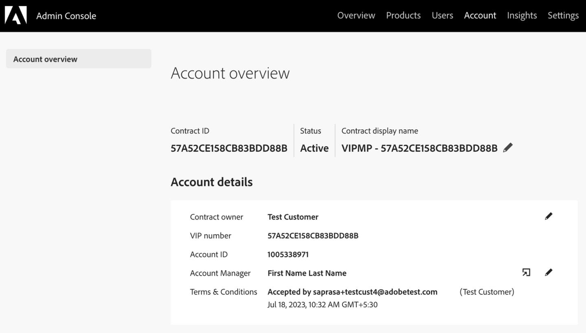
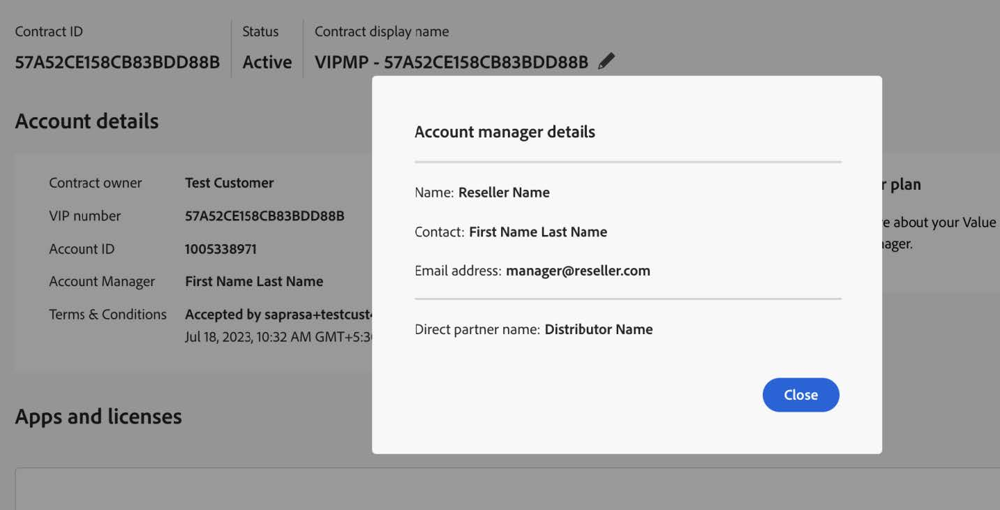
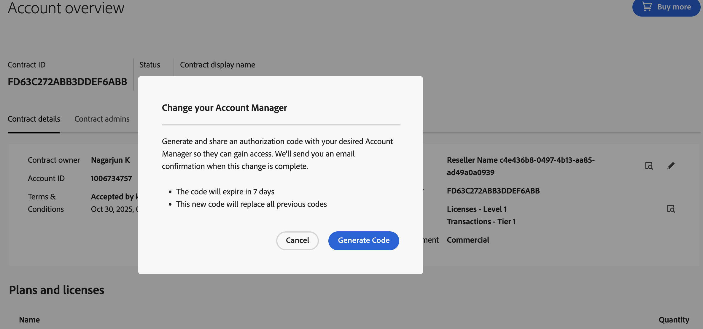
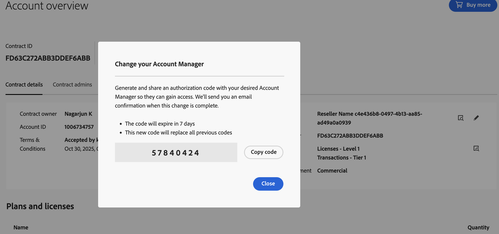
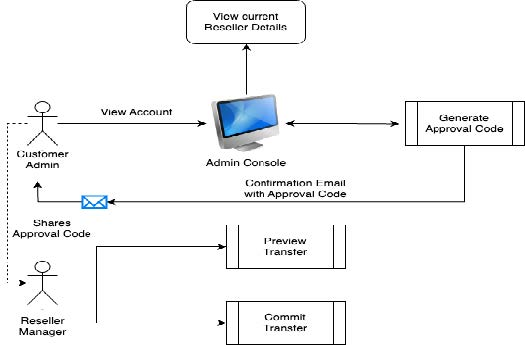

# Reseller change process

Customers can switch to a different reseller and continue with the new reseller to manage their subscriptions and orders.

Reseller Change is a customer-initiated process where a customer organization's administrator logs in to the Admin Console and checks for the current Reseller Account Manager under the Account Tab, as shown in the following figure:

Account Manager from the Reseller Organization is available in the account details. To view the Reseller Organization name and the Distributor details, click the view button that is highlighted in the above screenshot. A dialog box is displayed, showing the Reseller and Distributor information.

The edit button next to the view button allows the customer admin to opt for Reseller Change by generating an 8-digit unique code, which serves as an approval code for the new reseller to move the customer to his organization.

Click **Generate Code** to generate a new approval code.

This code is valid for 7 days. The same code is sent to all the customer administrators through email. The customer administrator then shares the approval code with the new reseller for transfer authorizations.

## Reseller change process APIs

Use the following API endpoints to manage the reseller change processes:

- [Preview transfer](preview-transfer.md)
- [Commit transfer](commit-transfer.md)
- [Get transfer](get-transfer.md)
