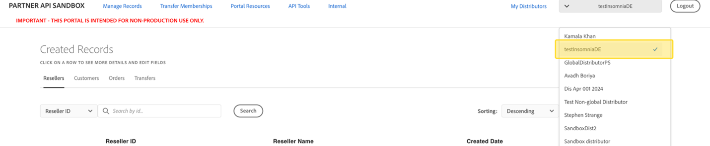

# Manage distributors

An authorized sandbox portal user may have access to one or more direct partners. To switch between partners, the user can select their desired direct partner from the drop-down menu on the right side of the menu bar.

A Portal user may request access to more direct partners by contacting the partner administrator. It is important to note that having access to credentials does not automatically grant access to the Portal, and vice versa. While credentials can be shared as needed, Portal access is managed separately through the Portal.

## Enabling Partner for Global Sales in the Portal

Follow the below steps to enable a Direct Partner for Global Sales:

1. Select the desired Direct Partner to be enabled for Global Sales on the top right of the screen. If it is not already selected, click the dropdown, and select the correct direct partner from the list.
2. Click the **My Distributors** link on the top right of the screen.
3. On the Distributor Management page, select the **Enable Global Sales** button.

    - Result: The currently selected direct partner should now be enabled for global sales.

4. Select the **Disable Global Sales** button to disable Global Sales for this direct partner.

**Notes:**

- Resellers do not need to be enabled for Global Sales.
- Direct Partners could be referred to as “Distributors” in the Sandbox Portal

