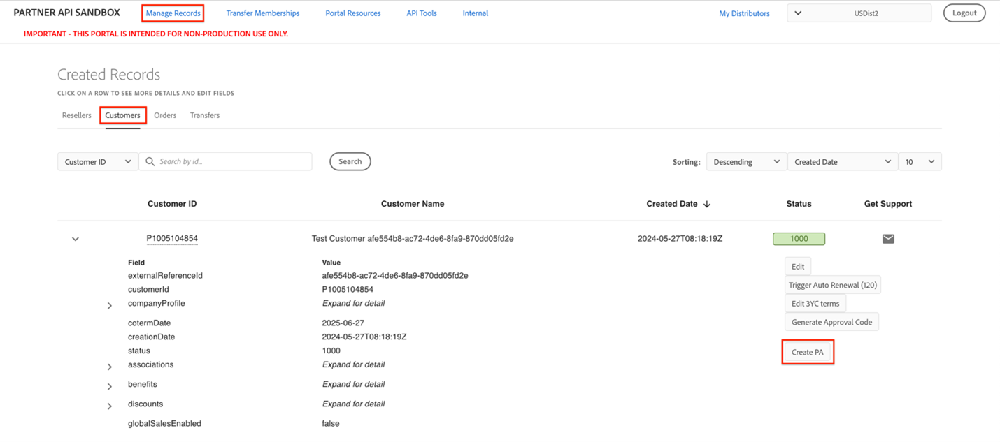

# Create Purchase Authorizations for a customer

Adding products in the Admin Console will create Purchase Authorization (PAs) that remain open for seven days. Orders must be placed before the PAs expire. You can create PAs for each customer in the Sandbox UI by following these steps:

1. Navigate to **Manage Records > Csutomers**.

2. Select **Create PA**. A dialog is displayed, allowing you to select the product and specify the quantity for the PA. A few product options will be listed for creating the PA.

3. Select the product, and specify the quanity in the **Quantity** field. The quantity can be any numeric value.

Upon successful creation, the dialog will close, and the Notifications API will now be able to display the open PA, which will remain valid for the next seven days from the date of creation.
