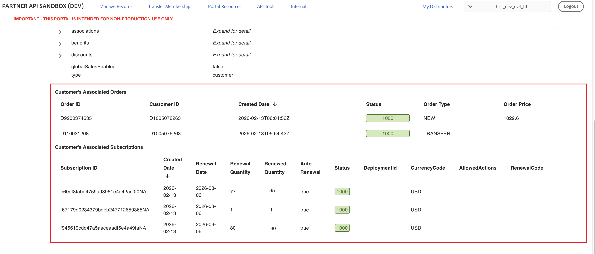
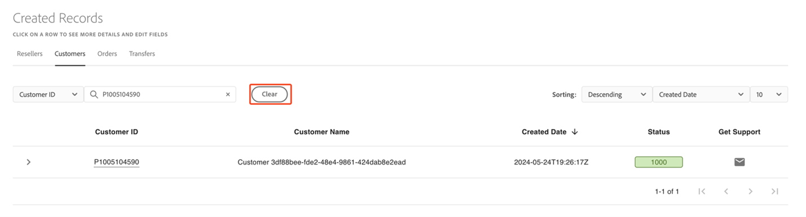
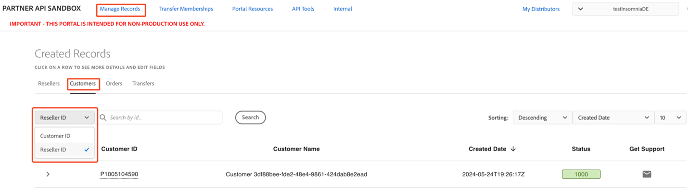

# View customer details

To access customer details, navigate to **Manage Records -> Created Records -> Customers**. The list of customers is sorted by creation date in descending order, showing the most recently created customers first.
A successfully created customer has a designated status of 1000 (Success).

Expand the view by clicking on the down arrow next to the customer ID to view a customer's detailed information. Expanding the **companyProfile** and **associations** fields also allows you to view additional information on the customer.

## Order and subscription details

The Customer details also include the orders and subscriptions that are associated with the selected customer.

This information helps partners understand the customer’s purchase history, active subscriptions, and renewal-related data.

### Customer’s associated orders

This section lists all orders that are linked to the customer.

| **Field** | **Description** |
|---|---|
| **Order ID** | The unique identifier assigned to the order. |
| **Customer ID** | The unique identifier of the customer who placed or received the order. |
| **Created Date** | The date and time when the order was created. |
| **Status** | The current status of the order. |
| **Order Type** | Indicates the type of order, such as a new order or a transfer. |
| **Order Price** | The total price of the order. A hyphen (**-**) indicates that the price is not applicable or not available for the order type. The pricing data is populated only for the orders that are created after the pricing feature is introduced. |

## Customer’s associated subscriptions

This section lists all subscriptions that belong to the customer.

| **Field** | **Description** |
|---|---|
| **Subscription ID** | The unique identifier assigned to the subscription. |
| **Created Date** | The date when the subscription was created. |
| **Renewal Date** | The date on which the subscription is scheduled to renew. |
| **Renewal Quantity** | The quantity that is set to renew at the next renewal cycle. |
| **Renewed Quantity** | The quantity that has already been renewed for the subscription. |
| **Auto Renewal** | Indicates whether the subscription is set to renew automatically. |
| **Status** | The current status of the subscription. |
| **Deployment ID** | The identifier of the deployment that is associated with the subscription. |
| **Currency Code** | The currency in which the subscription is billed. |
| **Allowed Actions** | The actions that are permitted on the subscription, based on its current state. Currently, only `MANUAL_RENEWAL` is available as the allowed action. |
| **Renewal Code** | The code associated with the renewal configuration of the subscription. |

## Sort the customer list

You can sort the customer list by:

- Created date (default)
- Customer ID
- Status
- Name

The sorted order can be set either in descending (default) or ascending order. You can also adjust the number of customers shown per page to 10 (default), 20, 30, 50, or 100 by using the corresponding sorting dropdown menus.

## Searching a customer

Two criteria can be used to search for customers in the Portal:

- [Search by customer ID](#searching-a-customer-by-customer-id)
- [Search by reseller ID](#searching-customers-by-reseller-id)

### Searching a customer by customer ID

Search for individual customers under **Manage Records -> Customers** by entering the Customer ID in the **Search by ID** field.

To return to the complete list, select **Clear**.

### Searching customers by reseller ID

Search for customers under a specific reseller under **Manage Records -> Customers**. Change the dropdown criteria to Reseller ID, enter a valid ID, and select **Search** to display all customers for that reseller.

