# Manage Flexible Discounts

Partners can get flexible discounts for a product in a specific market segment and country. These discounts can be applied while placing the order or creating a subscription. For detailed guidance on managing Flexible Discounts through APIs, refer to [Manage Flexible Discounts using APIs](../../../docs/flex-discounts/apis.md).

## Testing flexible discounts in Sandbox

You can explore and test the Flexible Discounts feature in the Sandbox environment using the following options:

- [View the available flexible discounts](#view-the-available-flexible-discounts)
- [Edit reusable flexible discounts](#edit-reusable-flexible-discounts)
- [Create, view, and manage closed discounts](#create-view-and-manage-closed-discounts)
- [View flexible discounts applied to an Order](#view-flexible-discounts-applied-to-an-order)
- [View flexible discounts applied to a subscription](#view-flexible-discounts-applied-to-a-subscription)
- [Flexible discounts for 3YC customers](#)

### View the available flexible discounts

Go to **Portal Resources > View Available Flex Discounts** to view the available flexible discounts, as shown in the following figure:

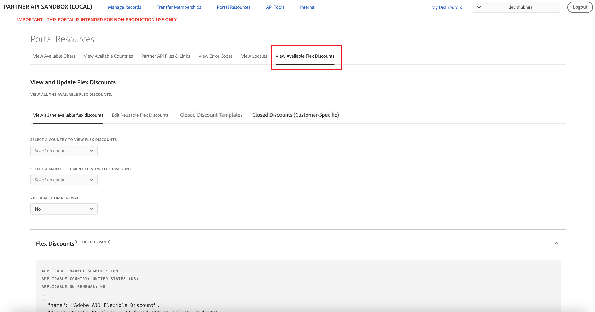

You can view Flexible Discounts applicable for all countries by selecting **All Countries**, as shown in the following figure:

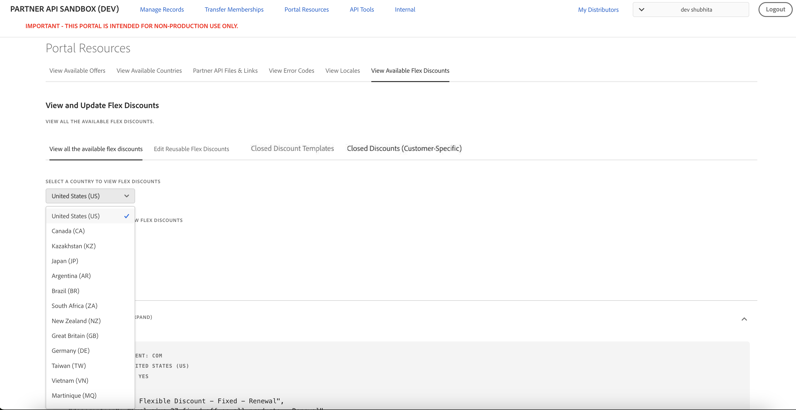

The UI displays a list of current discounts, including the following details:

- Option to filter flexible discounts based on the applicable market segments.
- Option to filter flexible discounts based on the applicable country.
- Option to filter flexible discounts applicable for renewal or for new purchases.
- Name and description of the discount.
- Discount `code` to identify the discount. Use this code to apply the discounted price.
- `category` of the discount. Possible values are: `STANDARD` and `INTRO`.
- Start and end date of discount.
- Status of the discount.
- Offer IDs the discount applies to.
- Type and value of the discount. A discount can be either a fixed discount, a percentage discount, or a fixed price. For example, if the `type` is **FIXED DISCOUNT** and `value` is **20**, and `currency` is **USD**, this means a flat discount of $20 on the offer price.
- Discount lock end date for reusable flexible discounts. This date determines the date until a reusable flexible discount can continue to be used after its end date.

You can use the discount code while placing an order using the Create Order API.

**Note:** In the Sandbox environment, Flexible Discounts that include the term "FAILURE" in both the `name` and the `code` are specifically intended for validating failure scenarios. These codes are designed to always fail when used in PREVIEW and NEW order flows. All other discount codes can be used to validate successful application scenarios. Example:

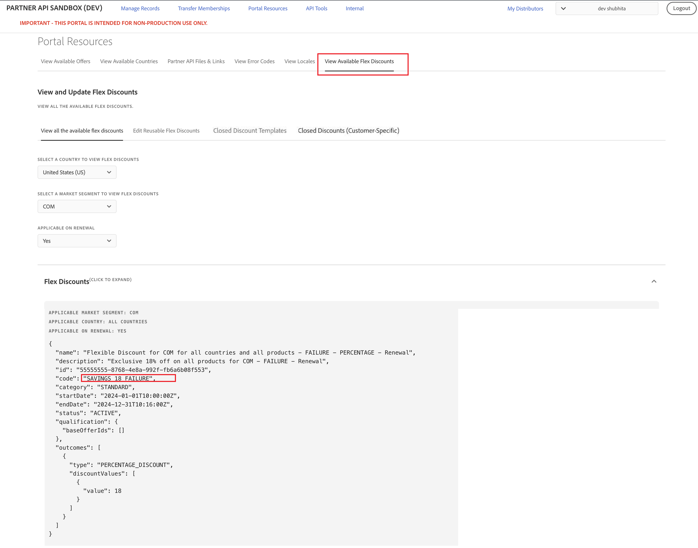

### Edit reusable flexible discounts

Reusable flexible discounts allow partners to continue using a discount for a customer even after the discount end date, provided the discount is still within its discount lock end date and the customer has already used the discount before the original end date.

The discount lock end date is exposed in the [Get Flexible Discounts API](../../../docs/flex-discounts/apis.md#get-flexible-discounts) response and in the UI for reusable flexible discounts:

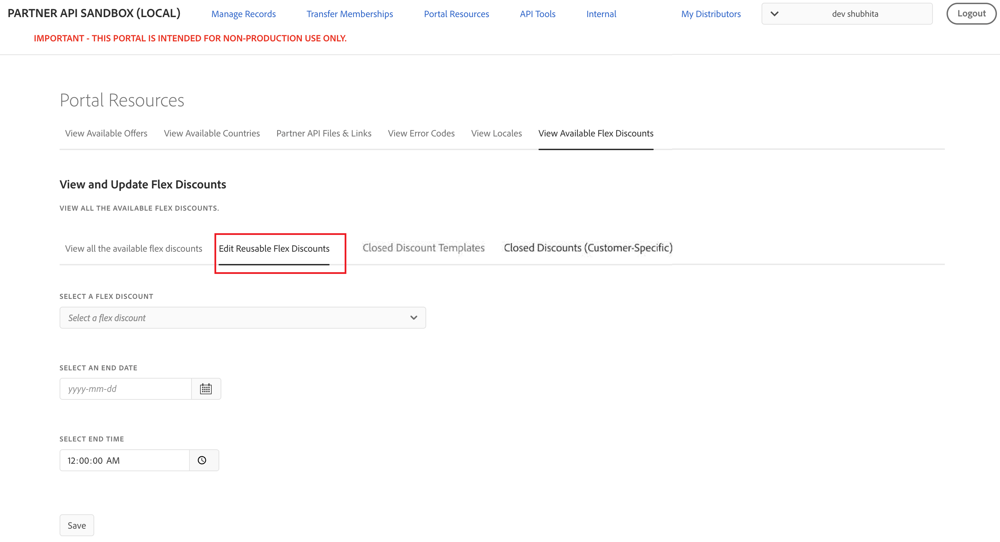

Partners can edit the end date of reusable flexible discounts of customers belong to them. This capability allows partners to continue using a reusable discount after its end date but before the discountLockEndDate. You can modify the end date of a reusable discount in the Edit Reusable Flex Discounts tab, as described in the workflow below. The updated end date must be later than the flexible discount start date and earlier than the `discountLockEndDate`.

**Note:** The time displayed in the UI, the Get Flexible Discounts API, and the Get Orders API is in UTC.

**Workflow to reuse a flexible discount after its end date**

To allow a customer to continue using a reusable flexible discount after its end date but before the discount lock end date, partners can perform the following steps:

1. Discover reusable flexible discounts

   Use the [Get Flexible Discounts API](../../../docs/flex-discounts/apis.md#get-flexible-discounts) and identify reusable flexible discounts by checking the presence of the discount lock end date.
2. Use the flexible discount before its end date

   Place an order for the customer using the reusable flexible discount before the discount end date.
3. Update the discount end date using the UI

   After the order is completed, go to **Portal Resources > View Available Flex Discounts > Edit Reusable Flex Discounts**.
4. Select the relevant reusable flexible discount and update its end date to a date that is later than the order creation date.
5. Reuse the flexible discount after its end date

   Even though the discount end date has passed, the reusable flexible discount can still be used for the same customer as long as the current date is before the discount lock end date.
6. Also customer can do PREVIEW_RENEWAL without line items to see how reusable discount is auto applied in preview renewal response, and can later enjoy same discount in Auto renewal order.

Example for editing the end date of reusable flexible discounts:

- If a customer places an order using a reusable flexible discount before its end date, for example on 1 April 2026 at 13:00:00 UTC, the end date of the reusable flexible discount can be updated after the order is completed, for example to 1 April 2026 at 13:30:00 UTC.
- The customer can then place another order using the same reusable flexible discount after the updated end date but before the `discountLockEndDate`, for example on 1 April 2026 at 13:45:00 UTC.

**Note:** The time displayed in the Edit Reusable Flex Discounts UI tab, the Get Flexible Discounts API, and the Get Orders API is in UTC.

### Create, view, and manage closed discounts

Closed discounts are discounts that are not returned in the [Get Flexible Discount API](../../../docs/flex-discounts/apis.md#get-flexible-discounts) call. In the Sandbox environment, you can browse the available closed discount templates, create closed discount codes for your customers based on those templates, and manage those codes.

You can manage closed discounts by navigating to the following tabs under  **Portal Resources > View Available Flex Discounts**:

- **Closed Discount Templates:** Displays the available test templates that you can use to create closed discounts.
- **Closed Discounts (Customer-Specific):** Displays the closed discounts you have created, with options to search, create, and delete them.

#### View closed discount templates

The **Closed Discount Templates** tab displays the closed discount templates available for closed discount creation. Select a market segment, such as COM, to view the templates available for that segment.

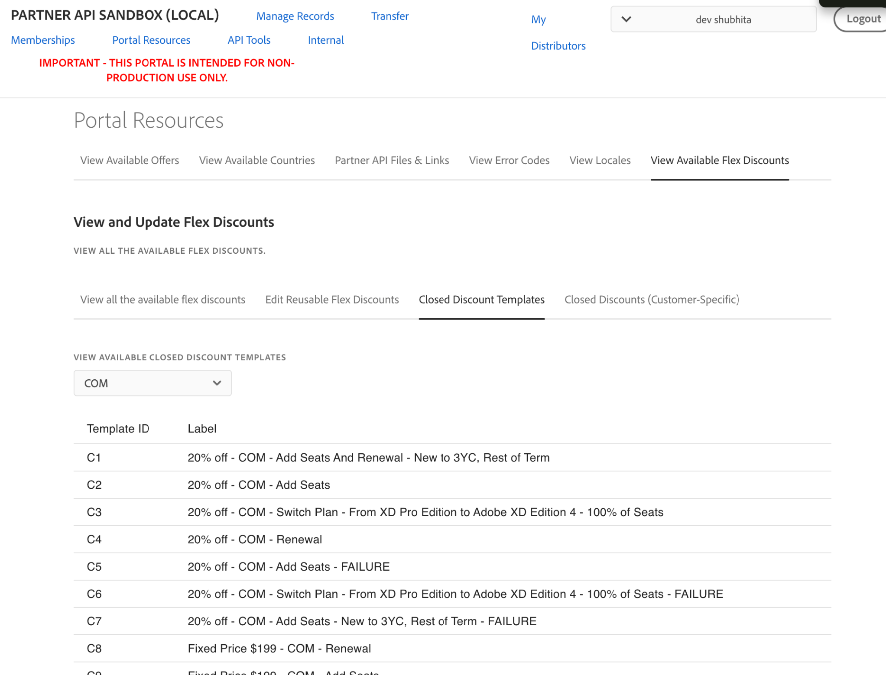

The list includes the following columns:

- **Template ID:** The alphanumeric identifier for the template corresponding to each closed discount listed in the **Closed Discounts (Customer-Specific)** tab.
- **Label:** A short description of the template. Example: `20% off - COM - Add Seats And Renewal New to 3YC, Rest of Term`.

**Note:** Templates with **FAILURE** in the label are always-fail variants intended for validating failure of order scenarios.

#### View closed discount codes

The **Closed Discounts (Customer-Specific)** tab lists all closed discount codes created by your distributor, across all customers and statuses. The list includes the following columns:

- **Closed Discount Code:** The unique identifier of the discount code to be used while placing an order.
- **Customer ID:** The customer for whom the the closed discount code is valid.
- **Closed Discount Label:** Label describing the closed discount to be used for the customer.
- **Template ID:** The template ID corresponding to that label.
- **Redemption Status:** Possible values are: `ACTIVE`, `EXPIRED`, or `REDEEMED`.
- **Expiry Date:** The date and time when the closed discount code expires, displayed in UTC.

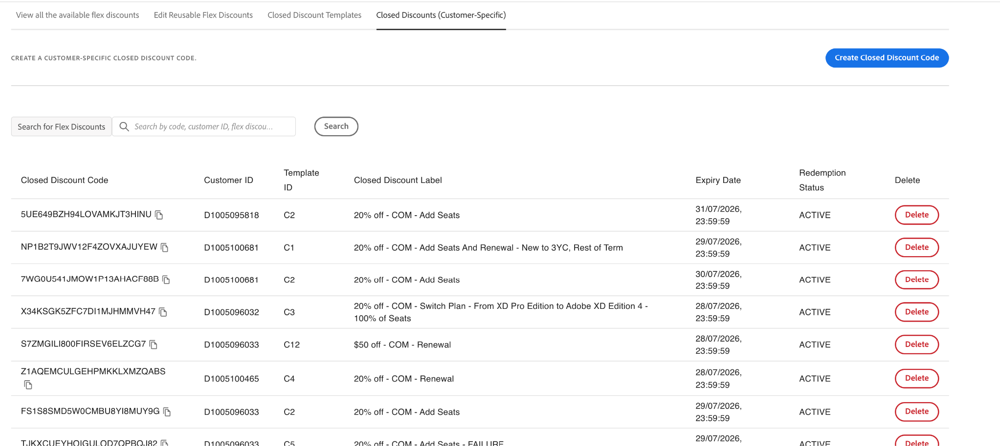

**Search and filter**

You can search and filter closed discount codes by code, customer ID, label, template ID, or status. Searches are case-insensitive and support partial matches.

#### Create a closed discount code

To create a closed discount code:

1. On the **Closed Discounts (Customer-Specific)** tab, select **Create Closed Discount Code**. The **Create Closed Discount Code** dialog opens.

   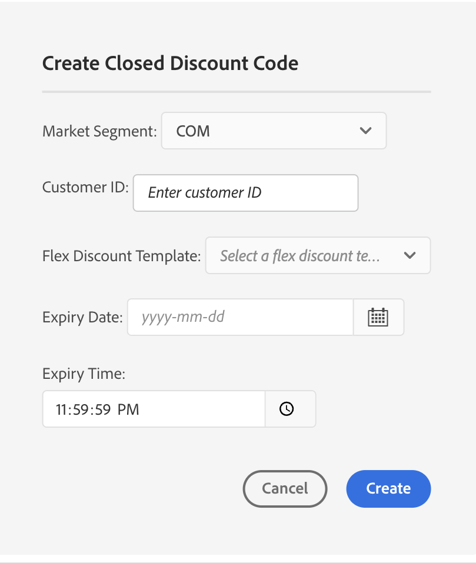

2. Complete the following fields:

   - Market Segment
   - Customer ID
   - Flex Discount Template
   - Expiry Date and Expiry Time

3. Select **Create**.

4. After the code is created successfully, the **Closed Discount Code Created** dialog displays the generated discount code and the Customer ID, each with a copy button. Select **Done** to close the dialog.

   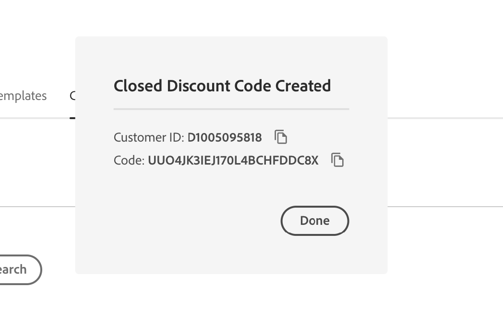

5. If an active code already exists for that customer and template, the same code is returned with an **Existing Code Returned** message, showing the existing active code and customer ID.

   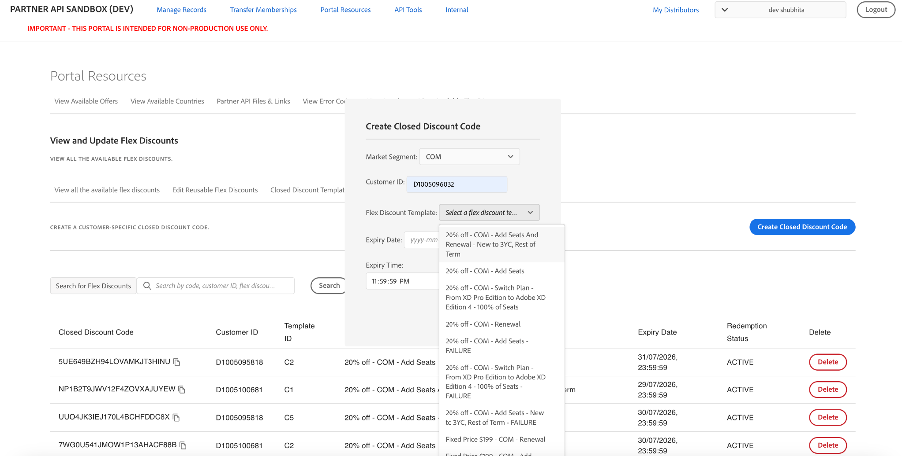

   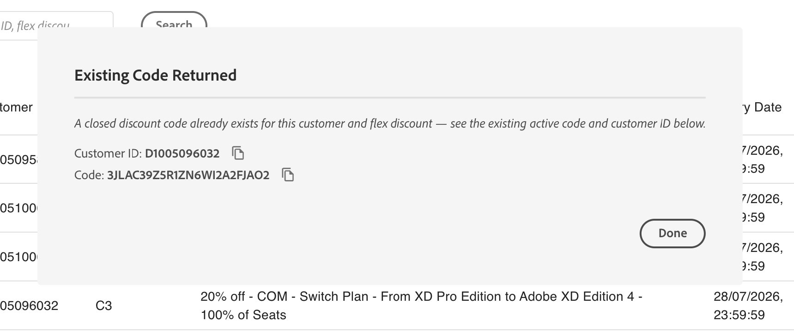

You can use the generated code while placing an order using the [Create Order API](../../../docs/order-management/create-order.md). Depending on the renewal preferences, you can also use the code with the [Update Subscription API](../../../docs/subscription-management/update-subscription.md).

**Note:** Customer specific closed discount codes are unique to a customer can only be used by the customer for whom they were generated.

#### Delete a closed discount code

To delete a closed discount code, select **Delete** for the corresponding code in the **Closed Discounts (Customer-Specific)** tab.

You can delete closed discount codes in any redemption status, including `ACTIVE`, `REDEEMED`, and `EXPIRED`. Deleting unused or no longer needed codes helps free up available slots for creating new closed discount codes.

**Note:** A distributor can have a maximum of 20 closed discount codes in the Sandbox environment at any given time, across all customers and redemption statuses. If you reach this limit, delete one or more existing closed discount codes before creating additional codes.

#### Error messages

When creating a closed discount code, you may encounter the following validation errors:

- **Customer validation**
  - `Customer {customerID} does not belong to this distributor.`
  - `Customer {customerID} does not belong to the selected market segment: {marketSegment}.`
- **Field validation**
  - `Please select a valid flex discount template.`
  - `Please enter a valid customer ID.`
  - `Please select an expiry date.`
- **Expiry date**
  - `Expiry date must be a valid ISO-8601 format (YYYY-MM-DDThh:mm:ssZ).`
  - `Expiry date must be in the future.`
- **Cap reached**
  - `Closed discount code creation limit reached (max 20). Please delete an existing code to create a new one.`
- **Existing code (reuse)**
  - `A closed discount code already exists for this customer and flex discount. See the existing active code and customer ID below.`

### View flexible discounts applied to an Order

If a Flexible Discount is applied during order placement, its details can be viewed from the Order screen. For example, in **Manage Records > Orders**, the discount information appears within the `lineItems` section, as illustrated in the following figure:

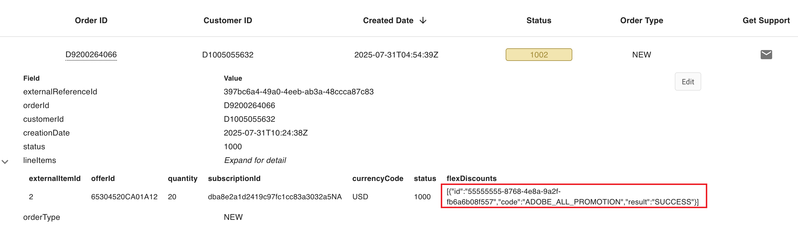

The **flexDiscounts** section displays the discount code and indicates whether it was successfully applied to the order.

### View flexible discounts applied to a Subscription

In **Manage Records > Customers**,  the subscription details display any flexible discounts applied for the upcoming renewal.
Points to note:

- Flexible discounts are shown only if the customer has opted for them for the next renewal via the Update Subscription or Create Subscription API. For example:

  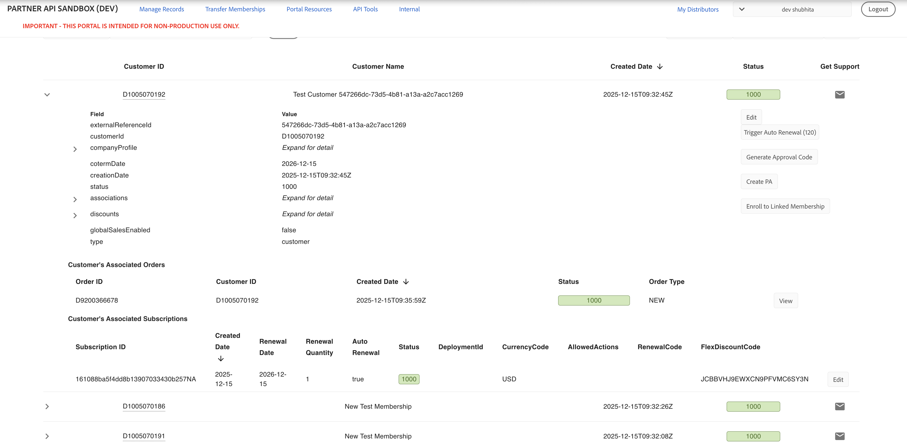

- Flexible discounts that were applied to past orders are not reflected in the subscription details.
- If no flexible discount is applied for renewal, the FlexDiscountCode field remains empty. For example:

  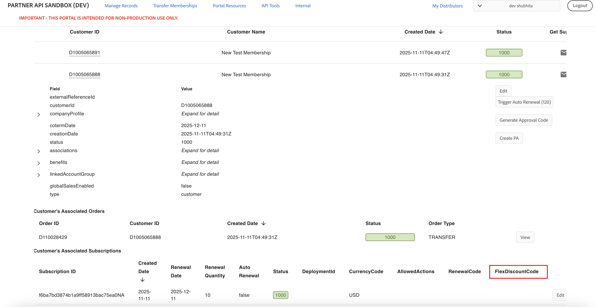

## Flexible discounts for 3YC and mid-term upgrades

You can test 3YC and mid-term upgrade (also known as anytime upgrade) discounts in Sandbox. Unlike the discounts that were originally on the sandbox that always succeed or always fail, these discounts will have slight validations associated with them to ensure you are integrating with the new criteria correctly.

Read more about the [3YC eligibility critera](../../../docs/flex-discounts/index.md#3-year-commitment-3yc-eligibility) and [mid-term eligibility criteria](../../../docs/flex-discounts/index.md#mid-term-upgrade-eligibility).
