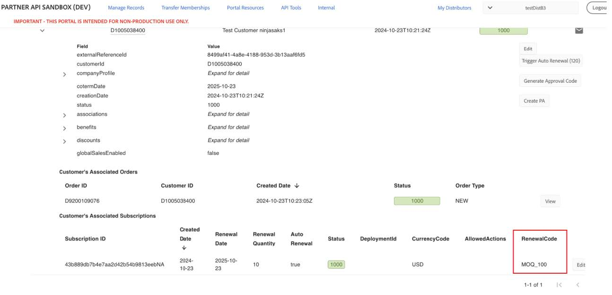
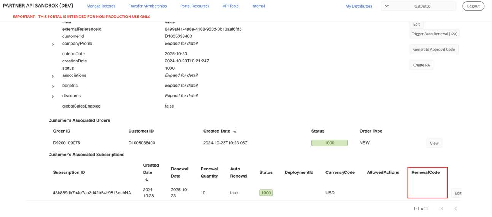

# High Growth Offers for Customers

High Growth Offers are designed for customers who are either making new purchases or significantly expanding their existing Acrobat Pro seats. These offers will replace the High Volume Discounting program (17-23 levels) that exists in VIP.

The following High Growth Offers are available:  

- MOQ_100
- MOQ_250
- MOQ_500

The Sandbox UI allows you to view the High Growth Offers available to customers at renewal.

Perform the following steps to view the high growth MOQ offers that a customer will receive at the renewal:

1. Go to **Manage Record**s > **Customers**.
2. Expand the customer for whom you want to see the details.  

Customers who will receive high growth MOQ offer at renewal can see a value in the  RenewalCode column. For example, MOQ_100, MOQ_250, and MOQ_500:

Customers who are ineligible for High Growth Offers will get an empty **RenewalCode** column:

