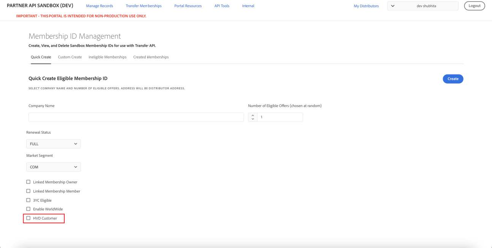

# Migrate High Volume Discount customers from VIP to VIP MP

The Sandbox UI provides various options to test the High Volume Discount customer migration from VIP to VIP Marketplace. For more details, refer to the Migrating High Volume Discount customers from VIP to VIP Marketplace documentation in the CPAPI documentation.

You can test various aspects of HVD migration in the Sandbox UI, as explained in the following sections:

- [Create an HVD customer using the Quick Create option](#create-an-hvd-customer-using-the-quick-create-option)
- [Create an HVD customer using the Custom Create option](#create-an-hvd-customer-using-the-custom-create-option)
- [View discountCode of a specific order](#view-discountcode-applicable-to-a-specific-order)

Creating an HVD customer with their discount level and existing pricing in VIP will help you test various migration scenarios, including post-migration discount levels and pricing in the current 3YC term and future 3YC terms.

## Create an HVD customer using the Quick Create option

Perform the following steps:

1. Go to **Transfer Memberships** > **Quick Create**.
2. Select the **HVD customer** checkbox:

Selecting the HVD Customer option displays additional details, such as the pricing information and the current discount level in VIP:

3. Select whether the customer has pre-price action pricing (**preDCLO customer**) or post-price action pricing (**postDCLO Customer**) for existing subscriptions in VIP.
4. Select the discount level of the customer.

**Notes:**

- Although customers can be migrated at discount levels 17 to 22, the Sandbox UI only provides levels 17 and 18 for testing.
- Customers with 50-99 licenses will be migrated to discount level 13 in VIP MP.
- Customers with more than 100 licenses will be migrated to discount level 14 in VIP MP.

5. Click **Create**.  

## Create an HVD customer using the Custom Create option

1. Go to **Transfer Memberships** > **Custom Create**.
2. Select the **HVD customer** checkbox:

Selecting the HVD Customer option displays additional details, such as the pricing information and the current discount level in VIP:

3. Select whether the customer has pre-price action pricing (preDCLO customer) or post-price action pricing (postDCLO Customer) for the existing subscriptions in VIP.
4. Select the discount level of the customer.

**Notes:**

- Although customers can be migrated at discount levels 17 to 22, the Sandbox UI only provides levels 17 and 18 for testing.
- The Sandbox UI provides only level 17 and 18 as the options for testing purposes.
- Customers with 50-99 licenses will be migrated to discount level 13 in VIP MP.
- Customers with more than 100 licenses will be migrated to discount level 14 in VIP MP.

5. Modify the 3YC configuration in the 3YC Info section:

- The Minimum License Commit Quantity must be  ≥ 50 if the selected discount level is 17.
- The Minimum License Commit Quantity must be ≥ 100 if the selected discount level is 18.

6. Click **Create**.

## View discountCode applicable to a specific order

Perform the following steps:

1. Go to **Manage Records** > **Orders**.
2. Expand the order for which you need details.
3. Expand the lineItems section to view the discountCode applicable to that order, as shown in the following figure:

