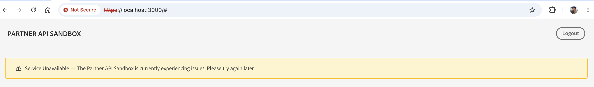
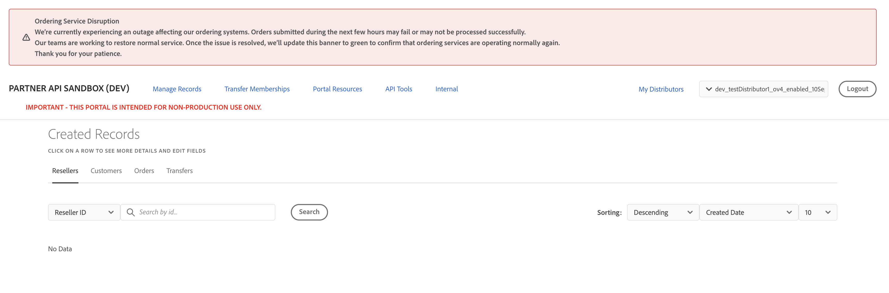

# Banners

The Sandbox Portal can display two types of messages related to service availability:

- An automatic **Service Unavailable** message that appears when the Portal backend is unavailable.
- A Sandbox maintenance and outage banner used to communicate planned maintenance, known issues, and partial service disruptions.

## Automatic Service Unavailable banner

When the Sandbox Portal loads, it performs a health check against its backend. If the health check fails, the Portal displays a full-page **Service Unavailable** message instead of loading partially available or potentially inconsistent content.

This message is generated automatically and is not published by an administrator. It indicates that the Sandbox backend is currently unreachable and does not correspond to a specific maintenance activity or outage notification.

When this message appears:

- The Portal displays a single **Service Unavailable** message instead of loading incomplete or broken content.
- The issue is with the Sandbox backend and does not indicate a problem with your account or data.
- You can still sign out from the page.
- The health check runs only when the page loads and is not retried automatically. To check whether the service has recovered, reload the page.

**Note:** The Service Unavailable message does not distinguish between a Sandbox backend outage and a network connectivity issue on your side. Both conditions result in the same message being displayed.

For information about the health check used to determine Portal availability, see [Health check API](health-check.md).

## Sandbox maintenance and outage banner

The Sandbox Portal includes a banner that communicates planned maintenance windows, known issues, and service disruptions. Unlike the automatic Service Unavailable message, which appears only when the Sandbox Portal backend is unavailable, this banner can be used to communicate partial outages or planned maintenance while the Portal remains accessible.

For example, an administrator might use the banner to notify users that a specific workflow is unavailable or that maintenance is scheduled during a particular time window.

### What you see

The banner appears at the top of the Sandbox Portal on every page. It includes a severity indicator and a message describing the issue or maintenance activity.

Examples:

The banner uses one of the following severity levels:

| Severity     | Meaning                                                                                                                    |
| ------------ | -------------------------------------------------------------------------------------------------------------------------- |
| **Info**     | General information or advance notice. No functionality is impacted.                                                       |
| **Warning**  | A minor issue affects a limited feature or workflow. Core Portal functionality remains available.                          |
| **Critical** | A significant issue affects one or more key workflows. Users should expect service disruption until the issue is resolved. |

### Banner behaviour

The banner:

- Appears at the top of the Sandbox Portal for all users, regardless of role or distributor.
- Automatically disappears when the issue is resolved or the maintenance window expires.
- Supports only one active banner at a time. Publishing a new banner immediately replaces the current banner.

### Important limitations

Keep the following limitations in mind:

- The banner is not targeted. All users see the same message, even if the issue affects only specific users or workflows.
- Banner updates are not delivered in real time. The Portal checks for an active banner when the page loads, so you may need to refresh the page or navigate within the Portal to see a newly published banner or the removal of an existing one.
- Banner history is not retained. Only the currently active banner is visible.
