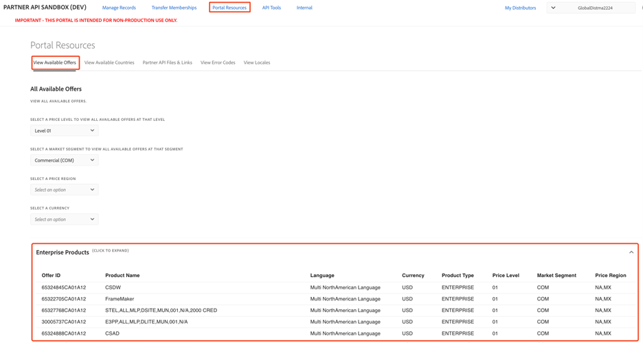

# Portal resources

We have added some additional resources to assist with the Sandbox testing as follows.

## Available offers

A list of all available offers for the current distributor can be found on the View Available Offers page. You can filter the available offers by Level, market segment, price region, and Currency.
The listed offer IDs can be used for testing the Create Order API call or for getting the offer IDs for global orders.

## Available countries

The list of available countries per Price Region can be viewed in the Portal Resources/View Available Countries page. This page includes the country, the two-character ISO Code associated with the country, a postal code regex, and the local regions available in each country.

The list of countries displayed on the page is determined by the price region to which they belong, as defined by Adobe. The price region can be selected by the dropdown menu at the top of the page.

## Partner API Files & Links

This section includes links and resources related to the partner API. Currently, this page includes two links:

- The Partner Hub – A secure location for Adobe to share confidential materials with VIP Marketplace partners. All materials on this site are provided according to your confidentiality obligations to Adobe.
- Partner API Materials – Location where the Partner API documentation, technical assets, and Sample Postman Environments.
