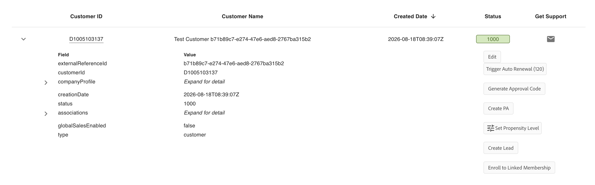
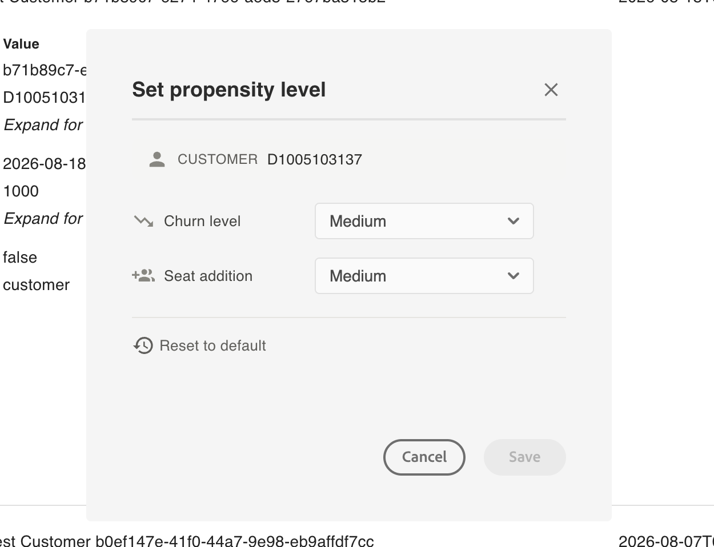

# Product Recommendations

The Recommendations API empowers VIP Marketplace partners to provide intelligent, personalized, and context-aware product suggestions, enhancing the customer experience through upsell, cross-sell, and add-on opportunities. For more details, see [Manage recommendations using APIs](../../../docs/recommendations/apis.md) section in the Adobe Commerce Partner API documentation.

## Testing Recommendations in Sandbox

The standalone Recommendations API and certain existing APIs can fetch recommendations through query parameters, and these recommendations are now available in the Sandbox environment.

No updates have been made to the Sandbox UI, as recommendations will be delivered exclusively through the APIs.

Specific, hardcoded recommendations have been configured to facilitate integration and functional testing of the recommendations feature. These predefined rules are as follows:

**Note:** In production, recommendations will be context-aware and based on the customer's entitlements (products owned), and products that are already owned are not recommended.

| APIs                    | Context         | Rules for showing recommendations in sandbox                                                                                                                                                                                                 | Comments                                                                 |
|-------------------------|-----------------|---------------------------------------------------------------------------------------------------------------------------------------------------------------------------------------------------------------------------------------------|--------------------------------------------------------------------------|
| Recommendations API (new) | GENERIC         | **Upsell Recommendation**\ 1. CC All Apps - Pro for teams\ \ **cross-sell Recommendation**\ 1. Adobe Express for teams\ \ **AddOn Recommendation**\ 1. AI Assistant for Acrobat for enterprise                                  | These products will be recommended regardless of the customer and their current entitlements. |
| Recommendations API (new) | ORDER_PREVIEW   | **Upsell Recommendation**\ 1. CC All Apps - Pro for teams while previewing Creative Cloud for teams All Apps\ 2. Creative Cloud All Apps - Edition 4 for enterprise, while previewing Creative Cloud All Apps Enterprise\ \ **cross-sell Recommendation**\ 1. Adobe Express for teams\ \ **AddOn Recommendation**\ 1. AI Assistant for Acrobat for enterprise while previewing Acrobat Pro/Std for enterprise\ 2. AI Assistant for Acrobat for the team while previewing Acrobat Pro/Std for the team | Recommendations are subject to the lineItem(s) that are previewed. |
| Create Order API        | Order Preview   | **Order Type: PREVIEW**\ \ **Upsell Recommendation**\ 1. CC All Apps - Pro for teams while previewing Creative Cloud for teams All Apps\ 2. Creative Cloud All Apps - Edition 4 for enterprise while previewing Creative Cloud All Apps Enterprise\ \ **cross-sell Recommendation**\ 1. Adobe Express for teams\ \ **AddOn Recommendation**\ 1. AI Assistant for Acrobat for enterprise while previewing Acrobat Pro/Std for enterprise\ 2. AI Assistant for team while previewing Acrobat Pro/Std for team | Same recommendations as exposed for the standalone Recommendations API in the ORDER_PREVIEW context.\ \ Recommendations are subject to the lineItem(s) that are previewed. |
| Create Order API        | Renewal Preview | **Order Type: PREVIEW_RENEWAL without lineItems**\ \ **Upsell Recommendation**\ 1. CC All Apps - Pro for teams\ \ **cross-sell Recommendation**\ 1. Adobe Express for teams\ \ **AddOn Recommendation**\ 1. AI Assistant for Acrobat for enterprise | Same recommendations as exposed for the standalone Recommendations API in the GENERIC context |
| Create Order API        | Renewal Preview | **Order Type: PREVIEW_RENEWAL with lineItems**\ \ **Upsell Recommendation**\ 1. CC All Apps - Pro for teams while previewing Creative Cloud for teams All Apps\ 2. Creative Cloud All Apps - Edition 4 for enterprise while previewing Creative Cloud All Apps Enterprise\ \ **cross-sell Recommendation**\ 1. Adobe Express for teams\ \ **AddOn Recommendation**\ 1. AI Assistant for Acrobat for enterprise while previewing Acrobat Pro/Std for enterprise\ 2. AI Assistant for team while previewing Acrobat Pro/Std for team. | Same recommendations as exposed for the standalone Recommendations API in the ORDER_PREVIEW context.\ \ Recommendations are subject to the lineItem(s) that are previewed. |

## Testing Propensity Signals in Sandbox

In addition to product recommendations, the Sandbox enables you to test propensity signals. For more information about propensity signals, see [Propensity Intelligence](../../../docs/recommendations/index.md#propensity-intelligence).

### Configuring propensity levels

Under **Manage Records > Customers**, expand a customer row and select **Set Propensity Level** from the actions list.

This opens the **Set propensity level** dialog, where you can independently set **Churn level** and **Seat addition**, corresponding to the `churn` and `seatExpansion` signals in the API response. Select **Save** to apply your changes, or **Reset to default** to revert both levels back to Medium.

Configuring propensity levels allows you to test all supported response scenarios without waiting for a corresponding real-world customer condition.

| Level | Effect on the API response |
|---|---|
| Medium | Default level. Returns a `MEDIUM` probability prediction. |
| High | Returns a `HIGH` probability prediction. |
| Low | Returns a `LOW` probability prediction. |
| Opt-out | Returns an empty array for that signal, for example `"churn": []`. |

- Medium is the default level for both `churn` and `seatExpansion` unless they are explicitly configured for a customer.
- `churn` and `seatExpansion` can be configured independently. For example, you can set `churn` to High while leaving `seatExpansion` at Medium.
- Selecting **Reset to default** restores both signals to Medium for the selected customer.

### Testing workflow

1. Set the propensity level for `churn`, `seatExpansion`, or both, for a customer in Sandbox.
2. Call the [Fetch Recommendations API](../../../docs/recommendations/apis.md#fetch-recommendations) for that customer, setting `includePropensity` to an array containing the signal or signals you configured, for example `["churn", "seatExpansion"]`.
3. Verify that the `propensity` object in the response matches the level you configured.
4. Repeat the test with different propensity levels to validate all response-handling scenarios in your integration.
