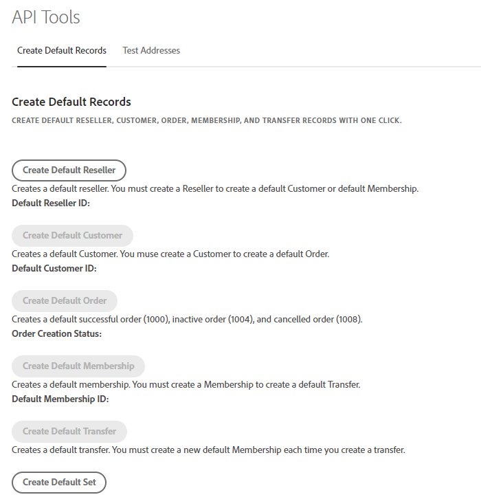

# Create a reseller

To create a default reseller, perform the following steps:

1. Navigate to the **API Tools** tab in the portal. The Create Default Records page is displayed.

2. Here, you can either:

- Create a default reseller by clicking on the **Create Default Reseller** button. \  or \ 
- Create a default set of records by clicking on the **Create Default Set** button, which includes a reseller, a customer, an order, a membership, and a transfer.

When a default reseller has been successfully created, a confirmation message will be displayed, and a Default Reseller ID will be assigned, as shown in the following figure:

