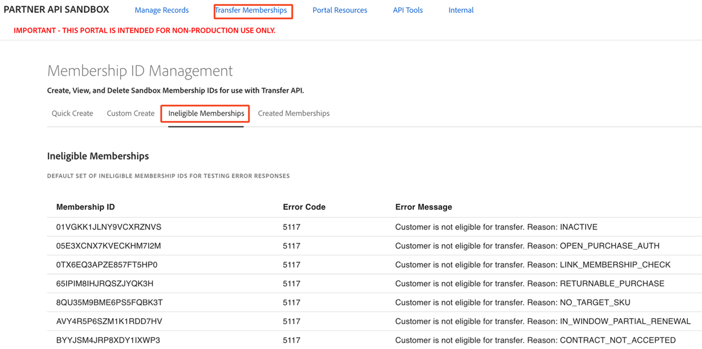
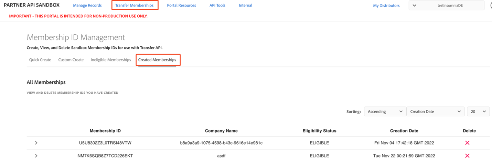

# View memberships

This topic discusses about:

- [List ineligible memberships](#list-ineligible-memberships)
- [List created memberships](#list-created-memberships)
- [View transfer details](#view-transfer-details)

## List ineligible memberships

The Portal offers you a default set of ineligible Membership IDs to be used while testing error responses. The list of ineligible Membership IDs includes error codes and the available error messages. The list can be found under the Transfer Memberships tag on the Ineligible Memberships page.

## List created memberships

To view a list of the Membership IDs that you have created, whether eligible or ineligible, navigate to the Transfer Membership -> Created Membership page. This page offers you the ability to delete Memberships.

The list of Membership IDs can be sorted in ascending or descending order by either Creation Date (default), Company Name, or Membership ID. The sorting criteria can be set using the corresponding dropdown menu. You also can choose the number of Memberships to display on the page.

To transfer the subscriptions using the created membership ID, refer to the External API Documentation.

## View transfer details

Successful transfer information can also be obtained through the Portal by navigating to the Manage Records -> Transfers page and clicking on the down arrowhead next to the Transfer ID to reveal the details of the transfer, including the resulting Customer ID.

