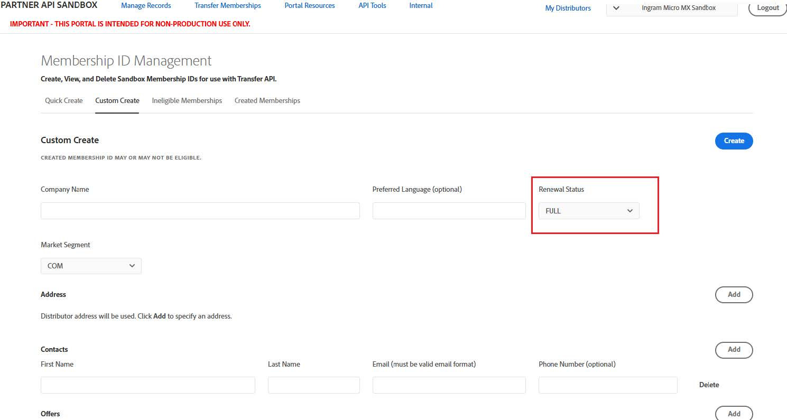

# View renewal status of memberships

You can view the renewal status of subscriptions in VIP from the Quick Create and Custom Create sections of the Sandbox UI. The possible values are:

- **FULL:** All subscriptions are renewed before the migration.
- **PARTIAL:** Not all subscriptions of the customer are renewed.
- **NO:** None of the subscriptions are renewed.

1. Transfer Memberships > Quick Create:

2. Transfer Memberships > Custom Create:  

