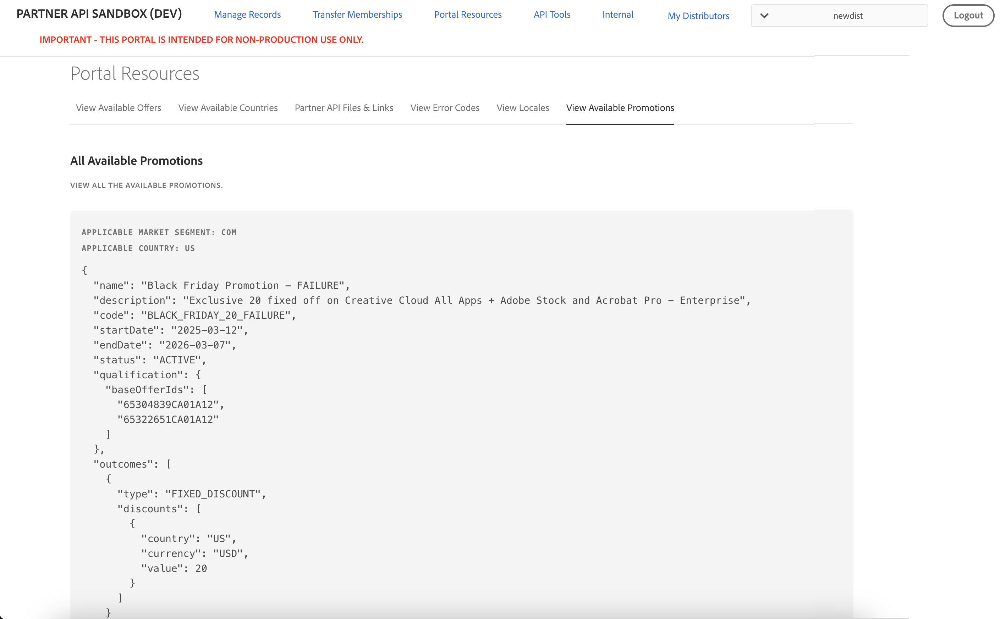
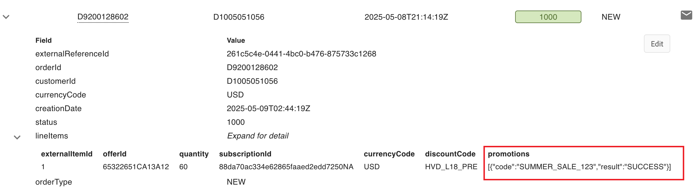
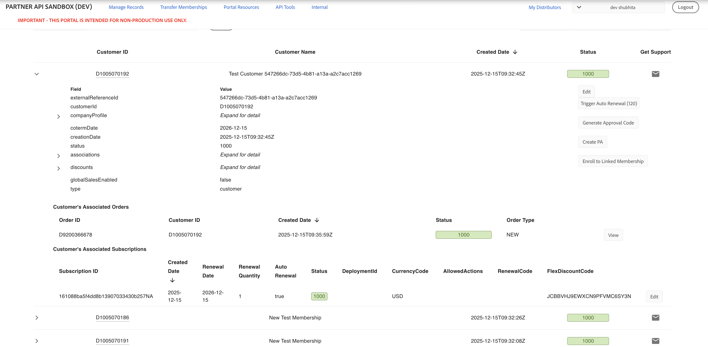
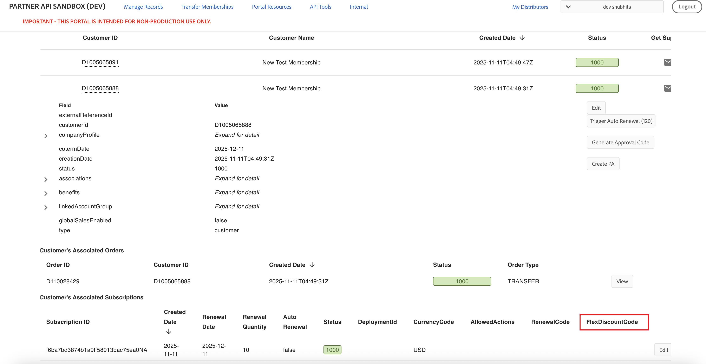

# Manage Flexible Discounts

Partners can get flexible discounts for a product in a specific market segment and country. These discounts can be applied while placing the order or creating a subscription. For detailed guidance on managing Flexible Discounts through APIs, refer to [Manage Flexible Discounts using APIs](/src/pages/docs/flex_discounts/apis.md).

## Testing flexible discounts in Sandbox

You can explore and test the Flexible Discounts feature in the Sandbox environment using the following options:

- [View the available flexible discounts](#view-the-available-flexible-discounts)
- [View flexible discounts applied to an Order](#view-flexible-discounts-applied-to-an-order)
- [View flexible discounts applied to a subscription](#view-flexible-discounts-applied-to-a-subscription)

### View the available flexible discounts

Go to **Portal Resources > View Available Flex Discouts** to view the available flexible discounts, as shown in the following figure:

You can view Flexible Discounts applicable for all countries by selecting **All Countries**, as shown in the folllowing figure:

The UI displays a list of current discounts, including the following details:

- Option to filter flexible discounts based on the applicable market segments
- Option to filter flexible discounts based on the applicable country
- Option to filter flexible discounts applicable for renewal or for new purchases
- Name and description of the discount
- Discount `code` to identify the discount. Use this code to apply the discounted price.
- Start and end date of discount
- Status of the discount. Only discounts with **ACTIVE** status are eligible.
- Offer IDs the discount applies to.
- Type and value of discount. A discount can have either fixed discount or a percentage discount on the price. For example, if the `type` is **FIXED DISCOUNT** and `value` is **20**, and `currency` is **USD**, means a flat discount of $20 on the offer price.

You can use the discount code while placing an order using the Create Order API.

**Note:** In the Sandbox environment, Flexible Discounts that include the term "FAILURE" in both the `name` and the `code` are specifically intended for validating failure scenarios. These codes are designed to always fail when used in PREVIEW and NEW order flows. All other discount codes can be used to validate successful application scenarios. Example:

### View flexible discounts applied to an Order

If a Flexible Discount is applied during order placement, its details can be viewed from the Order screen. For example, in **Manage Records > Orders**, the discount information appears within the `lineItems` section, as illustrated in the following figure:

The **flexDiscounts** section displays the discount code and indicates whether it was successfully applied to the order.

### View flexible discounts applied to a Subscription

In **Manage Records > Customers**,  the subscription details display any flexible discounts applied for the upcoming renewal.
Points to note:

- Flexible discounts are shown only if the customer has opted for them for the next renewal via the Update Subscription or Create Subscription API. For example:

  

- Flexible discounts that were applied to past orders are not reflected in the subscription details.
- If no flexible discount is applied for renewal, the FlexDiscountCode field remains empty. For example:

  
