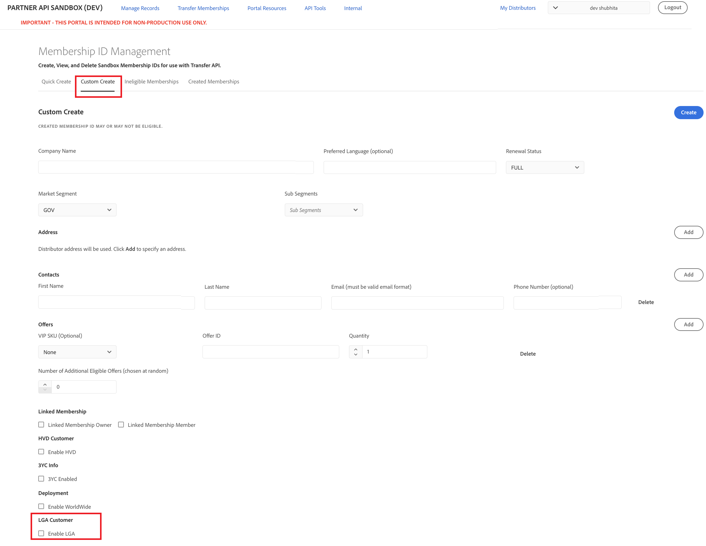
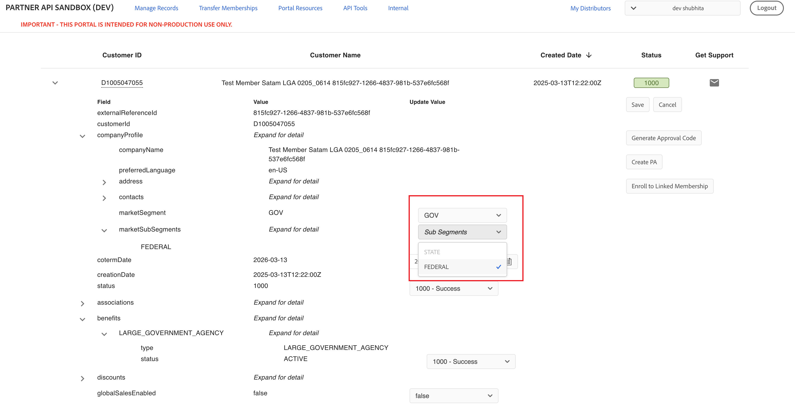

# Manage Large Government Agencies

Distributors designated as Large Government Agencies (LGA) distributors can create and manage LGA customers. An LGA-enabled distributor can:

- Create LGA customers
- Migrate existing LGA customers from VIP to VIP Marketplace
- Convert a customer in the Government market segment to an LGA customer

For more information on managing LGAs using APIs, refer to [Managing Large Government Agencies using APIs](/src/pages/docs/lga/index.md).

Use this document to test how to create and manage LGAs in a Sandbox environment.

## Create LGA customers

You can create an LGA customer in one of the following ways:

- [Create using Quick Create option](#create-a-membership-for-transfer-using-the-quick-create-option)
- [Create using Custom Create option](#create-a-membership-for-transfer-using-the-custom-create-option)

### Create a membership for transfer using the Quick Create option

1. Go to the **Transfer Memberships** tab in the Sandbox UI and then select **Quick Create**:

2. Under the Quick Create section, select **Enable LGA** to create an LGA customer.

Configuration tips:

- When the COM and EDU market segments are selected, the **Enable LGA** option is disabled.
- When the HVD, 3YC, and Worldwide options are selected, the **Enable LGA** option is disabled, and vice-versa.
- The value selected for the **Market Segment** must be `GOV`. Selecting `GOV` as the Market Segment displays market subsegment options: `STATE` and `FEDERAL`.
- Selecting **Enable LGA** sets the minimum and maximum values of the **Number of Eligible Offers** to 1 and 5, respectively.
- A customer migrated using the generated membership ID should be an LGA customer.

### Create a membership for transfer using the Custom Create option

1. Go to the **Transfer Memberships** tab in the Sandbox UI and select **Custom Create**:

2. Select **Enable LGA** under the LGA Customer section.
3. Enter other details. Some configuration tips are as follows:

- Selecting the **Enable LGA** checkbox displays the Has FRL products checkbox. Selecting this checkbox opens the quantity selector corresponding to the FRL products.
- **Market Segment** must be `GOV`. When the `COM` and `EDU` market segments are selected, the **Enable LGA** option is disabled. Selecting `GOV` displays market subsegment options: `STATE` and `FEDERAL`.
- When the HVD, 3YC, and Worldwide options are selected, the **Enable LGA** option is disabled, and vice-versa.
- The value selected for the Market Segment must be GOV.
- Selecting LGA changes the available offers in the offers section to products with 06-09 discount levels.
- Selecting **Enable LGA** disables the **Number of Additional Eligible Offers** checkbox.
- A customer migrated using the generated membership ID should be an LGA customer.
- Selecting Enable LGA, without FRL products, shows invalid in the "LGA Enabled" checkbox and does not allow membership ID creation if the total quantity of offers selected is less than 100.

### Select market subsegment for existing GOV customers

For the `GOV` market segment, you can select market subsegment for the customer in the Edit mode:

## View LGA customer details

To view LGA customer details:

1. Go to **Manage Records > Customers**.
2. Expand the customer record.

LGA Customers contain a `LARGE_GOVERNEMENT_AGENCY` section in `benefits`. This section shows the type of benefits applicable to the customer and its status.

### View Linked Membership details of an LGA customer

When an LGA or non-LGA customer is part of a Linked Membership group, you can view those details from the customer account details. Two new attributes, `type` and `country`, are displayed in the `linkedAccountGroup` details section:

### View ineligible memberships

The **Transfer Memberships > Ineligible Memberships** tab lists the error codes for the LGA Membership Transfer cases, as shown in the following figure:

