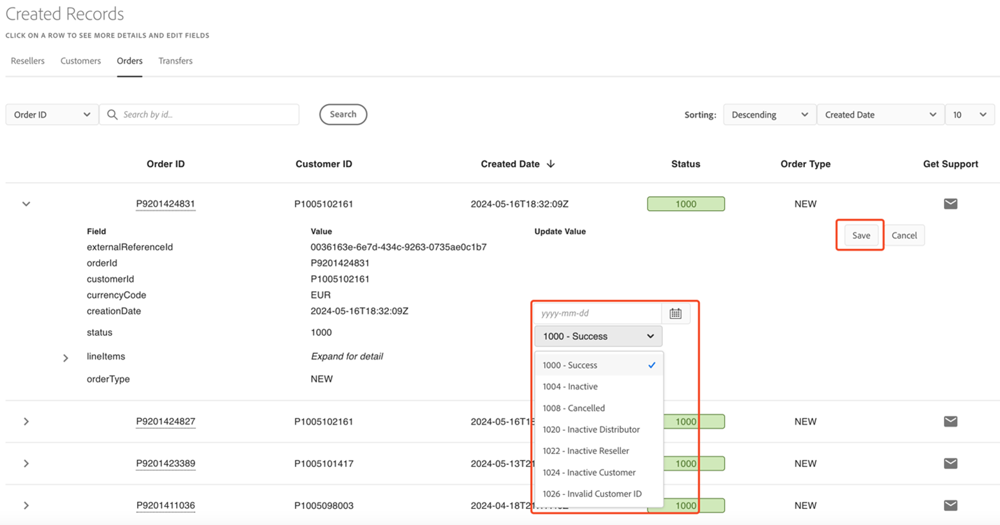

# Edit the order status and creation date (Portal Only)

An Order can have one of seven statuses, each designated by a four-digit number:

- 1000 – Success (default)
- 1004 – Inactive
- 1008 – Cancelled
- 1020 – Inactive Distributor
- 1022 – Inactive Reseller
- 1024 – Inactive Customer
- 1026 – Invalid Customer ID

The status of the Order and Creation Date can be changed by expanding the Order view (click on the down arrow next to the Order ID), which will reveal the EDIT button:

Clicking on the EDIT button will reveal a dropdown menu with the seven status options and a date field next to ‘Creation Date’. To change the status of the Order, click on the desired option and then click on the **Save** button to save your choice.

