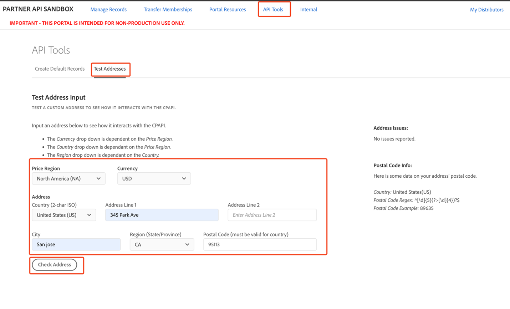
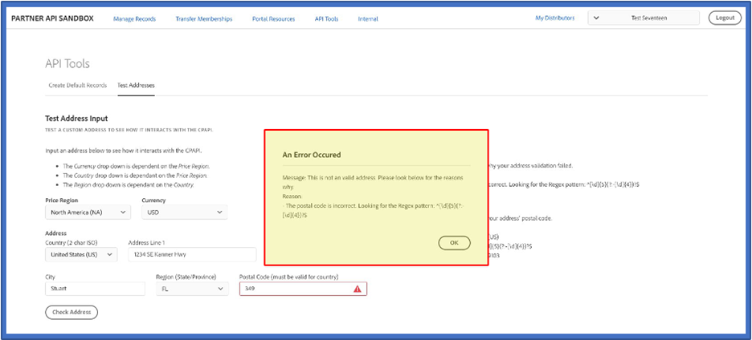

# Other API tools

This topic discusses about the Test Addresses page tool.

The Test Addresses page is a tool designed to test custom addresses to see how they interact with the CPAPI.

While inputting a custom address, you will need to define the following information:

- Price Region
- Currency
- Country
- Local region (State/Province)

The following dependencies exist among the choices above:

- The currency dropdown menu is dependent on the Price Region selected.
- The Country dropdown menu is dependent on the Price Region selected.
- The Region dropdown menu is dependent on the Country selected.

To test an address, navigate to API Tools -> Test Address:

If the API accepts the address format, the tool will display a message announcing that the validation was successful.

If the address fails API validation, the tool will display a message indicating why the validation failed.

