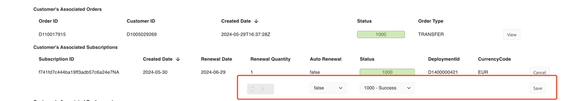

# Update auto-renewal configuration

- [Update  auto-renewal configuration through API calls](#update--auto-renewal-configuration-through-api-calls)
- [Manually trigger auto-renewal through Sandbox UI](#manually-trigger-auto-renewal-through-sandbox-ui)

## Update  auto-renewal configuration through API calls

You can update the following two aspects of auto-renewal:

- Enable auto-renewal
- Modify the renewal quantity

The following considerations must be considered when setting the values above:

- Enabled flag can only be set to true or false.
- Setting enabled to true without the renewalQuantity field will mark all active licenses in the subscription for autorenewal.
- Setting enabled to false with a renewalQuantity will disable autorenewal, the renewalQuantity will be ignored.
- The autoRenewal preferences can only be updated for an active subscription.
- The autoRenewal object is only evaluated at renewal time (the customer’s cotermDate)
- If the renewalQuantity is higher than currentQuantity at renewal time, then the additional licenses will be included in renewal. If it is lower, then licenses will be removed at renewal.
- If the renewalQuantity has been explicitly set, the renewalQuantity will not be increased or decreased by additional orders or cancellations (until subscription becomes inactive)

The considerations named above translate into three states of autorenewal:

- Disabled
- Enabled with renewal quantity
- Enabled without explicit renewal quantity (all purchased licenses will be renewed. The renewalQuantity will still be returned with the number of purchased licenses)

To update Subscriptions through the Portal, navigate to Manage Records -> Customers and expand the view of the desired Customer. In the Customer’s Associated Subscriptions section, click on the EDIT button at the end of the Subscription line.

Clicking on the EDIT button will bring up several fields that will allow you to change the different values associated with the Subscription, namely:

- The Renewal Quantity
- The Auto-Renewal Flag
- The Status

## Manually trigger auto-renewal through Sandbox UI

Triggering an auto-renewal is a function that can be performed through the Portal. To trigger the auto-renewal:

1. Turn off the auto-renewal flag for the subscription through UI or API.
2. Update the co-term date to today or the date it is eligible for manual-renewal.
3. Select **Trigger Auto Renewal**:

   1. Navigate to the Manage Records -> Customers page, and expand the Customer view by clicking on the down arrowhead next to the desired Customer ID, which will reveal the **Trigger Auto Renewal** button.
   2. Note that there is a renewal job that runs automatically every hour that will trigger Auto-Renewals upon reaching the corresponding anniversary date and time. The Trigger Auto-Renewal function allows you to accelerate this process.

