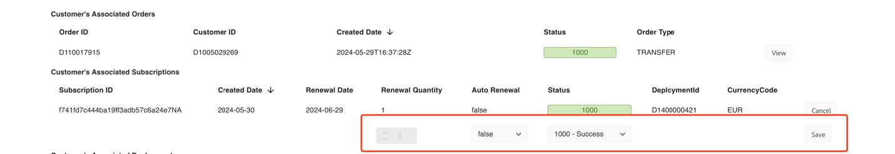
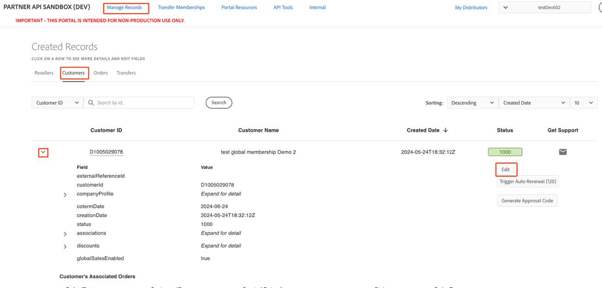
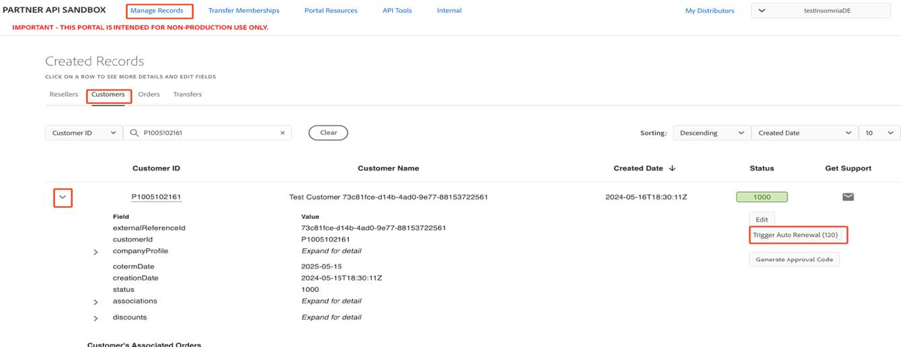

# Expire an active subscription (Portal Only)

To expire an active subscription of a customer, perform the following steps:

1. Navigate to the **Manage Records** -> **Customers** page, and expand the Customer view by selecting the down arrowhead next to the desired **Customer ID**.
2. In the Customer’s Associated Subscriptions section, select the **Edit** button at the end of the Subscription line to turn off the **Auto-Renewal** flag.

Clicking the **EDIT** button will display several fields, among which you should set the **Auto Renewal** Flag to **false**.

3. Update the customer's **coTermDate** to the current date by clicking the **Edit** button under the **Status** column in the expanded Customer Details view.

4. Enter the current date in the date field under the **Update Value** Column.

5. Click **Save** to set the new **cotermDate** to current date.

6. Manually trigger the Auto Renewal, by clicking on the **Trigger Auto Renewal** button, in the expanded Customer details view.

7. Wait for 2 minutes for the Auto Renewal Job to complete, then check that the subscription is marked as expired.

8. Go to the Customer’s Associated Subscriptions section and ensure that the subscription status is marked as 1004.
