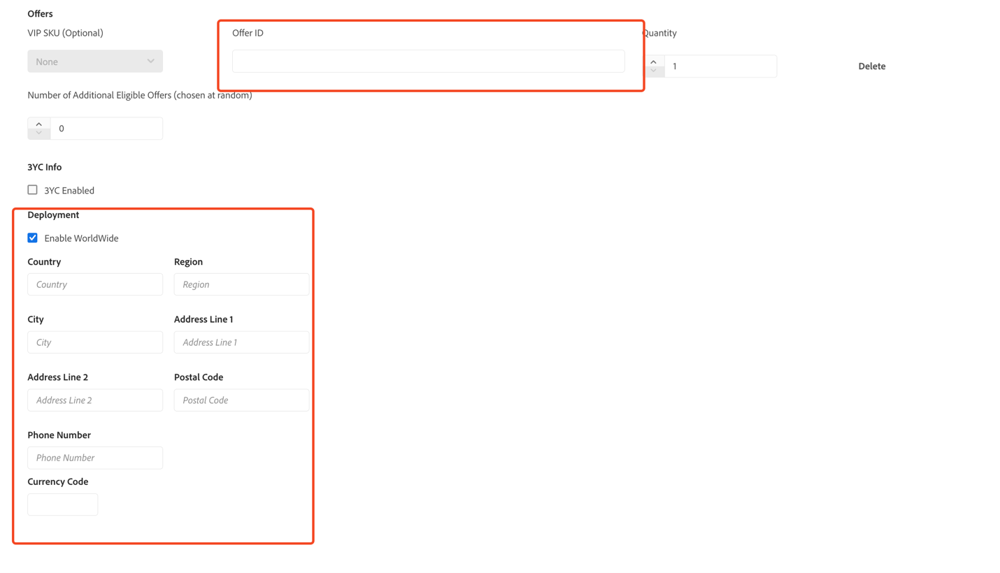
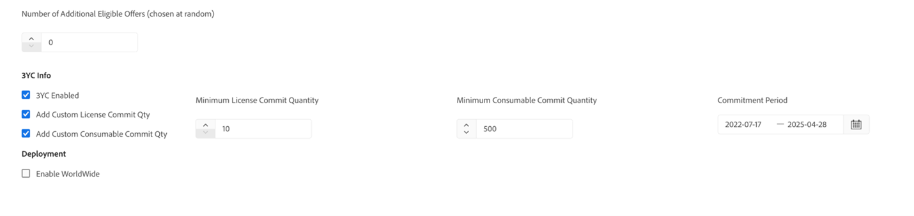

# Create membership

The following options are available to create memberships:

- [Quick create with Global Sales](#quick-create-with-global-sales)
- [Quick Create with 3YC](#quick-create-with-3yc)
- [Quick Create with Linked Membership Owner](#quick-create-with-linked-membership-owner)
- [Quick Create with Linked Membership Member](#quick-create-with-linked-membership-member)
- [Custom Create with Global Sales](#custom-create-with-global-sales)
- [Custom Create with 3YC](#custom-create-with-3yc)
- [Custom Create with Linked Membership](#custom-create-with-linked-membership)

## Quick Create

Clicking on the Transfer Memberships tab will land you on the Quick Create page. In this page, you can specify a company name and the number of eligible offers to quickly generate a VIP Membership ID that is always eligible and that will result in eligible transfers. After clicking on the CREATE button, the Portal will create a Membership and a window will pop up showing the Membership ID.

As stated above, creating a Membership ID in the Portal will make it possible to process a transfer through our preset API call, which requires an unused Membership ID. This is an important and necessary step because Membership IDs can only be used once.

### Quick create with Global Sales

To create a membership ID with Global Sales, Select the checkbox “Enable Worldwide” and press the ‘Create’ button

### Quick Create with 3YC

A Membership ID can optionally be created with existing 3YC. The 3YC information is also shown when viewing created memberships.

**Note:** Selecting 3YC will disable Linked Membership Owner and Linked Membership Member

### Quick Create with Linked Membership Owner

A Membership ID can optionally be created with a Linked Membership Owner. Selecting Linked Membership Owner will disable the checkboxes for Linked Membership Member and 3YC eligible.

Once you click on ‘Create’, the Linked Membership ID is returned along with the Membership ID.

**Note:** Selecting Linked Membership Owner will disable Linked Membership Member and 3YC eligible.

### Quick Create with Linked Membership Member

By selecting the ‘Linked Membership Member’ checkbox, you can create a VIP Membership who is also a Linked Member. Please enter the “Linked Membership Group ID” in the textbox provided. This value can be obtained when you create a Membership with a Linked Owner.

## Custom Create

You can create custom Membership IDs with your own desired information using Custom Create. Unlike the Quick Create form, which always creates an eligible Membership ID, the Membership IDs created with the Custom Create form may or may not be eligible for transfer.

This form allows you to enter an offer ID of your choice or delete this field and enter the number of offers you wish to add, in which case the offer ID(s) will be generated at random.

To create a Custom Membership ID, navigate to Transfer Memberships -> Custom Create in the Portal, fill in the form as desired, and click the CREATE button.

Upon successful creation of the custom Membership, a message will pop up with the Membership ID and the eligibility status.

As stated above, creating a Membership ID will make it possible to manage transfers with API calls. This is an important and necessary step because Membership IDs can only be used once, and every transfer requires a Membership ID.

### Custom Create with Global Sales

To create a custom VIP membership with worldwide enabled, go to the section labeled Deployment and select the Enable Worldwide checkbox.

Fill out the fields related to the deployment (Country, Region, City, Currency, etc.). Please note that you need to enter the offerID corresponding to the currencyCode entered in the Deployment section. To get the list of offers associated with a currency and price region please refer to the Available Offers section.

### Custom Create with 3YC

To create a VIP membership with 3YC from the custom create page, enable the checkbox ‘3YC Enabled’, this will display a few additional fields with default values as shown in the image below. Feel free to modify the values as per your requirements.

### Custom Create with Linked Membership

To create a VIP membership with a Linked Owner from the custom create tab, go to the section labeled Linked Membership and select the checkbox Linked Membership Owner. Fill out the Linked Membership Organization name and Type and click on ‘Create’ to create the membership. You can view a Linked Membership ID along with a VIP membership ID in the output alert box.

To create a VIP membership with a Linked Membership Member, select the ‘Linked Membership Member’ checkbox and enter the Linked Membership ID from the previous step.

